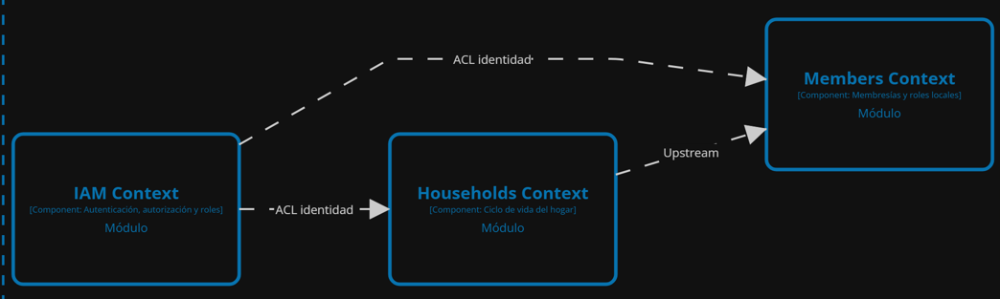

## 2.6. Tactical-Level Domain-Driven Design

## 2.6. Bounded Contexts

### 2.6.1. Bounded Context: Identity and Access Management (IAM)

Este contexto delimitado es de alcance global y de naturaleza técnica. Su responsabilidad es gestionar la identidad de los usuarios registrados en Splitly y proporcionar los mecanismos de autenticación y autorización mediante tokens, abstrayéndose completamente de la lógica de negocio de la distribución de gastos.

#### 2.6.1.1. Domain Layer (Model)

**Aggregates**
* **`User` (Aggregate Root):** Representa la identidad central del usuario en el sistema. Administra los datos de acceso, credenciales y su estado de actividad.
* **`Role` (Entity):** Define los niveles de acceso a nivel de plataforma (sistema) que pueden ser asignados a un `User`.

**Value Objects**
* **`Roles` (Enum):** Enumerador que encapsula y restringe los valores permitidos para los roles del sistema, garantizando type-safety en la capa de dominio.

**Commands (CQRS)**
* **`SeedRolesCommand`**: Comando empleado al inicio de la aplicación para poblar la base de datos con los roles fundamentales del sistema si estos no existen.

**Queries (CQRS)**
* **`GetAllRolesQuery`**: Solicitud para obtener la lista completa de roles disponibles.
* **`GetRoleByNameQuery`**: Solicitud para buscar un rol específico mediante su nombre.
* **`GetUserByIdQuery`**: Solicitud para obtener los detalles de un usuario a partir de su identificador único.
* **`GetUserByUsernameQuery`**: Solicitud para recuperar el perfil de un usuario utilizando su nombre de usuario (útil para validaciones de login o registro).

**Events**
* Actualmente, el modelo está preparado para soportar eventos de dominio (Domain Events) que permitirán reaccionar a cambios de estado (por ejemplo, notificar a otros Bounded Contexts cuando un nuevo `User` se registre exitosamente).

**Repositories (Interfaces de Persistencia)**
* **`IUserRepository`**: Define el contrato para las operaciones de acceso a datos relacionadas con la entidad `User`.
* **`IRoleRepository`**: Define el contrato para la persistencia y consulta de la entidad `Role`.

**Services**
* **`IUserCommandService` / `IUserQueryService`**: Segregan las responsabilidades de mutación (escritura) y lectura de la identidad del usuario, respetando el principio CQRS.
* **`IRoleCommandService` / `IRoleQueryService`**: Abstracciones para la administración y consulta de los roles del sistema.
* **`IHashingService`**: Servicio de dominio encargado de aplicar algoritmos de derivación unidireccional (hashing) a las contraseñas para su almacenamiento seguro.
* **`ITokenService`**: Servicio responsable de la generación, firma y validación de los tokens (JWT) requeridos para el acceso desde la aplicación móvil multiplataforma.
  
#### 2.6.1.2. Interface Layer

Esta capa actúa como el punto de entrada a los servicios de IAM para la aplicación móvil de **Splitly** y su Landing Page. Su responsabilidad fundamental es exponer los endpoints RESTful, gestionar las solicitudes HTTP, traducir los datos de entrada (Payload) a comandos entendibles por la capa de aplicación y formatear las respuestas de salida, manteniendo la integridad del sistema frente a clientes externos.

##### REST (Controllers)

* **`AuthenticationController`**: Es el controlador crítico para la seguridad. Expone los endpoints públicos para el registro de nuevas cuentas (`sign-up`) y la validación de credenciales para el inicio de sesión (`sign-in`), gestionando el retorno de tokens de acceso para la persistencia de sesión en el dispositivo móvil.
* **`RolesController`**: Proporciona endpoints para la lectura de los roles de sistema disponibles, permitiendo que la aplicación móvil configure los permisos básicos del usuario tras el registro.
* **`UsersController`**: Gestiona las solicitudes relacionadas con la consulta de perfiles, permitiendo recuperar la información pública de los usuarios registrados mediante su identificador único.

##### REST / Resources (DTOs)

* **`AuthenticatedUserResource`**: Estructura de datos enviada al cliente tras una autenticación exitosa. Contiene los datos básicos del usuario junto con el token JWT (Json Web Token) requerido para autorizar peticiones posteriores.
* **`RoleResource`**: Representación simplificada de la entidad `Role` (ID y nombre) para su consumo en la interfaz de usuario.
* **`SignInResource`**: Objeto de transferencia de datos que captura las credenciales (email y password) enviadas desde el formulario de inicio de sesión de la aplicación.
* **`SignUpResource`**: Estructura utilizada para recibir la información necesaria para la creación de una nueva cuenta global en la plataforma.
* **`UserResource`**: Representación pública de los datos de identidad del usuario, asegurando que información sensible como los hashes de contraseñas no se expongan fuera del backend.

##### REST / Transform (Assemblers)

* **`AuthenticatedUserResourceFromEntityAssembler`**: Mapeador encargado de construir el objeto `AuthenticatedUserResource` a partir de la entidad `User` y el token generado por la infraestructura.
* **`RoleResourceFromEntityAssembler`**: Transforma la entidad de dominio `Role` en un `RoleResource` listo para ser serializado a JSON.
* **`SignInCommandFromResourceAssembler`**: Traduce los datos del `SignInResource` a un comando de autenticación para ser procesado por la Application Layer.
* **`SignUpCommandFromResourceAssembler`**: Convierte el recurso de registro (`SignUpResource`) en el comando correspondiente para iniciar la creación del nuevo usuario.
* **`UserResourceFromEntityAssembler`**: Realiza la conversión de la entidad agregada `User` hacia un `UserResource`, filtrando cualquier dato que no deba ser enviado a la capa de presentación.

#### 2.6.1.3. Application Layer

Esta capa actúa como el motor de orquestación de **Splitly**, encargándose de implementar la lógica de los servicios definidos en la capa de dominio. Coordina las tareas de la aplicación y delega el trabajo a los objetos de dominio, asegurando que se respeten las reglas de negocio en cada transacción y manteniendo la separación de responsabilidades mediante el patrón CQRS.

**Internal**

* **CommandHandlers**: Contiene las implementaciones de los servicios de comando (escritura). Estas clases procesan los comandos que resultan en un cambio de estado en el sistema.
    * `RoleCommandServiceImpl`: Implementa la lógica para la gestión de roles, incluyendo la inicialización de los roles base (`SeedRolesCommand`) requeridos para la operación inicial del sistema.
    * `UserCommandServiceImpl`: Orquesta el proceso de registro de nuevos usuarios y la actualización de perfiles, coordinando la validación de identidad y el almacenamiento seguro.

* **QueryHandlers**: Contiene las implementaciones de los servicios de consulta (lectura). Se encargan de recuperar información sin alterar el estado de la base de datos.
    * `RoleQueryServiceImpl`: Gestiona la recuperación de roles existentes, permitiendo listar todos los roles o filtrar por criterios específicos.
    * `UserQueryServiceImpl`: Procesa las consultas para obtener la información de los usuarios mediante su identificador único o su nombre de usuario.

**OutboundServices**

Define las interfaces y servicios necesarios para interactuar con componentes técnicos externos o con otros contextos delimitados de la aplicación, manteniendo el núcleo del negocio aislado de implementaciones de infraestructura.

* **Hashing**: 
    * `IHashingService`: Define el contrato para los servicios de criptografía, encargándose de transformar las contraseñas en hashes seguros y validar las credenciales durante el inicio de sesión.
* **Tokens**:
    * `ITokenService`: Define el contrato para la gestión de la seguridad basada en tokens. Es responsable de la generación, firma y validación de los JSON Web Tokens (JWT) utilizados para autorizar las solicitudes desde la aplicación móvil.
* **ACL (Anti-Corruption Layer)**:
    * `IExternalProfileService` / `ExternalProfileService`: Actúa como una capa de anticorrupción que facilita la comunicación con otros Bounded Contexts. Su función es traducir y transferir información de identidad hacia módulos externos (como la gestión de perfiles o el registro en hogares) sin acoplar los modelos de dominio entre sí.

#### 2.6.1.4. Infrastructure Layer

Esta capa proporciona las implementaciones técnicas reales para los contratos definidos en las capas de dominio y aplicación. Es la encargada de gestionar el acceso a la base de datos, la seguridad criptográfica, la generación de tokens y la intercepción de peticiones en el pipeline, asegurando que los detalles de implementación permanezcan aislados de la lógica de negocio.

**Hashing**
* **`HashingService`**: Implementación concreta de la interfaz `IHashingService`. Utiliza internamente el algoritmo BCrypt para transformar las contraseñas de los usuarios en hashes seguros antes de su persistencia, garantizando la protección de las credenciales.

**Persistence / EFC (Entity Framework Core)**
* **`IAMContext`**: Contexto de base de datos específico para este Bounded Context. Configura las entidades `User` y `Role` mediante Fluent API, definiendo la estructura de las tablas, claves primarias y restricciones en el motor de base de datos.
* **`UserRepository`**: Implementación del repositorio (hereda de la configuración base) encargada de las operaciones de acceso a datos, consultas y mutaciones específicas para la entidad `User`.
* **`RoleRepository`**: Implementación del repositorio que maneja las operaciones CRUD reales sobre la tabla de roles en la base de datos.

**Pipeline / Middleware / Components**
* **`RequestAuthorizationMiddleware`**: Componente crítico en el pipeline de peticiones HTTP. Actúa como un middleware que intercepta las solicitudes entrantes para validar la presencia y autenticidad del token JWT. Si el token es válido, extrae los claims (como el ID del usuario) y los inyecta en el contexto de la petición (`HttpContext`), autorizando el acceso a los endpoints protegidos de la API.

**Tokens**
* **`TokenService`**: Implementación técnica de `ITokenService`. Es responsable de la creación, firma criptográfica y validación de los JSON Web Tokens (JWT) que permiten a los usuarios de la aplicación móvil y web mantener sus sesiones de forma segura.
* **`TokenSettings`**: Clase ubicada en la carpeta de configuración de tokens. Se encarga de mapear y tipar fuertemente los parámetros de seguridad definidos en el archivo `appsettings.json` (como el `Secret`, `Issuer`, `Audience` y el tiempo de expiración en días).

#### 2.6.1.5. Bounded Context Software Architecture Component Level Diagrams

El siguiente diagrama de componentes ilustra la estructura interna y el flujo de interacción dentro del Bounded Context de Identity and Access Management (IAM). Esta representación visual materializa la arquitectura en capas descrita en los apartados anteriores, evidenciando cómo se aplica el patrón Clean Architecture y CQRS en el proyecto. 

En el diagrama se detalla cómo las solicitudes de los clientes (como el inicio de sesión o el registro) son interceptadas por la **Interface Layer** (Controllers), las cuales delegan la orquestación a la **Application Layer** (Command y Query Handlers). Asimismo, se observa cómo estos servicios orquestadores interactúan con las entidades de la **Domain Layer** para validar las reglas de negocio, y finalmente se apoyan en la **Infrastructure Layer** (Repositories, TokenService, y IAMContext) para la persistencia de datos y la generación de credenciales seguras.

### 2.6.1.6. Bounded Context Software Architecture Code Level Diagrams

#### 2.6.1.6.1 Bounded Context Domain Layer Class Diagrams

El siguiente diagrama de clases de la capa de dominio representa el modelo conceptual de negocio para el contexto de **Identity and Access Management (IAM)**. En este esquema se visualizan las entidades fundamentales, como `User` (Aggregate Root) y `Role`, junto con sus atributos esenciales y las relaciones que definen el comportamiento del sistema de identidades. 

Este modelo se mantiene estrictamente agnóstico a factores externos, como la persistencia en base de datos o los protocolos de comunicación, centrándose únicamente en las reglas de dominio que rigen la creación y validación de usuarios y sus niveles de acceso dentro de la plataforma **Splitly**.

#### 2.6.1.6.2 Bounded Context Database Design Diagram

El siguiente diagrama representa el modelo físico de datos (Entity-Relationship) estructurado específicamente para el contexto de **Identity and Access Management (IAM)**. 

En este esquema se visualiza la estructura relacional de las tablas empleadas para la persistencia de identidades y accesos, aislando las tablas `users`, `roles` y la tabla de resolución `user_roles`. Se especifican los atributos, las claves primarias (PK) y las claves foráneas (FK) que garantizan la integridad referencial y modelan correctamente la asignación de permisos a los usuarios registrados en la plataforma **Splitly**.

### 2.6.2. Bounded Context: Contributions Distribution

El Bounded Context de **Contributions Distribution** representa el núcleo matemático y de registro de cuentas de la plataforma **Splitly**. Su propósito principal es gestionar el ciclo de vida de los gastos compartidos, garantizando precisión en la división y trazabilidad en los compromisos de cada usuario.

A nivel arquitectónico, este límite transaccional consolida de manera cohesiva tres sub-dominios lógicos fundamentales:
* **Bills:** Encargado del registro, emisión y categorización de los gastos o facturas centrales generados dentro del hogar.
* **Contributions:** Actúa como el motor de reglas de negocio que aplica diferentes métodos de asignación matemática para fragmentar un gasto (Bill) y determinar la obligación financiera exacta que le corresponde a cada miembro.
* **Members Contribution:** Responsable del seguimiento interno y registro del estado de las cuotas de los usuarios (marcando y conciliando quién ya cumplió con su parte de la deuda), operando de forma independiente a la pasarela de pagos.

Al unificar estas responsabilidades en un único Bounded Context, el sistema asegura que la generación de un gasto y el cálculo automático de sus respectivas deudas se mantengan siempre consistentes, altamente cohesivos y sincronizados.

#### 2.6.2.1. Domain Layer

La capa de dominio (Domain Layer) del Bounded Context de **Contributions Distribution** encapsula la lógica central del negocio para el registro de gastos y la conciliación de deudas. Al ser el núcleo del sistema, esta capa es completamente independiente de frameworks, bases de datos o interfaces de usuario, modelando fielmente las reglas matemáticas y financieras de la plataforma.

A partir de la consolidación de los submódulos, el modelo de dominio se estructura mediante los siguientes elementos tácticos:

**Aggregates y Entities:**
* **`Expense` (Aggregate Root):** Es la entidad raíz que representa una factura o gasto general del hogar. Controla la consistencia de los datos del cobro (monto total, fecha de emisión `issueDate`, fecha de vencimiento `dueDate`) y actúa como punto de entrada para agregar detalles o marcar el gasto como liquidado (`markSettled()`).
* **`ExpenseLine` (Entity):** Representa cada uno de los ítems o líneas de detalle que componen un gasto mayor, especificando su propia categoría (`category`), monto (`amount`) y notas adicionales.
* **`DocumentAttachment` (Entity):** Gestiona los comprobantes físicos o digitales (recibos, facturas en PDF/imagen) asociados a un gasto para garantizar la transparencia, almacenando la clave del archivo (`fileKey`).
* **`Contribution` (Aggregate Root / Entity):** Representa el cálculo general de división de un gasto (`expenseId`). Contiene la lógica para recomputar (`recompute()`) las obligaciones financieras basándose en una política o método de asignación.
* **`ContributionItem` (Entity):** Representa la obligación financiera individual y exacta de un miembro del hogar (`memberId`). Define el porcentaje de la deuda, el monto a pagar y cuánto ha sido pagado hasta el momento (`paidTotal`).
* **`Payment` (Entity):** Registra la transacción individual que realiza un miembro para cubrir su cuota (`contributionItemId`). Encapsula el monto abonado, la fecha (`paidAt`), la referencia de la operación y los métodos para confirmar o conciliar el pago (`confirm()`, `reconcile()`).

**Value Objects y Enumeradores:**
* **Enumeradores de Estado:** `ExpenseStatus` y `PaymentStatus` para manejar el ciclo de vida de las deudas (ej. Pendiente, Saldado, Confirmado).
* **Enumeradores de Categoría y Método:** `ExpenseCategory` (ej. Comida, Servicios) y `PaymentMethod` (ej. Efectivo, Transferencia).
* **`AllocationMethod`:** Define la estrategia matemática para dividir el gasto (Partes iguales, Porcentual, etc.).

**Repositories (Interfaces):**
Para garantizar la persistencia de estos agregados sin acoplar el dominio a la base de datos, se exponen los siguientes contratos:
* **`IExpenseRepository`:** Contrato para persistir y recuperar los gastos generales y sus líneas de detalle.
* **`IContributionRepository`:** Contrato para gestionar el almacenamiento de los cálculos de división y las cuotas individuales.
* **`IPaymentRepository`:** Contrato para registrar el historial de transacciones y abonos de los miembros.

#### 2.6.2.2. Interface Layer

La capa de interfaz (Interface Layer) para el Bounded Context de **Contributions Distribution** actúa como la frontera externa del módulo. Su responsabilidad es recibir las solicitudes HTTP desde las aplicaciones cliente (móviles o web), transformar las cargas útiles (payloads) mediante DTOs, y enrutar las peticiones hacia la capa de aplicación correspondiente, protegiendo así el modelo de dominio subyacente.

Alineado con los agregados definidos en el modelo, esta capa expone los siguientes controladores RESTful y componentes:

**REST Controllers:**
* **`ExpensesController`:** Punto de entrada para la gestión de las facturas del hogar. Expone rutas para registrar un nuevo gasto, añadir líneas de detalle (`ExpenseLine`), subir comprobantes (`DocumentAttachment`) y actualizar el estado general del cobro.
* **`ContributionsController`:** Expone los endpoints para consultar y gestionar la división de los gastos. Permite solicitar la recomputación de las cuotas (`recompute()`) basándose en una política específica y obtener el listado de las obligaciones (`ContributionItem`) de cada miembro.
* **`PaymentsController`:** Maneja las peticiones relacionadas con la liquidación de las deudas. Expone rutas para que un usuario registre el pago de su cuota, y para que el representante del hogar pueda confirmar (`confirm()`) y conciliar (`reconcile()`) dichos abonos.

**Data Transfer Objects (DTOs / Resources):**
Para evitar exponer las entidades de dominio directamente, se implementan contratos de datos de entrada y salida, tales como:
* **Request Resources:** Clases como `CreateExpenseResource`, `AddExpenseLineResource`, o `RegisterPaymentResource`, que encapsulan los datos crudos enviados por el cliente y validan su formato antes de procesarlos.
* **Response Resources:** Clases como `ExpenseResponse`, `ContributionItemResponse`, o `PaymentResponse`, diseñadas para devolver al cliente únicamente la información relevante y segura, ocultando detalles de implementación interna y estructurando los datos de forma óptima para la interfaz de usuario.

#### 2.6.2.3. Application Layer

La capa de aplicación (Application Layer) en el Bounded Context de **Contributions Distribution** actúa como el orquestador central de los casos de uso financieros del sistema. Su responsabilidad principal es recibir las solicitudes desde la capa de interfaz, interactuar con los repositorios para recuperar las entidades, invocar la lógica de negocio pertinente en la capa de dominio, y finalmente guardar los cambios de estado. 

Para mantener el código escalable y organizado, esta capa implementa el patrón CQRS, separando las operaciones de lectura (Queries) de las de escritura (Commands):

**Commands (Operaciones de Escritura) y Command Handlers:**
Encapsulan la intención de mutar el estado de los gastos y deudas en el sistema. Los *Handlers* correspondientes orquestan el flujo transaccional de estas operaciones:
* **`ExpenseCommandService` / Handlers:** Orquesta casos de uso como `CreateExpenseCommand` (para instanciar un nuevo gasto central), `AddExpenseLineCommand` (invocando el método `addLine` del agregado) y `MarkExpenseAsSettledCommand` (ejecutando `markSettled()`).
* **`ContributionCommandService` / Handlers:** Gestiona comandos como `ComputeContributionsCommand`. Este handler es vital porque recupera el gasto, obtiene la política de asignación (`AllocationMethod`) y delega al agregado `Contribution` la ejecución de su método `recompute()`.
* **`PaymentCommandService` / Handlers:** Controla el ciclo de vida de los abonos mediante comandos como `RegisterPaymentCommand` (creando una nueva entidad `Payment`), y orquesta los cambios de estado ejecutando `confirm()` y `reconcile()` tras validaciones exitosas.

**Queries (Operaciones de Lectura) y Query Handlers:**
Encapsulan las solicitudes de información sin alterar el estado del sistema, optimizadas para devolver datos de forma rápida hacia los recursos de respuesta (Response DTOs):
* **`ExpenseQueryService` / Handlers:** Gestiona consultas como `GetExpenseByIdQuery` para ver los detalles de una factura y sus comprobantes (`DocumentAttachment`), o `GetExpensesByHouseholdQuery`.
* **`ContributionQueryService` / Handlers:** Atiende solicitudes como `GetContributionItemsByMemberQuery`, la cual es fundamental para que el cliente móvil pueda renderizar en pantalla cuánto dinero debe exactamente un usuario en un momento dado.

De esta manera, la capa de aplicación coordina eficientemente las matemáticas puras del modelo de dominio sin acoplarse a los detalles de la base de datos (Entity Framework) ni a los controladores de la API.

#### 2.6.2.4. Infrastructure Layer

La capa de infraestructura (Infrastructure Layer) para el Bounded Context de **Contributions Distribution** es la responsable de materializar los contratos definidos en el dominio, gestionando la persistencia de los datos financieros y la integración con servicios técnicos externos. Esta capa aísla los detalles tecnológicos (como el ORM y el almacenamiento en la nube) para que el núcleo de la aplicación se mantenga limpio e independiente.

Para este contexto delimitado, la infraestructura se compone de los siguientes elementos clave:

**Persistencia de Datos y ORM:**
Se utiliza Entity Framework Core (EF Core) como herramienta de mapeo objeto-relacional, gestionando el ciclo de vida de los datos a través de un contexto de base de datos específico (ej. `ContributionsDbContext` o un esquema dedicado dentro del contexto principal).
* **Mapeo de Entidades (Fluent API):** Se configuran las reglas de persistencia para garantizar la integridad referencial. Se mapean las relaciones de uno a muchos (1..*) observables en el modelo de dominio, como la relación entre `Expense` y sus `ExpenseLines` o `DocumentAttachments`, y la jerarquía entre `Contribution`, `ContributionItem` y `Payment`.
* **Precisión Financiera:** Se configuran las restricciones de tipo de dato para garantizar que los atributos monetarios (`amount`, `total`, `paidTotal` de tipo Decimal) se almacenen con la precisión exacta requerida para aplicaciones financieras, evitando errores de redondeo.
* **Mapeo de Enumeradores:** Los Value Objects y estados (`ExpenseStatus`, `PaymentStatus`, `AllocationMethod`) se configuran para ser persistidos como cadenas de texto (Strings) o enteros (Ints) en la base de datos, facilitando su lectura y mantenimiento.

**Implementación de Repositorios:**
Se proveen las implementaciones concretas de las interfaces del dominio, interactuando directamente con el `DbContext`:
* **`ExpenseRepository`:** Implementa la lógica SQL/LINQ para guardar facturas, incluyendo la inserción en cascada de sus líneas de detalle.
* **`ContributionRepository`:** Gestiona el guardado y la recuperación de las obligaciones financieras recomputadas.
* **`PaymentRepository`:** Inserta los registros de pagos y actualiza el estado de las transacciones conciliadas.

**Servicios Externos (Integraciones):**
* **Storage Services:** Para respaldar la entidad `DocumentAttachment`, se implementa un servicio de infraestructura (ej. `S3StorageService` o `BlobStorageService`) que gestiona la subida física de los comprobantes (imágenes o PDFs) a la nube, devolviendo el `fileKey` que finalmente se guarda en la base de datos relacional.

### 2.6.2.5. Bounded Context Software Architecture Component Level Diagrams

The following component diagram illustrates the internal software architecture of the **Contributions Distribution** Bounded Context. This visual representation details how the logical sub-domains (Bills, Contributions, and Members Contribution) are structured using Clean Architecture principles and the C4 Model.

The diagram outlines the flow of dependencies across the four main layers:
* **Interface Layer:** Exposes the REST API endpoints (`ExpensesController`, `ContributionsController`, `PaymentsController`) to handle incoming HTTP requests from the client.
* **Application Layer:** Orchestrates the system's use cases through Command and Query services, delegating tasks without containing any core business logic.
* **Domain Layer:** The heart of the Bounded Context, encapsulating the pure business rules, mathematical allocation methods, and Aggregates (`Expense`, `Contribution`, `Payment`).
* **Infrastructure Layer:** Implements the persistence interfaces, mapping the domain entities to the **Relational Database** using Entity Framework Core, and interacting with external **Cloud Storage Services** to manage `DocumentAttachments` (such as expense receipts).

By enforcing these boundaries, the architecture ensures that the core financial logic remains isolated from database technologies and UI frameworks.

### 2.6.2.6. Bounded Context Software Architecture Code Level Diagrams

#### 2.6.2.6.1 Bounded Context Domain Layer Class Diagrams

El siguiente diagrama de clases de la capa de dominio ilustra el modelo conceptual de negocio estructurado específicamente para el Bounded Context de **Contributions Distribution**. 

En este esquema se visualizan las entidades centrales que conforman este límite transaccional, destacando los Aggregate Roots (`Expense` y `Contribution`) y sus entidades relacionadas (`ExpenseLine`, `Payment`, `ContributionItem`). Se detallan sus atributos esenciales, métodos de comportamiento (como `recompute()` y `registerPayment()`) y las multiplicidades que rigen las reglas de división de gastos y liquidación de deudas.

Al omitir intencionalmente detalles de infraestructura y dependencias externas, este modelo demuestra una alta cohesión interna y se mantiene estrictamente agnóstico a frameworks de persistencia o interfaces de usuario, cumpliendo fielmente con los principios tácticos de Domain-Driven Design (DDD).

#### 2.6.2.6.2 Bounded Context Database Design Diagram

El siguiente diagrama representa el modelo físico de datos (Entity-Relationship) estructurado específicamente para dar soporte a la persistencia del Bounded Context de **Contributions Distribution**. 

En este esquema se aíslan las tablas responsables de almacenar la información financiera y transaccional del módulo. Se observan las tablas `bills` (que materializa el agregado de gastos), `contributions` (que almacena las cuotas proporcionales calculadas mediante las políticas de reparto) y `member_contributions` (que registra el estado de los pagos y liquidaciones de cada usuario).

El diagrama detalla los atributos físicos, los tipos de datos implícitos, las claves primarias (PK) y las relaciones de clave foránea (FK) que garantizan la integridad referencial de las reglas de negocio finacieras de **Splitly**, manteniendo este esquema lógicamente separado de otros dominios como la gestión de identidades o el ciclo de vida de los hogares.

