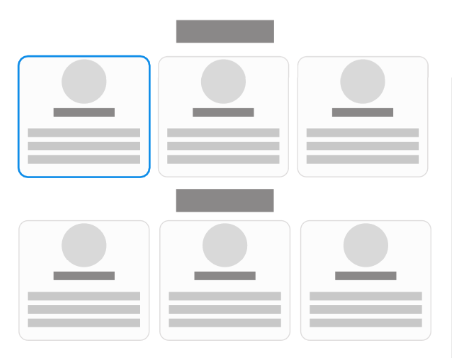
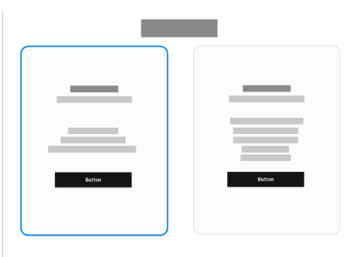
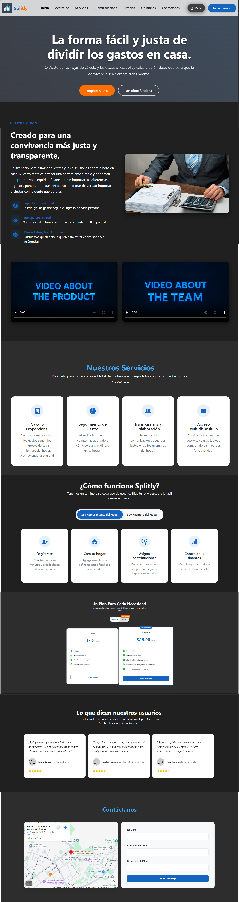
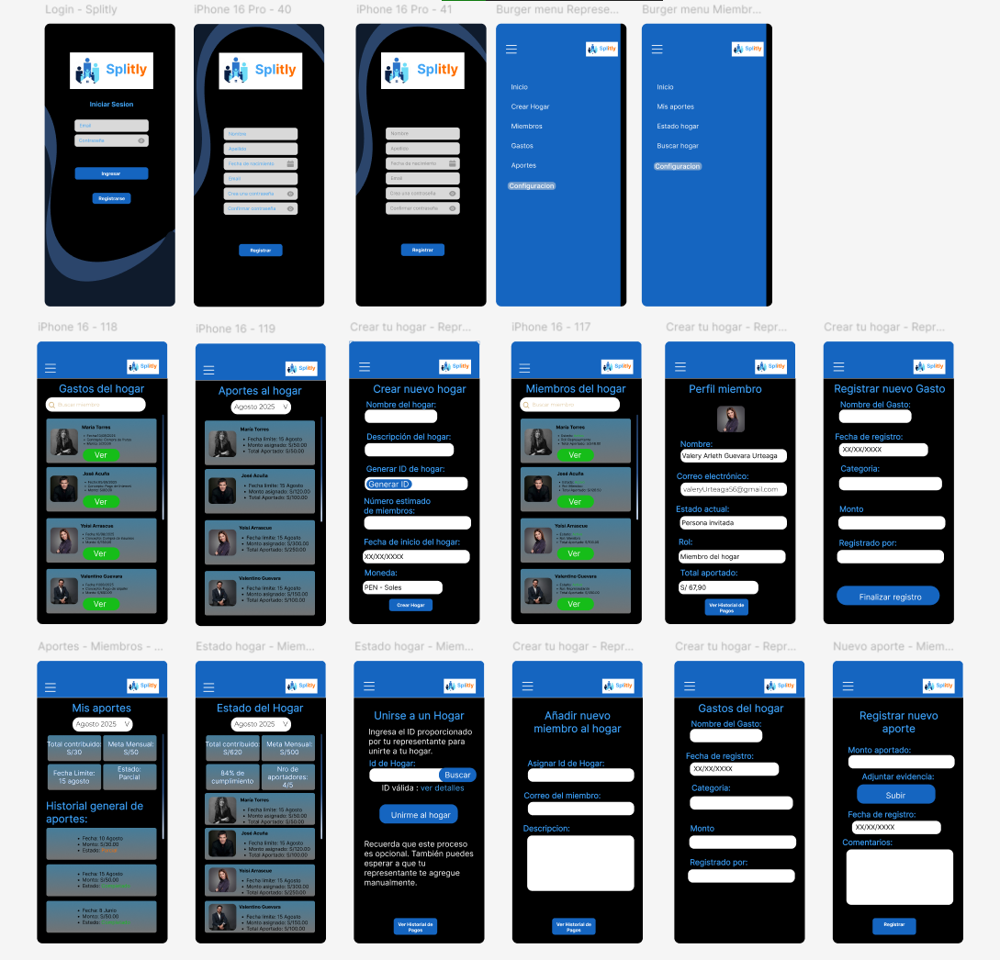

    

<h1 align="center">
    Universidad Peruana de Ciencias Aplicadas
</h1>

<h3 align="center">
    Carrera: Ingeniería de Software
       
    Curso: 1ACC0238 - Aplicaciones para Dispositivos Móviles
       
    Sección: 3667
       
    Profesor: Eduardo Martin Reyes Rodriguez
       
    Ciclo: 2026-01
       
    Informe de Trabajo Final
       
    Startup: GroupFund
       
    Producto: Splitly  
</h3>

| 
Alumno
       | 
Código
 |
|:-------------------------------------------:|:-------------------------------------:|
|  Martínez Valdivia, José Luis               |              u202213989               |
|       Ríos Pacheco, Héctor Javier           |              u20231c540               |
| Cuentas Peña, JoaquinAlberto                |              u20201f788               |
|       Ramirez Escalante, Walter Luis        |              u202221632               |
|       Miraval Pomalaya, Rodrigo Jesús       |              u202311082               |

 Abril 2026 

## Registro de Versiones del Informe
| Versión | Fecha      | Autor(es)      | Descripción de modificación       |
| ------- | ---------- | -------------------------------------------------------- | --------- |
| 0.1     | 22/04/2026 |            |         |

## Project Report Collaboration Insights  
**TB1**

# Tabla de Contenidos

- Capítulo I: Introducción  
  - [1.1 Startup Profile](#11-startup-profile)  
    - [1.1.1 Descripción de la Startup](#111-descripcion-de-la-startup)  
    - [1.1.2 Perfiles de integrantes del equipo](#112-perfiles-de-integrantes-del-equipo)  
  - [1.2 Solution Profile](#12-solution-profile)  
    - [1.2.1 Antecedentes y problemática](#121-antecedentes-y-problematica)  
    - [1.2.2 Lean UX Process](#122-lean-ux-process)  
      - [1.2.2.1 Lean UX Problem Statements](#1221-lean-ux-problem-statements)  
      - [1.2.2.2 Lean UX Assumptions](#1222-lean-ux-assumptions)  
      - [1.2.2.3 Lean UX Hypothesis Statements](#1223-lean-ux-hypothesis-statements)  
      - [1.2.2.4 Lean UX Canvas](#1224-lean-ux-canvas)  
  - [1.3 Segmentos objetivo](#13-segmentos-objetivo)  

- Capítulo II: Requirements Development and Software Solution Design  
  - [2.1 Competidores](#21-competidores)  
    - [2.1.1 Análisis competitivo](#211-analisis-competitivo)  
    - [2.1.2 Estrategias y tácticas frente a competidores](#212-estrategias-y-tacticas-frente-a-competidores)  

  - [2.2 Entrevistas](#22-entrevistas)  
    - [2.2.1 Diseño de entrevistas](#221-diseno-de-entrevistas)  
    - [2.2.2 Registro de entrevistas](#222-registro-de-entrevistas)  
    - [2.2.3 Análisis de entrevistas](#223-analisis-de-entrevistas)  

  - [2.3 Needfinding](#23-needfinding)  
    - [2.3.1 User Personas](#231-user-personas)  
    - [2.3.2 User Task Matrix](#232-user-task-matrix)  
    - [2.3.3 User Journey Mapping](#233-user-journey-mapping)  
    - [2.3.4 Empathy Mapping](#234-empathy-mapping)  
    - [2.3.5 Big Picture EventStorming](#235-big-picture-eventstorming)  
    - [2.3.6 Ubiquitous Language](#236-ubiquitous-language)  

  - [2.4 Requirements Specification](#24-requirements-specification)  
    - [2.4.1 User Stories](#241-user-stories)  
    - [2.4.2 Impact Mapping](#242-impact-mapping)  
    - [2.4.3 Product Backlog](#243-product-backlog)  

  - [2.5 Strategic-Level Domain-Driven Design](#25-strategic-level-domain-driven-design)  
    - [2.5.1 EventStorming](#251-eventstorming)  
      - [2.5.1.1 Candidate Context Discovery](#2511-candidate-context-discovery)  
      - [2.5.1.2 Domain Message Flows Modeling](#2512-domain-message-flows-modeling)  
      - [2.5.1.3 Bounded Context Canvases](#2513-bounded-context-canvases)  
    - [2.5.2 Context Mapping](#252-context-mapping)  
    - [2.5.3 Software Architecture](#253-software-architecture)  
      - [2.5.3.1 Software Architecture Context Level Diagrams](#2531-software-architecture-context-level-diagrams)  
      - [2.5.3.2 Software Architecture Container Level Diagrams](#2532-software-architecture-container-level-diagrams)  
      - [2.5.3.3 Software Architecture Deployment Diagrams](#2533-software-architecture-deployment-diagrams)  

  - [2.6 Tactical-Level Domain-Driven Design](#26-tactical-level-domain-driven-design)  
    - [2.6.x Bounded Context](#26x-bounded-context)  
      - [2.6.x.1 Domain Layer](#26x1-domain-layer)  
      - [2.6.x.2 Interface Layer](#26x2-interface-layer)  
      - [2.6.x.3 Application Layer](#26x3-application-layer)  
      - [2.6.x.4 Infrastructure Layer](#26x4-infrastructure-layer)  
      - [2.6.x.5 Component Level Diagrams](#26x5-component-level-diagrams)  
      - [2.6.x.6 Code Level Diagrams](#26x6-code-level-diagrams)  
        - [2.6.x.6.1 Domain Layer Class Diagrams](#26x61-domain-layer-class-diagrams)  
        - [2.6.x.6.2 Database Design Diagram](#26x62-database-design-diagram)  

- Capítulo III: Solution UI/UX Design  
  - [3.1 Product Design](#31-product-design)  
    - [3.1.1 Style Guidelines](#311-style-guidelines)  
      - [3.1.1.1 General Style Guidelines](#3111-general-style-guidelines)  

    - [3.1.2 Information Architecture](#312-information-architecture)  
      - [3.1.2.1 Organization Systems](#3121-organization-systems)  
      - [3.1.2.2 Labelling Systems](#3122-labelling-systems)  
      - [3.1.2.3 SEO Tags and Meta Tags](#3123-seo-tags-and-meta-tags)  
      - [3.1.2.4 Searching Systems](#3124-searching-systems)  
      - [3.1.2.5 Navigation Systems](#3125-navigation-systems)  

    - [3.1.3 Landing Page UI Design](#313-landing-page-ui-design)  
      - [3.1.3.1 Landing Page Wireframe](#3131-landing-page-wireframe)  
      - [3.1.3.2 Landing Page Mock-up](#3132-landing-page-mock-up)  

    - [3.1.4 Mobile Applications UX/UI Design](#314-mobile-applications-uxui-design)  
      - [3.1.4.1 Mobile Applications Wireframes](#3141-mobile-applications-wireframes)  
      - [3.1.4.2 Mobile Applications Wireflow Diagrams](#3142-mobile-applications-wireflow-diagrams)  
      - [3.1.4.3 Mobile Applications Mock-ups](#3143-mobile-applications-mock-ups)  
      - [3.1.4.4 Mobile Applications User Flow Diagrams](#3144-mobile-applications-user-flow-diagrams)  
      - [3.1.4.5 Mobile Applications Prototyping](#3145-mobile-applications-prototyping)  

- Capítulo IV: Product Implementation & Validation  
  - [4.1 Software Configuration Management](#41-software-configuration-management)  
    - [4.1.1 Software Development Environment Configuration](#411-software-development-environment-configuration)  
    - [4.1.2 Source Code Management](#412-source-code-management)  
    - [4.1.3 Source Code Style Guide & Conventions](#413-source-code-style-guide--conventions)  
    - [4.1.4 Software Deployment Configuration](#414-software-deployment-configuration)  

  - [4.2 Landing Page & Mobile Application Implementation](#42-landing-page--mobile-application-implementation)  
    - [4.2.1 Sprint n](#421-sprint-n)  
      - [4.2.1.1 Sprint Planning n](#4211-sprint-planning-n)  
      - [4.2.1.2 Sprint Backlog n](#4212-sprint-backlog-n)  
      - [4.2.1.3 Development Evidence for Sprint Review](#4213-development-evidence-for-sprint-review)  
      - [4.2.1.4 Testing Suite Evidence for Sprint Review](#4214-testing-suite-evidence-for-sprint-review)  
      - [4.2.1.5 Execution Evidence for Sprint Review](#4215-execution-evidence-for-sprint-review)  
      - [4.2.1.6 Services Documentation Evidence](#4216-services-documentation-evidence)  
      - [4.2.1.7 Software Deployment Evidence](#4217-software-deployment-evidence)  
      - [4.2.1.8 Team Collaboration Insights](#4218-team-collaboration-insights)  

  - [4.3 Validation Interviews](#43-validation-interviews)  
    - [4.3.1 Diseño de entrevistas](#431-diseno-de-entrevistas)  
    - [4.3.2 Registro de entrevistas](#432-registro-de-entrevistas)  
    - [4.3.3 Evaluaciones según heurísticas](#433-evaluaciones-segun-heuristicas)  

- [Conclusiones](#conclusiones)  
- [Conclusiones y recomendaciones](#conclusiones-y-recomendaciones)  
- [Video App Validation](#video-app-validation)  
- [Video About the Product](#video-about-the-product)  
- [Video About the Team](#video-about-the-team)  

**ABET – EAC - Student Outcome 7**

La capacidad de adquirir y aplicar nuevos
conocimientos según sea necesario,
utilizando estrategias de aprendizaje
apropiadas.

En el siguiente cuadro se describe las acciones realizadas y enunciados de conclusiones por parte del grupo,
que permiten sustentar el haber alcanzado el logro del ABET – EAC - Student Outcome 7.

| Criterio específico | Acciones realizadas | Conclusiones |
| :--- | :--- | :--- |
| **Actualiza conceptos y conocimientos necesarios para su desarrollo profesional y en especial para su proyecto en soluciones de software.** |  **Héctor Rios:** Contribuí realizando el capítulo 1 y organizando las ideas para la continuación del proyecto    **Jose Luis Martínez Valdivia:** Contribui en El desarrollo del capitulo 2 - Strategic Level Domain Driven Design    **Joaquin Alberto Cuentas Peña:** Contribuí en El desarrollo del capítulo 2 – con el análisis de segmentos objetivos, entrevistas y elaboración de personas    **Walter Luis Fajardo Monrroy:** Contribuí en el desarrollo de diagramas, así como segmentación de bounded context     **Rodrigo Jesus Miraval Pomalaya:** Contribui realizando parte del capítulo 2, con las user historias, el impact mapping y el product backlog.   |    **Héctor Rios** **TB1:** El desarrollo del capítulo 1 me permitió reforzar mis conocimientos sobre la estructura inicial de un proyecto de software. Sentí que este proceso me ayudó a entender mejor cómo plantear una base sólida, lo cual considero clave para mi crecimiento profesional.         **Jose Luis Martínez Valdivia:** El desarrollo del capitulo 2 me permitió comentar y enriquecer mis conocimientos de DDD y la forma en la que se debaten ideas para implementar una solución de Servicio Web    **Joaquin Alberto Cuentas Peña:** El desarrollo de este capítulo me permitió conocer la perspectiva de los usuarios que usarán la aplicación.     **Walter Luis Fajardo Monrroy:** El desarrollo de este capítulo permitirá a los desarrolladores asignar los bounded context y hacer consultas de funcionamiento e interconexión.    **Rodrigo Jesus Miraval Pomalaya:** El desarrollo del capítulo 2 me permitió profundizar en la construcción de artefactos clave como las user historias, el impact mapping y el product backlog. A través de este proceso, logré entender mejor cómo traducir necesidades del negocio en requerimientos claros y estructurados, facilitando una mejor organización del trabajo y priorización de funcionalidades dentro del proyecto   |
| **Reconoce la necesidad del aprendizaje permanente para el desempeño profesional y el desarrollo de proyectos en soluciones detecnologías de ingeniería de software** | **Héctor Rios:** Contribuí realizando el capítulo 1,sedimentando las bases del proyecto    **Jose Luis Martínez Valdivia:** Contribui en El desarrollo del capitulo 2 - Strategic Level Domain Driven Design    **Joaquin Alberto Cuentas Peña:** Reconocí las necesidades de los usuarios a través de entrevistas, así como sus gustos y molestias    **Walter Luis Fajardo Monrroy:** Reconocí segmentos, funcionalidades y los convertí en bounded context para desarrollo     **Rodrigo Jesus Miraval Pomalaya:** Contribui realizando parte del capítulo 2, con las user historias, el impact mapping y el product backlog.   | **Héctor Rios** **TB1:** A lo largo del desarrollo del capítulo 1, comprendí que siempre hay aspectos que mejorar y aprender. Esta experiencia me hizo reflexionar sobre la importancia de mantenerme en constante actualización para poder aportar mejor en futuros proyectos.    **Jose Luis Martínez Valdivia:** Durante El desarrollo de capitulo 2, logre entender los procesos y requerimientos que se deben llevar acabo para poder delimitar el alcance y arquitectura de desarrollo del proyecto a implementar    **Joaquin Alberto Cuentas Peña: :** Este conocimiento me permitió hacer un análisis y crear personas para enfocarnos en posibles requisitos funcionales    **Walter Luis Fajardo Monrroy:** El desarrollo de este capítulo me permitió aprender como segmentar bounded context en el contexto de desarrollo móvil    **Rodrigo Jesus Miraval Pomalaya:** Durante el desarrollo del capítulo 2, comprendí mejor cómo definir y organizar el alcance del proyecto. El uso de herramientas como el impact mapping y el product backlog me ayudó a estructurar las ideas, priorizar funcionalidades y tener una visión más clara del desarrollo del software.   |

## Objetivos SMART

## Capítulo I: Introducción

## 1.1 Startup Profile

### 1.1.1 Descripción de la Startup

**GroupFund** es una empresa emergente del sector tecnológico dedicada a desarrollar soluciones innovadoras para la gestión financiera en entornos de convivencia. Su producto principal, **Splitly**, está diseñado para facilitar la organización y distribución equitativa de los gastos compartidos del hogar, considerando los ingresos de cada miembro.  

A través de un sistema digital automatizado, claro y accesible, Splitly fomenta la responsabilidad económica, la comunicación eficaz y la adecuada gestión del presupuesto común, reduciendo conflictos y fortaleciendo una cultura de colaboración dentro del hogar.

**Título:** Splitly  

**Misión:** Brindar un manejo eficiente de las finanzas compartidas mediante una solución orientada a dispositivos móviles que distribuye los gastos de forma proporcional a los ingresos de cada integrante, fomentando la equidad, la claridad y una convivencia armoniosa.

**Visión:** Convertirse en la plataforma líder en la gestión financiera compartida en los hogares, reconocida por empoderar a las personas para tomar decisiones económicas justas, responsables y colaborativas. 

**Principios:** Transparencia, justicia y colaboración. 

### 1.1.2 Perfiles de integrantes del equipo

| Integrante | Descripción Personal | Conocimientos Técnicos |
|-------------|----------------------|-------------------------|
| **José Luis Martínez Valdivia - u202213989**    | Soy una persona responsable, comprometida con mis objetivos y con gran disposición para aprender continuamente. Me adapto con facilidad al trabajo en equipo, aportando ideas y soluciones. Valoro mucho la eficiencia, la ética profesional y la mejora constante. Me esfuerzo por entregar siempre resultados de calidad, gestionando mis tareas con orden y enfoque.      | Desarrollador de resolución de problemas de .NET con experiencia en C#, JavaScript, TypeScript, C++, HTML CSS. Además de .NET, .Net Core, Angular, React.Trabajo bien tanto individualmente como en un ambiente de equipo.         |
| **Héctor Javier Rios Pacheco - u20231c540**     |  Soy responsable, me gusta involucrarme activamente en los proyectos, aportar ideas útiles y cumplir con mis tareas a tiempo. Siempre estoy dispuesto a colaborar y ayudar al equipo a avanzar de la mejor manera posible.     |  Cuento con formación en desarrollo de software, incluyendo estructuras de datos, algoritmos y arquitecturas orientadas a servicios. Trabajo con lenguajes como Java, TypeScript, JavaScript, HTML5 y CSS3, y utilizo herramientas y frameworks como Angular, Spring Boot, Git/GitHub, Swagger y bases de datos relacionales.       |
| **Joaquin Alberto Cuentas Peña - u20201f788**  |   Soy responsable, me gusta aprender cosas nuevas y apoyar a mis compañeros cuando lo necesitan. Siempre estoy dispuesto a desafiarme y a desafiar a mis compañeros para sacar lo mejor de nosotros    |   Mi experiencia en desarrollo de software incluye conocimientos de algoritmos hasta estructuras de datos en distintos lenguajes como C++ y python. Asimismo he trabajado con tecnologías como angular, vue, flask y fast Appi. Me intereso en expandir mis conocimientos en backend.       |
| **Walter Luis Fajardo Monrroy - u202221632**     |   Soy un integrante comprometido y adaptable, apasionado por adquirir nuevos conocimientos que agreguen valor al proyecto. Priorizo el éxito del equipo brindando apoyo constante a mis compañeros, a quienes motivo a superar sus límites    |    Mi formación técnica abarca desde la lógica algorítmica hasta la gestión de estructuras de datos complejas en lenguajes como C++ y Rust. He trabajado en el ecosistema frontend con Svelte y Vue, complementando mi perfil con el manejo de herramientas como Go y NestJS     |
| **Rodrigo Jesús Miraval Pomalaya - u202311082**      |  Mi nombre es Rodrigo Jesus Miraval Pomalaya y estudio Ingeniería de Software en la Universidad Peruana de Ciencias Aplicadas. Me considero una persona adaptable y detallista, siempre en busca de aprender y mejorar en lo que hago. Me gusta aplicar lo aprendido en proyectos académicos y trabajar en equipo, ya que compartir ideas no solo ayuda a obtener mejores resultados, sino también a ampliar mi visión en la carrera.       | Tengo conocimientos en Python, JavaScript, HTML y CSS, además de un nivel intermedio en SQL Server y MySQL.       |

## 1.2. Solution Profile

**Splitly**, producto desarrollado por **GroupFund**, es una solución integral compuesta por una aplicación móvil (nativa/multiplataforma) y un sitio web estático (Landing Page)l diseñada para facilitar la distribución equitativa de los gastos del hogar entre sus miembros, considerando los ingresos personales de cada individuo. La plataforma calcula automáticamente el aporte correspondiente de cada integrante, basándose en su situación económica, y garantiza así una distribución justa de los gastos compartidos como alquiler, servicios esenciales y alimentos.  

Técnicamente, la aplicación móvil aprovecha las capacidades del dispositivo para optimizar la experiencia del usuario: soporte de almacenamiento local, y acceso a recursos internos del dispositivo (como la cámara para registrar recibos y pagos realizados). Además, toda la lógica de negocio se integra de forma segura con un servicio RESTful de desarrollo interno, y se conecta a un servicio externo de terceros (pasarela de pagos) para procesar y validar las transferencias directamente desde la app.

Los usuarios pueden registrar sus ingresos, conocer cuánto deben contribuir y monitorear sus pagos, mientras que la persona responsable de la gestión del hogar obtiene una visión integral del proceso. Además, Splitly ofrece monitoreo en tiempo real, informes mensuales claros y alertas de pagos pendientes mediante notificaciones push en sus dispositivos.

Con una interfaz intuitiva y accesible, la aplicación no solo simplifica la gestión de las finanzas, sino que también promueve la transparencia, la confianza y la cooperación entre los integrantes del hogar, reduciendo posibles conflictos y asegurando un manejo económico eficaz y equilibrado.  

### 1.2.1. Antecedentes y Problemática

Enunciado del problema: La ausencia de un método equitativo para distribuir los gastos compartidos en pequeñas comunidades genera tensiones financieras y de convivencia entre sus integrantes.

Objetivos del Proyecto: Desarrollar una aplicación móvil que automaticen el cálculo de aportes proporcionales, faciliten la visibilidad de los gastos mediante servicios RESTful y permitan registrar y pagar deudas usando integración con APIs de terceros.

Restricciones: La solución móvil debe ser nativa o multiplataforma, implementando obligatoriamente almacenamiento local, uso de recursos del hardware (cámara) e integración con servicios de terceros y propios.

La metodología **5W y 2H** es un recurso utilizado para analizar la causa fundamental de un problema, error o discrepancia en los sistemas. Esta metodología, promovida por Toyota, constituye un pilar del Sistema de Producción Toyota (TPS). Según Taichii Ohno, permite comprender con claridad los problemas y facilita la implementación de acciones correctivas o preventivas (Palko et al., 2015). Asimismo, es un enfoque adaptable que puede aplicarse en diversos tipos de organizaciones, convirtiéndose en una herramienta valiosa para la resolución de disputas y la optimización de procesos.  

---

### What – ¿Cuál es la dificultad?

La cuestión central se encuentra en la ausencia de una repartición equitativa de los gastos en hogares con ingresos desiguales. Esto origina contribuciones desiguales que producen tensiones y posibles disputas entre los miembros, especialmente cuando se intenta repartir los gastos sin tener en cuenta la situación económica de cada individuo.

**¿Cuál es el vínculo con la persona mencionada?**  
El sistema tiene como objetivo que cada miembro pueda observar su contribución correspondiente desde su dispositivo móvil y cumplir con ella de forma equitativa. El responsable del hogar asume la tarea de supervisar el proceso y asegurar la igualdad en las aportaciones.

---

### When – ¿Cuándo ocurre el inconveniente?

La dificultad aparece principalmente en los momentos en que se deben pagar las facturas del hogar, las cuales suelen ser mensuales. Al repartir los gastos sin un cálculo justo, las discrepancias en los ingresos se hacen visibles y provocan problemas.

**¿Cuándo emplea el consumidor el artículo?**  
El producto se utiliza cada vez que se incurre en un gasto compartido, como servicios, alquiler, alimentos o compras en general. Al concluir cada mes, los usuarios pueden revisar desde la app el estado de los pagos efectuados y las deudas por saldar.

---

### Where – ¿Dónde ocurre?

**¿En qué lugar se encuentra el cliente al utilizar el producto?**  
EEl cliente suele estar en su casa o en cualquier lugar con conexión a Internet, mediante un dispositivo móvil.

**¿Hacia dónde se encamina?**  
El usuario ingresa al panel principal de la app móvil para examinar en detalle los gastos, las contribuciones que debe efectuar y los pagos pendientes.

**¿Cuál es el origen del problema?**  
El conflicto se origina en el hogar, cuando es necesario dividir los gastos compartidos (como luz, agua, alimentos, alquiler, etc.) y no se dispone de un método digital y accesible en todo momento que permita realizar esta división de manera equitativa y proporcional.

---

### Why – ¿Por qué ocurre?

La razón principal es la falta de un sistema claro y justo que facilite el cálculo de las contribuciones conforme a los ingresos de cada individuo. La ausencia de proporcionalidad provoca que algunos paguen más de lo que les corresponde y otros menos, generando descontento y disputas.

---

### Who – ¿Quiénes están involucrados?

**¿Quiénes están involucrados?**  
Los actores principales son los integrantes del hogar que comparten los costos, así como el encargado de gestionar dichos gastos.

**¿A quiénes les ocurre el problema?**  
Afecta a todas las personas que conviven y comparten responsabilidades financieras: familias, parejas o compañeros de vivienda con distintos niveles de ingresos.

**¿Quién hará uso de esto?**  
Todos los integrantes del hogar, ya que cada uno podrá revisar su aporte proporcional llevando el control en sus propios smartphones. El representante será responsable de planificar y supervisar la adecuada distribución de los gastos.

---

### How - ¿Cómo ocurre el problema?

#### ¿Cómo ocurre el problema?

La dificultad surge al momento de repartir los gastos compartidos (alquiler, servicios básicos, alimentos, entre otros) sin considerar un criterio proporcional a los ingresos de cada miembro, lo que provoca aportes desiguales.

#### ¿En qué condiciones los clientes usan nuestro producto?

Los usuarios recurrirán al producto cuando deseen calcular su aporte proporcional en los gastos del hogar o revisar cuánto han abonado y qué parte aún tienen pendiente de acuerdo con sus ingresos. Asimismo, podrán emplearlo para llevar un control más ordenado de las finanzas compartidas.

#### ¿Qué llevará a la persona a usar nuestro producto?

La persona recurrirá al producto ante la necesidad de dividir los gastos del hogar de manera justa, la falta de claridad en las aportaciones o el interés por prevenir conflictos financieros dentro de la convivencia. Del mismo modo, si desean consultar los montos pendientes de forma clara y en tiempo real, la inmediatez de una app móvil funcionará como una herramienta práctica.

<strong>Representación de costo promedio de errores en cálculos manuales - 2020</strong>

  

Fernando Blanco P. (2020). Gráfico de LDL – ESTADÍSTICA VISUAL (VIII). Gráficos con barras de error: manual de usuario – Lima, 2020

<em>Figura: Representación visual del costo promedio de errores manuales.</em>

---

### How much - ¿Cúanto?

#### ¿Cuánto impacta en la convivencia y las finanzas no dividir equitativamente los gastos?

Genera tensiones, discusiones y desequilibrios económicos dentro del hogar, mientras que con la implementación de la aplicación se logra transparencia, justicia en las aportaciones y una mejor organización financiera compartida.

## 1.2.2 Lean UX Process

El Lean UX se define como un proceso en el que varios colaboradores trabajan juntos de manera continua y repetitiva, centrado en la experimentación y el aprendizaje constante. A diferencia de los métodos convencionales, este enfoque no se centra en la creación de una documentación detallada, sino que enfatiza la elaboración de prototipos y la ejecución de pruebas rápidas. Estas pruebas se realizan con usuarios auténticos y en situaciones específicas, lo que facilita la validación de hipótesis y la realización de cambios en el producto basados en la evidencia recopilada. Su propósito esencial es minimizar el desperdicio de recursos y optimizar la eficiencia en el ciclo de desarrollo, facilitando que los equipos de diseño y desarrollo puedan adaptarse con mayor agilidad a las demandas y expectativas de los usuarios (Gothelf & Seiden, 2013).

### 1.2.2.1 Lean UX Problem Statements

Los miembros de un mismo hogar con ingresos desiguales (como roommates, parejas o familias) enfrentan dificultades constantes al intentar dividir sus gastos compartidos de manera justa. Las herramientas tradicionales no consideran la capacidad adquisitiva real de cada integrante o no permiten una división rápida y auditable por el resto, lo que resulta en un sistema de cobro rígido.

Hemos observado que esta falta de proporcionalidad genera tensiones, desconfianza y conflictos domésticos entre los convivientes, afectando negativamente la organización económica del hogar. Al no contar con una plataforma accesible y transparente que refleje su realidad, los usuarios sienten que asumen cargas financieras injustas, lo que provoca desmotivación y un manejo ineficiente del presupuesto común.

¿Cómo podríamos desarrollar una aplicación móvil que automatice la distribución de los gastos del hogar de forma proporcional a los ingresos de cada integrante, facilitando el registro de recibos y el pago de cuotas, para fortalecer la equidad, la transparencia y la convivencia financiera?

### 1.2.2.2 Lean UX Assumptions

### Supuestos del Negocio – Splitly

1. **Creo que mis clientes tienen la necesidad de:**  
   Organizar, transparentar y distribuir equitativamente los gastos compartidos del hogar (alquiler, servicios, alimentos) basándose en los ingresos reales de cada miembro, para evitar tensiones financieras y conflictos de convivencia.

2. **Estas necesidades pueden resolverse con:**  
   Splitly, una solución digital conformada por una aplicación móvil, que calcula aportes proporcionales automáticamente, permite escanear recibos físicos usando la cámara del dispositivo, y facilita la liquidación de deudas mediante la integración con una pasarela de pagos de terceros.

3. **Mis clientes iniciales son (o serán):**  
   - Jóvenes profesionales y estudiantes universitarios que comparten departamento (roommates).  
   - Parejas jóvenes o familias con ingresos económicos dispares que buscan mayor transparencia financiera.

4. **El principal valor que un cliente quiere obtener de mi servicio es:**  
   Justicia financiera, transparencia y reducción drástica de las discusiones por dinero dentro del hogar.  
   **También pueden obtener estos beneficios adicionales:**  
   Ahorro de tiempo en cálculos manuales, recordatorios automáticos de pago (notificaciones push), y un historial claro y accesible del estado de las finanzas.

5. **Adquiriré la mayoría de mis clientes a través de:**  
   - Nuestro sitio web estático (Landing Page) optimizado para motores de búsqueda (SEO).  
   - Marketing digital en redes sociales dirigido a grupos demográficos jóvenes.  
   - Recomendaciones "boca a boca" e invitaciones directas enviadas desde la app por el representante del hogar hacia sus convivientes.

6. **Ganaré dinero mediante:**  
   - Modelo Freemium: acceso gratuito a las funciones de cálculo proporcional básico.     
   - Comisiones transaccionales derivadas de los pagos procesados a través de nuestra integración API con pasarelas de pago.

7. **Mi principal competencia en el mercado será:**  
   Aplicaciones genéricas de división de gastos, hojas de cálculo manuales (Excel) y la simple memoria o acuerdos informales.  
   **Superaremos a la competencia debido a:**  
   Nuestro algoritmo de cálculo enfocado estrictamente en la proporcionalidad de los ingresos, el uso de hardware (cámara) para automatizar ingresos de recibos, y la experiencia fluida de liquidar la deuda directamente desde la misma app móvil.

8. **El mayor riesgo de mi producto es:**  
   La desconfianza de los usuarios al tener que registrar sus ingresos reales en una plataforma digital o la reticencia a enlazar métodos de pago en una app nueva.  
   **Lo resolveremos mediante:**  
   Políticas de privacidad estrictas, encriptación de datos, un diseño que denote seguridad institucional, y alianzas con pasarelas de pago de terceros ampliamente reconocidas y confiables.

9. **Otras suposiciones que, si se demuestran falsas, harán que nuestro negocio fracase:**  
   - Que las personas están dispuestas a transparentar su nivel de ingresos con sus convivientes.  
   - Que los usuarios prefieran descargar una app dedicada a este fin en lugar de usar transferencias bancarias directas (Yape/Plin) con cálculos mentales.  
   - Que los usuarios cuenten con dispositivos móviles con capacidad de almacenamiento y características de hardware necesarias para correr la aplicación fluidamente.

   ### Supuestos del Cliente – Splitly

1. **¿Quién es el cliente?**  
   Jóvenes profesionales y estudiantes universitarios que comparten departamento (roommates), así como parejas jóvenes o familias con ingresos económicos dispares que buscan una gestión más justa de los gastos del hogar.

2. **¿Dónde encaja nuestro producto en su vida?**  
   En su vida cotidiana dentro del hogar compartido, específicamente en la gestión mensual de gastos como alquiler, servicios, alimentos y otros gastos comunes.

3. **¿Qué problemas soluciona nuestro producto?**  
   - Conflictos y tensiones por la división desigual o poco clara de los gastos.  
   - Falta de transparencia en los aportes de cada miembro del hogar.  
   - Pérdida de tiempo realizando cálculos manuales.  
   - Dificultad para llevar un registro ordenado de pagos y deudas.

4. **¿Cuándo y cómo se utiliza nuestro producto?**  
   - Uso frecuente al registrar gastos compartidos (diarios o semanales).  
   - Uso mensual al calcular y distribuir los gastos totales del hogar.  
   - Uso puntual al escanear recibos físicos o al realizar pagos entre convivientes.  
   - Acceso a través de la app móvil para gestionar gastos, revisar balances y liquidar deudas.

5. **¿Qué características son importantes?**  
   - Cálculo automático proporcional basado en ingresos.  
   - Integración con pasarelas de pago.  
   - Notificaciones y recordatorios de pago.  
   - Historial claro y accesible de gastos y deudas.

6. **¿Cómo debe verse y comportarse nuestro producto?**  
   - Diseño moderno, intuitivo y fácil de usar.  
   - Interfaz clara que transmita confianza y seguridad.  
   - Navegación fluida en dispositivos móviles.  
   - Respuestas rápidas, cálculos precisos.

### 1.2.2.3 Lean UX Hypothesis Statements

**Hipótesis 1 – Distribución equitativa de gastos**  
Creemos que automatizar la asignación de contribuciones según los ingresos individuales aumentará la equidad y reducirá los conflictos financieros.  
**Consideraremos que hemos alcanzado el éxito cuando** el **70 % de los usuarios** manifieste una **disminución en las discusiones por dinero** y una **mayor satisfacción con la gestión financiera** durante los primeros tres meses.

**Hipótesis 2 – Transparencia y control del representante del hogar**  
Suponemos que al ofrecer reportes automáticos y alertas visuales, el representante del hogar logrará fortalecer la transparencia y el cumplimiento de pagos.  
**Consideraremos que hemos alcanzado el éxito cuando** el número de **pagos atrasados se reduzca en un 50 %**, y el **60 % de los hogares** utilice activamente el panel de control.

**Hipótesis 3 – Adopción y facilidad de uso**  
Creemos que una interfaz intuitiva y adaptable incrementará la adopción del sistema incluso entre usuarios con poca experiencia digital.  
**Consideraremos que hemos alcanzado el éxito cuando** el **80 % de los usuarios** complete el registro y uso básico sin requerir asistencia técnica.

**Hipótesis 4 – Cultura de ahorro cooperativo**  
Consideramos que introducir metas de ahorro compartidas fomentará la planificación y cooperación económica familiar.  
**Consideraremos que hemos alcanzado el éxito cuando** al menos el **50 % de los hogares** cree y mantenga una **meta de ahorro en común** durante los primeros dos meses.

### 1.2.2.4 Lean UX Canvas

### 1.3 Segmentos objetivo

Para el modelo de negocio de Splitly, se han identificado dos segmentos principales que interactuarán con la solución móvil y web. A continuación, se detallan sus perfiles y el sustento estadístico que valida la necesidad del producto en el mercado.

---

#### Segmento objetivo 1: Convivientes y Roommates (Miembros del hogar)

##### Aspectos demográficos
- Sexo: Masculino y femenino  
- Edad: 18 – 65 años  
- Nivel socioeconómico: Clases A, B y C (alta, media-alta y media)  
- Estado civil: Solteros, casados, convivientes, parejas, compañeros de cuarto  

##### Aspectos geográficos
- Nacionalidad: Peruana  
- Zona geográfica: Urbana y suburbana  
- Departamento: Lima Metropolitana y principales ciudades del país  

##### Aspectos psicográficos
- Buscan una forma justa y equitativa de compartir gastos del hogar (alquiler, servicios, alimentación, etc.)  
- Están interesados en herramientas que brinden transparencia y simplicidad en la gestión de las finanzas  
- Se preocupan por mantener un equilibrio financiero entre los miembros del hogar, asegurando que cada uno aporte de acuerdo a sus ingresos  
- Tienen un estilo de vida basado en la convivencia y la corresponsabilidad, por lo que valoran soluciones que reduzcan discusiones y simplifiquen la organización de pagos  

##### Información estadística de sustento
Según un estudio de Ipsos Perú sobre Perfiles Socioeconómicos, la convivencia entre jóvenes (roommates) o parejas sin casarse ha aumentado significativamente en zonas urbanas debido al alto costo de los alquileres. Además, reportes del sector inmobiliario indican que más del 40% de los jóvenes profesionales optan por compartir departamento para aligerar la carga económica. A nivel de comportamiento financiero, la Superintendencia de Banca, Seguros y AFP (SBS) señala que la población joven y adulta joven es altamente afín a la adopción de billeteras digitales (como Yape o Plin) y aplicaciones móviles para resolver sus transacciones cotidianas, lo que valida la disposición de este segmento a utilizar una app como Splitly para liquidar sus deudas.

---

#### Segmento objetivo 2: Representante o Administrador del hogar

##### Aspectos demográficos
- Sexo: Masculino y femenino  
- Edad: 25 – 50 años  
- Nivel socioeconómico: Clases A, B y C (alta, media-alta y media)  
- Estado civil: Casados, convivientes, parejas con hijos o personas encargadas de la administración financiera del hogar  

##### Aspectos geográficos
- Nacionalidad: Peruana  
- Zona geográfica: Urbana y suburbana  
- Departamento: Lima Metropolitana y principales ciudades del país  

##### Aspectos psicográficos
- Son responsables de la planificación y control de los gastos familiares, buscando asegurar la equidad entre los integrantes  
- Muestran interés en herramientas digitales que permitan monitorear y organizar finanzas de manera práctica  
- Buscan evitar conflictos financieros dentro del hogar mediante claridad y control en los aportes de cada miembro  
- Están comprometidos con la eficiencia en la gestión de recursos y valoran soluciones que distribuyan gastos de manera proporcional y transparente  

##### Información estadística de sustento
De acuerdo con encuestas de Datum Internacional sobre la economía familiar en Perú, más del 65% de las familias y hogares afirman que el pago de servicios básicos (agua, luz, internet) y alimentación representan su mayor carga de estrés a fin de mes. En muchos de estos hogares, suele haber un "administrador principal" (generalmente uno de los miembros de la pareja) que asume la carga mental de recolectar el dinero y pagar los recibos. Por otro lado, datos de la Cámara Peruana de Comercio Electrónico (CAPECE) muestran que la digitalización y el uso de smartphones para la gestión de finanzas creció por encima del 50% en los últimos años en los sectores A, B y C. Esto demuestra que los administradores del hogar ya cuentan con las capacidades tecnológicas y el dispositivo necesario para adoptar Splitly y digitalizar la captura de recibos y el cobro.

# Capítulo II: Requirements Elicitation & Analysis

## 2.1. Competidores

### 2.1.1. Análisis competitivo

Mediante un análisis comparativo, hemos organizado información clave de cada propuesta de valor. Esto nos ayudará a entender mejor en qué se diferencia nuestra solución y compararla con las de nuestros competidores.

| Categoría | Detalle | **Splitly** | **Halfway** | **UnityPay** | **Parity** |
| :--- | :--- | :--- | :--- | :--- | :--- |
| **¿Por qué este análisis?** | **Objetivo** | Automatizar la distribución de los gastos del hogar de forma proporcional a los ingresos de cada integrante. | Identificar el estándar de automatización de gastos en parejas. | Evaluar la flexibilidad de las reglas de equidad financiera. | Analizar la experiencia de usuario en apps de nicho de reciente lanzamiento. |
| **Perfil** | **Overview** | Aplicación móvil y sitio web estático diseñados para facilitar la distribución equitativa de gastos del hogar considerando los ingresos personales de cada individuo. | App que automatiza finanzas compartidas mediante sincronización bancaria directa. | Plataforma de gestión de dinero para parejas que permite configurar "reglas de equidad". | App móvil minimalista enfocada exclusivamente en el cálculo porcentual por ingresos. |
| | **Ventaja Competitiva** | Algoritmo de cálculo enfocado estrictamente en la proporcionalidad de los ingresos, uso de la cámara para automatizar ingresos de recibos y liquidación de deudas directamente desde la app. | Sincronización bancaria en tiempo real (EE.UU./UK) que elimina el registro manual. | Permite gestionar tanto gastos compartidos como metas de ahorro en una sola cuenta. | Interfaz extremadamente simple centrada en el cálculo rápido sin fricciones. |
| **Marketing** | **Mercado Objetivo** | Jóvenes profesionales y estudiantes universitarios que comparten departamento (roommates). Parejas jóvenes o familias con ingresos económicos dispares. | Parejas estables y matrimonios que buscan independencia financiera. | Parejas jóvenes "Tech-savvy" con objetivos financieros comunes (viajes, casa). | Parejas jóvenes (Gen Z y Millenials) que inician su convivencia. |
| | **Estrategias de Marketing** | Sitio web estático optimizado para motores de búsqueda (SEO). Marketing digital en redes sociales. Recomendaciones "boca a boca" e invitaciones directas desde la app. | Marketing de contenido sobre "paz mental" y salud financiera en la relación. | Alianzas con influencers de finanzas personales y estilo de vida. | Redes sociales visuales (TikTok/Instagram) enfocadas en simplicidad. |
| **Producto** | **Productos & Servicios** | Cálculo automático proporcional basado en ingresos. Integración con pasarelas de pago. Notificaciones y recordatorios de pago. Historial claro y accesible de gastos y deudas. | División automática, seguimiento de facturas, reportes mensuales. | Cuentas conjuntas virtuales, reglas de división personalizadas, fondos de ahorro. | Calculadora de proporción salarial, registro manual de gastos, alertas de pago. |
| | **Precios & Costos** | Modelo Freemium con acceso gratuito a funciones de cálculo proporcional básico. Comisiones transaccionales por pagos procesados mediante integración de API. | Modelo Freemium con suscripción para conexión bancaria ilimitada. | Suscripción mensual por pareja para acceder a todas las reglas de equidad. | Gratuita con anuncios o pago único para eliminar publicidad. |
| | **Distribución** | Aplicación móvil (nativa/multiplataforma). Sitio web estático (Landing Page). | iOS y Android (enfocado en mercados anglosajones). | iOS y Android (Global). | Principalmente iOS. |
| **SWOT** | **Fortalezas** | Algoritmo de cálculo proporcional de ingresos. Uso de hardware (cámara) para automatizar el ingreso de recibos físicos. Experiencia fluida para liquidar deudas desde la app. | Robustez tecnológica y automatización real vía API bancaria. | Gran flexibilidad en la personalización de las reglas de división. | Curva de aprendizaje casi nula y diseño moderno. |
| | **Debilidades** | Posible desconfianza de los usuarios para registrar ingresos reales en una plataforma digital o enlazar métodos de pago en una app nueva. | Muy dependiente de la infraestructura bancaria local. | Puede resultar compleja de configurar inicialmente. | Funcionalidades limitadas; no gestiona ahorros ni inversiones. |
| | **Oportunidades** | La población joven es altamente afín a la adopción de billeteras digitales y apps móviles. La digitalización para gestión de finanzas creció más del 50% en los últimos años en sectores A, B y C. | Expansión a mercados internacionales donde el Open Banking crece. | Integración con sistemas de pago directo (como wallets digitales). | Posicionarse como la app de entrada para quienes nunca han compartido gastos. |
| | **Amenazas** | Aplicaciones genéricas de división de gastos y métodos informales (Excel, memoria). Riesgo de que los usuarios prefieran transferencias bancarias directas (Yape/Plin) realizando cálculos mentales. | Apps de banca tradicional lanzando funciones de "cuentas compartidas". | Competencia directa de neobancos que ya incluyen gestión de gastos. | Facilidad de ser copiada por apps de gestión de gastos más grandes. |

### 2.1.2. Estrategias y tácticas frente a competidores
Para que Splitly penetre con éxito en el mercado, la estrategia que seguiremos se enfocará en integrarse fluidamente a los hábitos de pago diarios del segmento joven mediante las pasarelas de paga conocidas en el país. A nivel de producto, el verdadero diferenciador será aprovechar la función de cálculo proporcional no solo para dividir gastos, sino para proyectar metas de ahorro compartidas que mejoren la salud financiera del hogar. 

Asimismo, será crucial implementar un modelo de privacidad y "onboarding" amigable donde los ingresos absolutos se mantengan ocultos para el resto de los convivientes, mostrando únicamente los porcentajes de deuda correspondientes a cada uno. De esta manera, estaremos garantizando la equidad sin vulnerar la confidencialidad de los demás.
## 2.2. Entrevistas

### 2.2.1. Diseño de entrevistas

### Segmento objetivo 1: Convivientes y Roommates (Miembros del hogar)

**Aspectos demográficos y psicográficos clave**

- Sexo: Masculino o femenino
- Edad: 18 a 65 años
- Nivel socioeconómico: A, B, y C
- Estado civil: Solteros, casados, convivientes, parejas, roommates
- Zona: Urbana y suburbana (Perú)

**Preguntas demográficas:**

1. ¿Me podria decir su edad?
2. ¿Cual es su sexo?
3. ¿En que zona vive actualmente?
4. ¿Con cuál de estas opciones se identifica su nivel socioeconómico? (A / B / C)
5. ¿Cuál es su estado civil o situación actual?

**Preguntas Principales:**

1. ¿Con quién vive actualmente y cómo reparten los gastos del hogar?
2. ¿Considera justo el sistema que usan para dividir los pagos? ¿Por qué?
3. ¿Cuáles son los mayores retos al organizar los gastos compartidos?
4. ¿Han tenido desacuerdos por temas de dinero o pagos en el hogar?
5. ¿Han considerado dividir los gastos en función de los ingresos de cada persona?
6. ¿Utilizan alguna app para anotar los pagos del hogar? ¿Cuál y qué tan útil les resulta?
7. ¿Qué funcionalidades cree que debería tener una app ideal para gestionar gastos entre varias personas?
8. ¿Cómo le gustaría visualizar lo que le toca pagar, lo que ya pagó y lo que está pendiente?
9. ¿Cree que una aplicación como Splitly podría ayudar a mejorar la convivencia y la organización en su hogar?

### Segmento objetivo 2: Representante o Administrador del hogar

**Aspectos demográficos y psicográficos clave**

- Sexo: Masculino o femenino
- Edad: 25 a 50 años
- Nivel socioeconómico: A, B, y C
- Estado civil: Casados, convivientes, parejas con hijos, personas responsables de las finanzas del hogar
- Zona: Urbana y suburbana (Perú)

**Preguntas demográficas:**

1. ¿Me podria decir su edad?
2. ¿Cual es su sexo?
3. ¿En que zona vive actualmente?
4. ¿Con cuál de estas opciones se identifica su nivel socioeconómico? (A / B / C)
5. ¿Cuál es su estado civil o situación actual?

**Preguntas Principales:**

1. ¿Cuál es su rol dentro de su hogar en cuanto a la administración del dinero?
2. ¿Cómo organiza actualmente los ingresos y gastos del hogar?
3. ¿Considera que el reparto de los gastos es equitativo para todos los miembros?
4. ¿Qué dificultades enfrenta para lograr un reparto justo de los gastos?
5. ¿Cómo controla que cada miembro cumpla con su parte financiera?
6. ¿Qué herramientas (apps, cuadernos, Excel, etc.) usa actualmente para llevar este control?
7. ¿Qué funcionalidades le gustaría que tenga una app como Splitly?
8. ¿Qué tan importante considera la transparencia financiera dentro del hogar?
9. ¿Estaría dispuesto(a) a registrar los ingresos de cada miembro para que la aplicación calcule automáticamente cuánto debe aportar cada uno?
10. ¿Qué beneficios cree que traería una solución como Splitly en la convivencia familiar?

### 2.2.2. Registro de entrevistas

En esta sección, se registra cada entrevista realizada. En total, se realizaron tres entrevistas por cada segmento objetivo. Se detalla el nombre del miembro entrevistador y el del entrevistado. Además, se redacta un resumen general del contenido de la entrevista realizada.

Segmento Objetivo 1: Miembros del hogar
  
Entrevista 1:  

| Entrevista | Registro |  
| ----- | ----- |  
| 

 | **Zona:** Magdalena  **Entrevistada:** Maria Fernanda |  
| [Link](https://upcedupe-my.sharepoint.com/personal/u20201f788_upc_edu_pe/_layouts/15/stream.aspx?id=%2Fpersonal%2Fu20201f788%5Fupc%5Fedu%5Fpe%2FDocuments%2Fupc%2Dpre%2D202601%2Dcc238%2D3667%2DSplitly%20needfinding%2Dsprint%2D1%20%2Emp4&nav=eyJyZWZlcnJhbEluZm8iOnsicmVmZXJyYWxBcHAiOiJTdHJlYW1XZWJBcHAiLCJyZWZlcnJhbFZpZXciOiJTaGFyZURpYWxvZy1MaW5rIiwicmVmZXJyYWxBcHBQbGF0Zm9ybSI6IldlYiIsInJlZmVycmFsTW9kZSI6InZpZXcifX0&ga=1&referrer=StreamWebApp%2EWeb&referrerScenario=AddressBarCopied%2Eview%2E42e1c332%2Df797%2D4b13%2Dbfa1%2D69414c126315)|  **Entrevistador:** Jose Luis Martinez Valdivia |  
| Timing: Minuto 0:00-4:10| **Resumen:** María Fernanda, de 20 años, es soltera y vive con su familia. En su hogar, los gastos se dividen entre todos los miembros, lo que en general les permite cubrir sus necesidades de manera organizada. Ella considera que el sistema que llevan actualmente para gestionar los gastos es eficiente, ya que cada integrante asume una parte proporcional, pero reconoce que su mayor dificultad está en mantener un registro claro y ordenado de cada desembolso. Para ella, contar con una aplicación que ofrezca registros rápidos y fáciles de consultar sería de gran utilidad, pues le permitiría llevar un control más transparente y evitar confusiones en el futuro. Como tecnologias utiliza un celular iphone con IOS 25.|  

Entrevista 2:  
  
| Entrevista | Registro |  
| ----- | ----- |  
| 

 | **Zona:** Magdalena del Mar  **Entrevistado:** Melisa Geraldine Sulca |  
| [Link](https://upcedupe-my.sharepoint.com/personal/u20201f788_upc_edu_pe/_layouts/15/stream.aspx?id=%2Fpersonal%2Fu20201f788%5Fupc%5Fedu%5Fpe%2FDocuments%2Fupc%2Dpre%2D202601%2Dcc238%2D3667%2DSplitly%20needfinding%2Dsprint%2D1%20%2Emp4&nav=eyJyZWZlcnJhbEluZm8iOnsicmVmZXJyYWxBcHAiOiJTdHJlYW1XZWJBcHAiLCJyZWZlcnJhbFZpZXciOiJTaGFyZURpYWxvZy1MaW5rIiwicmVmZXJyYWxBcHBQbGF0Zm9ybSI6IldlYiIsInJlZmVycmFsTW9kZSI6InZpZXcifX0&ga=1&referrer=StreamWebApp%2EWeb&referrerScenario=AddressBarCopied%2Eview%2E42e1c332%2Df797%2D4b13%2Dbfa1%2D69414c126315)|  **Entrevistador:** Joaquin Alberto Cuentas Peña |  
| Timing: Minuto 4:11-10:26| **Resumen:** Melisa Sulca, de 23 años, es soltera y vive junto a su hermana y su prima. En su hogar, los gastos más importantes, como el pago de servicios principales y compromisos de mayor monto, son asumidos por su padre. En cambio, los gastos comunes, relacionados con el día a día, se dividen entre Harri y su primo. Esta forma de organización les resulta práctica y cómoda, ya que no genera conflictos y todos saben con claridad qué parte les corresponde cubrir. El principal reto que enfrenta al organizar sus finanzas surge al momento de realizar las compras para la casa, aunque señala que no han tenido desacuerdos al repartir los gastos. Melisa no considera necesario dividirlos según los ingresos de cada miembro, ya que como convive con su familia le resulta practico el tema de dividir proporcionalmente los gastos; sin embargo, si viviera con otras personas considera que sí sería provechoso. Como tecnologia movil utiliza un celular android Samsung con Android 15.|  
  
Entrevista 3:  
  
| Entrevista | Registro |  
| ----- | ----- |  
| 

 | **Zona:** San Miguel **Entrevistado:** Diego Avalos |  
| [Link](https://upcedupe-my.sharepoint.com/personal/u20201f788_upc_edu_pe/_layouts/15/stream.aspx?id=%2Fpersonal%2Fu20201f788%5Fupc%5Fedu%5Fpe%2FDocuments%2Fupc%2Dpre%2D202601%2Dcc238%2D3667%2DSplitly%20needfinding%2Dsprint%2D1%20%2Emp4&nav=eyJyZWZlcnJhbEluZm8iOnsicmVmZXJyYWxBcHAiOiJTdHJlYW1XZWJBcHAiLCJyZWZlcnJhbFZpZXciOiJTaGFyZURpYWxvZy1MaW5rIiwicmVmZXJyYWxBcHBQbGF0Zm9ybSI6IldlYiIsInJlZmVycmFsTW9kZSI6InZpZXcifX0&ga=1&referrer=StreamWebApp%2EWeb&referrerScenario=AddressBarCopied%2Eview%2E42e1c332%2Df797%2D4b13%2Dbfa1%2D69414c126315)|  **Entrevistador:** Joaquin Alberto Cuentas Peña |  
| Timing: Minuto 10:27-15:45| **Resumen:** Diego Avalos, de 20 años, es soltero y comparte vivienda con 2 amigos de la universidad, todos ellos son estudiantes que vienen de provincia y alquilar una vivienda en común cerca a la Universidad. Para organizarse, decidieron dividir los gastos del hogar entre los cuatro. Aunque este método les permite cubrir sus necesidades básicas, Diego comenta que el mayor reto que enfrentan es ponerse de acuerdo sobre quién debe pagar en cada ocasión, así como recordar quién ya cumplió con su parte y quién no lo ha hecho. Esta situación ha generado varios desacuerdos, especialmente al momento de realizar los pagos compartidos. considera que dividir los gastos según los ingresos de cada miembro no sería una alternativa viable, ya que complicaría aún más la organización y la gestión de sus finanzas. Por esta razón, Diego cree que una aplicación con funciones específicas, como recordar los gastos pendientes y notificar las acciones que realizan los demás integrantes, sería de gran utilidad. Como tecnologia movil utiliza un celular Xiaomi con Android 15.  
  
Segmento Objetivo 2: Representante del hogar
  
Entrevista 4:  
  
| Entrevista | Registro |  
| ----- | ----- |  
| 

 | **Zona:** Magdalena del Mar **Entrevistada:** Juan Castillo |  
| [Link](https://upcedupe-my.sharepoint.com/personal/u20201f788_upc_edu_pe/_layouts/15/stream.aspx?id=%2Fpersonal%2Fu20201f788%5Fupc%5Fedu%5Fpe%2FDocuments%2Fupc%2Dpre%2D202601%2Dcc238%2D3667%2DSplitly%20needfinding%2Dsprint%2D1%20%2Emp4&nav=eyJyZWZlcnJhbEluZm8iOnsicmVmZXJyYWxBcHAiOiJTdHJlYW1XZWJBcHAiLCJyZWZlcnJhbFZpZXciOiJTaGFyZURpYWxvZy1MaW5rIiwicmVmZXJyYWxBcHBQbGF0Zm9ybSI6IldlYiIsInJlZmVycmFsTW9kZSI6InZpZXcifX0&ga=1&referrer=StreamWebApp%2EWeb&referrerScenario=AddressBarCopied%2Eview%2E42e1c332%2Df797%2D4b13%2Dbfa1%2D69414c126315)| **Entrevistador:** Walter Fajardo |  
| Timing: Minuto 15:46-20:38| **Resumen:** Juan Castillo, de 27 años es soltero y vive con su hermano menor. Él se encarga de administrar el dinero destinado a los pagos y la organización de los gastos del hogar. Considera que la distribución de los gastos es equitativa, ya que él trabaja y recibe un salario considerable que le permite cubrir el 70% de los gastos, mientras que su hermano cubre el 30%. Su mayor dificultad al momento de gestionar las finanzas surge cuando realiza compras innecesarias, ya que esto provoca que en ocasiones se exceda del presupuesto establecido. Juan cree que una aplicación que registre los gastos de manera automática y que, además, envíe recordatorios mensuales sobre pagos próximos o recurrentes sería de gran ayuda para evitar retrasos y mantener un control más estricto. También considera muy útil una función que identifique y clasifique los gastos innecesarios, lo que le permitiría reconocer patrones de consumo, tomar decisiones más conscientes y, al mismo tiempo, contar con una herramienta que calcule de forma automática cuánto gasta cada integrante de la familia, garantizando mayor transparencia y equidad en la administración del dinero, y fortaleciendo así la confianza y la organización en el hogar. Como tecnologia movil utiliza un celular android con Android 16.|  

Entrevista 5:  
  
| Entrevista | Registro |  
| ----- | ----- |  
| 

 | **Zona:** San Isidro  **Entrevistado:** Frank |  
| [Link](https://upcedupe-my.sharepoint.com/personal/u20201f788_upc_edu_pe/_layouts/15/stream.aspx?id=%2Fpersonal%2Fu20201f788%5Fupc%5Fedu%5Fpe%2FDocuments%2Fupc%2Dpre%2D202601%2Dcc238%2D3667%2DSplitly%20needfinding%2Dsprint%2D1%20%2Emp4&nav=eyJyZWZlcnJhbEluZm8iOnsicmVmZXJyYWxBcHAiOiJTdHJlYW1XZWJBcHAiLCJyZWZlcnJhbFZpZXciOiJTaGFyZURpYWxvZy1MaW5rIiwicmVmZXJyYWxBcHBQbGF0Zm9ybSI6IldlYiIsInJlZmVycmFsTW9kZSI6InZpZXcifX0&ga=1&referrer=StreamWebApp%2EWeb&referrerScenario=AddressBarCopied%2Eview%2E42e1c332%2Df797%2D4b13%2Dbfa1%2D69414c126315)|  **Entrevistador:** Kevin Patrick Pardo Chumpitazi |  
| Timing: Minuto 20:39-24:45| **Resumen:** Frank, de 25 años, vive con su pareja y es quien se encarga principalmente de los gastos del hogar. Para mantener un control adecuado, organiza un presupuesto mensual en el que contempla tanto los gastos fijos como los variables. Además, utiliza Excel como herramienta de apoyo para calcular y registrar sus finanzas, lo que le permite tener una visión más ordenada de sus ingresos y egresos. Él considera que la forma en que distribuyen los gastos en el hogar es equitativa; sin embargo, reconoce que su mayor dificultad surge con los gastos imprevistos, especialmente aquellos relacionados con urgencias o problemas que no estaban contemplados en el presupuesto inicial. Frank cree que sería de gran utilidad contar con una aplicación que automatice la división de los gastos y que, además, ofrezca reportes claros, alertas y recordatorios. Para él, una herramienta sencilla de usar que le permita organizar mejor las finanzas del hogar, anticiparse a posibles problemas y visualizar de manera clara la distribución de sus recursos sería clave para optimizar la gestión de su dinero. Como tecnología movil utiliza un celular iphone con IOS 25.|  
  
Entrevista 6:  
  
| Entrevista | Registro |  
| ----- | ----- |  
| 

 | **Zona:** Chorrillos **Entrevistada:** Jessica Castillo |  
| [Link](https://upcedupe-my.sharepoint.com/personal/u20201f788_upc_edu_pe/_layouts/15/stream.aspx?id=%2Fpersonal%2Fu20201f788%5Fupc%5Fedu%5Fpe%2FDocuments%2Fupc%2Dpre%2D202601%2Dcc238%2D3667%2DSplitly%20needfinding%2Dsprint%2D1%20%2Emp4&nav=eyJyZWZlcnJhbEluZm8iOnsicmVmZXJyYWxBcHAiOiJTdHJlYW1XZWJBcHAiLCJyZWZlcnJhbFZpZXciOiJTaGFyZURpYWxvZy1MaW5rIiwicmVmZXJyYWxBcHBQbGF0Zm9ybSI6IldlYiIsInJlZmVycmFsTW9kZSI6InZpZXcifX0&ga=1&referrer=StreamWebApp%2EWeb&referrerScenario=AddressBarCopied%2Eview%2E42e1c332%2Df797%2D4b13%2Dbfa1%2D69414c126315)| **Entrevistador:** Angel Martin Gonzales Castillo |  
| Timing: Minuto 24:45-30:00| **Resumen:** Jessica Castillo, de 47 años es casada y vive con su familia. Ella se encarga de administrar el dinero destinado a los pagos y la organización de los gastos del hogar. Considera que la distribución de los gastos es equitativa, ya que tanto ella como su esposo aportan a las necesidades principales de la familia, cubriendo servicios, alimentación y otros compromisos esenciales. Su mayor dificultad al momento de gestionar las finanzas surge cuando realiza compras innecesarias, ya que esto provoca que en ocasiones se exceda del presupuesto establecido. Jessica cree que una aplicación que registre los gastos de manera automática y que, además, envíe recordatorios mensuales sobre pagos próximos o recurrentes sería de gran ayuda para evitar retrasos y mantener un control más estricto. También considera muy útil una función que identifique y clasifique los gastos innecesarios, lo que le permitiría reconocer patrones de consumo, tomar decisiones más conscientes y, al mismo tiempo, contar con una herramienta que calcule de forma automática cuánto gasta cada integrante de la familia, garantizando mayor transparencia y equidad en la administración del dinero, y fortaleciendo así la confianza y la organización en el hogar. Utiliza como browser Google Chrome y Edge. Como tecnologias utiliza un celular android y una laptop con sistema operativo Windows.|  

### 2.2.3. Análisis de entrevistas ###

En primer lugar, con base en las tres entrevistas realizadas al primer segmento objetivo, conformado por los miembros del hogar, se puede concluir lo siguiente:

* La organización de los gastos depende más de la practicidad que de los ingresos. En primer lugar, Melisa considera que la división de gastos no debería depender estrictamente de los ingresos, sino de la practicidad y comodidad que facilite la convivencia. Diego, por su parte, comparte en parte esta visión, aunque señala que la falta de un método más formal puede generar confusiones con el tiempo.
    
* La principal dificultad surge en el control y la claridad de los pagos. Los entrevistados señalaron que, aunque no ha tenido tantos conflictos, reconocen que la informalidad puede causar olvidos o desbalances en el largo plazo y necesitarían que todos los integrantes de la vivienda reciban notificaciones y plazos iguales para tods.
    
* Existe una necesidad común de apoyo digital para gestionar mejor los gastos. Todos los entrevistados manifiestan una necesidad común de apoyo digital para gestionar los gastos del hogar. Sin embargo, sus prioridades difieren ligeramente: Melisa busca una herramienta práctica y rápida; María Fernanda, una con funciones de recordatorios y reportes; y Diego, una aplicación que permita una división más equitativa y transparente. Estas diferencias muestran que, aunque el interés por una solución digital es compartido, las expectativas y motivaciones varían según la experiencia de cada integrante.

A continuación, se presentan los porcentajes destacados en las respuestas de los entrevistados a las preguntas planteadas:

* Division de gastos:  
    
  

  
    
    En esta imagen, se visualiza una relación de respuestas sobre el tema planteado. Luego del análisis a este gráfico, se concluye que hay una gran mayoría que considera que si se deberia de dividir las gastos segun la ganancia de cada miembro. Pero, hay una pequeña parte que no esta deacuerdo.  
    
* Desacuerdo en los pagos:  
    
  

  
    
  En esta imagen, se visualiza una relación de respuestas sobre el tema planteado. Luego del análisis a este gráfico, se concluye que hay una gran mayoría que si presento desacuerdos a la hora de realizar sus pagos correspondientes. Pero, hay una pequeña parte que no presenta desacuerdos entre los miembros del hogar.

* Aplicacion que mejora la organizacion:  
    
  

  
    
  En esta imagen, se visualiza una relación de respuestas sobre el tema planteado. Luego del análisis a este gráfico, se concluye que todos los entrevistados consideran util e imprensindible una aplicacion que mejore la organizacion de sus gastos.  

Segundo, con base en las tres entrevistas realizadas al segundo segmento objetivo, conformado por los representantes del hogar, se puede concluir lo siguiente:

* Uso de métodos previos para gestionar las finanzas. Todos los entrevistados ya emplean algún tipo de organización antes de recurrir a una aplicación digital. Algnunos especificaron hojas de cálculo en Excel para presupuestar y clasificar gastos, mientras que otros también recurren a hacer sus cálculos a mano y notificarlo por mensaje. Esto refleja una clara disposición hacia el orden y la planificación financiera.
* Necesidad de un control más profundo y adaptable. Las principales dificultades giran en torno a factores que desequilibran la organización: Las compras innecesarias, los gastos imprevistos, la variación de ingresos. Todos coinciden en que requieren herramientas que permitan un seguimiento más detallado, con funciones que automaticen cálculos, generen reportes y se adapten a la realidad de cada hogar.
* Preferencia por soluciones digitales prácticas y accesibles. Existe un consenso en valorar una aplicación que sea fácil de usar, amigable e intuitiva. Los entrevistados consideran importantes funciones como reportes automáticos, alertas, subcategorías de gastos, proyecciones futuras y cálculos individuales por integrante.

A continuación, se presentan los porcentajes destacados en las respuestas de los entrevistados a las preguntas planteadas:

* Mantener un control de estructurado de gastos

  

  En esta imagen, se visualiza una relación de respuestas sobre el tema planteado. Luego del análisis a este gráfico, se concluye que todos los entrevistados requieren un control mas estructurado de sus gastos.

* Necesidad de controlar gastos

  

  En esta imagen, se visualiza una relación de respuestas sobre el tema planteado. Luego del análisis a este gráfico, se concluye que todos los entrevistados tienen una necesidad para poder controlar de forma mas detallada y adaptable

* Uso de herramientas digitales

    

    
    En esta imagen, se visualiza una relación de respuestas sobre el tema planteado. Luego del análisis a este gráfico, se concluye que todos los entrevistados consideran el uso de herramientas digitales para poder mejorar el control de gastos

## 2.3. Needfinding
A partir del análisis de entrevistas y del Lean UX Canvas presentado en el capítulo 1, se identificaron las principales necesidades y motivaciones de los segmentos objetivo. Los hallazgos confirman los problemas detectados en el Canvas: la falta de equidad en la distribución de gastos, la poca transparencia y la ausencia de herramientas colaborativas adaptadas a la realidad económica de cada hogar.

De esta manera, se presentan a continuación los hallazgos clave que guiarán el desarrollo de la solución
  
## Segmento #1: Convivientes y Roommates

- **Dividir los gastos comunes** forma justa y proporcional a los ingresos de cada miembro.  
- **Contar con visibilidad en tiempo real** sobre pagos realizados y saldos pendientes.  
- **Garantizar transparencia** para evitar malentendidos y conflictos dentro de la convivencia.  
- **Usar una aplicación movil sencilla** que organice los pagos del hogar y reduzca la carga mental.  

## Segmento #2: Representante o Administrador del hoga

- **Gestionar y supervisar** todos los aportes desde un panel centralizado.  
- **Recibir alertas automáticas** y recordatorios de pagos pendientes.  
- **Asegurar que las contribuciones** sean equitativas y basadas en ingresos reales.  
- **Obtener reportes financieros claros** y automáticos para ahorrar tiempo en la planificación y fortalecer la confianza del grupo.  

### 2.3.1. User Personas

- Segmento #1:  Convivientes y Roommates

  

- Segmento #2: Representante o Administrador del hogar

  

### 2.3.2. User Task Matrix.

En esta sección se presenta la *User Task Matrix*, enfocada en los dos segmentos clave de **Splitly**: Convivientes/Roommates y Representante/Administrador.  
Este instrumento permite identificar sus tareas habituales, nivel de importancia y frecuencia, así como los beneficios esperados (*Outcomes*) que el sistema debe ofrecer.  
Su análisis facilita la priorización de funcionalidades y asegura la coherencia con la propuesta de valor del producto: **automatización, transparencia y colaboración en la gestión financiera compartida.**

| **Persona** | **Tarea** | **Importancia** | **Frecuencia** | **Beneficio / Outcome** |
|--------------|------------|------------------|----------------|--------------------------|
| **Adriana (Miembro del hogar)** | Registrar su ingreso mensual | Alta | Baja | Permite que el sistema calcule automáticamente su aporte proporcional. |
|  | Revisar cuánto debe aportar según su ingreso | Alta | Alta | Aumenta la transparencia y confianza en los pagos. |
|  | Recibir recordatorios y confirmar pagos | Media | Media | Reduce los olvidos y mejora la convivencia financiera. |
|  | Consultar historial de pagos | Media | Baja | Brinda control y claridad sobre su participación mensual. |
| **Miriam (Representante del hogar)** | Crear y gestionar gastos compartidos | Alta | Alta | Centraliza la información y simplifica la planificación mensual. |
|  | Supervisar pagos realizados y pendientes | Alta | Alta | Asegura la equidad y el cumplimiento de las contribuciones. |
|  | Enviar recordatorios automáticos | Media | Media | Disminuye la carga operativa y los conflictos por pagos atrasados. |
|  | Generar reportes mensuales | Alta | Baja | Facilita la toma de decisiones y la comunicación con los miembros. |

### 2.3.3. User Journey Mapping.

Aquí se presentan los User Journey Mapping para cada user persona. El recorrido refleja cómo los usuarios reciben notificaciones de nuevos gastos, consultan su historial, calculan su aporte proporcional y completan el pago, asegurando claridad y transparencia en el proceso.

- Segmento #1: Miembro del hogar

  

- Segmento #2: Representante del hogar

  

### 2.3.4. Empathy Mapping.

El Empathy Mapping permite comprender a fondo qué piensan, sienten, ven, escuchan y hacen los usuarios, así como sus frustraciones y motivaciones. Este análisis facilita diseñar soluciones alineadas con sus verdaderas necesidades.

- Segmento #1: Miembro del hogar
  

  

- Segmento #2: Representante del hogar

  

### 2.3.5. Big Picture EventStorming.

La técnica del Evenstorming funcionará en Splitly para detallar el flujo de acciones que un usuario de la aplicación podrá ejecutar 

  

### 2.3.6. Ubiquitous Language

En esta sección se presenta el *Ubiquitous Language* definido para **Splitly**, el cual unifica la terminología utilizada por el equipo de desarrollo, los diseñadores y los usuarios.  
Su propósito es garantizar una comprensión común del dominio, evitando ambigüedades en la comunicación y manteniendo la coherencia entre los artefactos de diseño, los modelos de datos y la experiencia de usuario.

| **Término en Inglés** | **Término en Español** | **Definición** |
|------------------------|------------------------|----------------|
| **Household Representative** | **Representante del hogar** | Usuario responsable de administrar el hogar dentro del sistema. Tiene permisos especiales para registrar nuevos miembros, ingresar gastos comunes y visualizar los aportes de todos. |
| **Household Member** | **Miembro del hogar** | Usuario que forma parte de un hogar registrado. Aporta según su capacidad económica y puede visualizar su historial de gastos y contribuciones. |
| **Income-Based Contribution** | **Contribución basada en ingresos** | Mecanismo mediante el cual se calcula la cantidad que debe aportar cada miembro del hogar, según el ingreso personal declarado. Busca que el reparto sea justo y equitativo. |
| **Shared Expense** | **Gasto compartido** | Gasto que afecta a todo el hogar y que debe dividirse proporcionalmente entre sus miembros (por ejemplo, alquiler, servicios o compras comunes). |
| **Spending Record** | **Registro de gastos** | Entrada digital dentro del sistema que detalla la fecha, el monto, la categoría y quién ingresó el gasto. |
| **Contribution Percentage** | **Porcentaje de contribución** | Valor en porcentaje que representa la participación proporcional de cada miembro en los gastos comunes, calculado con base en su ingreso. |
| **Financial Overview** | **Resumen financiero** | Vista general de los ingresos, aportes y gastos de un hogar, accesible para todos los miembros y con mayor detalle para el representante. |
| **Pending Contribution** | **Contribución pendiente** | Monto que un miembro del hogar aún no ha cubierto con respecto a los gastos registrados. Puede generar recordatorios o alertas automáticas. |
| **Expense Category** | **Categoría de gasto** | Clasificación usada para organizar los gastos ingresados (por ejemplo: alimentación, servicios, alquiler, entretenimiento). Facilita el análisis y el seguimiento financiero. |
| **Adjustment Report** | **Reporte de ajustes** | Documento generado automáticamente por el sistema cuando hay variaciones en los ingresos de un miembro, sugiriendo una nueva distribución de aportes. |

## 2.4. Requirements specification
### 2.4.1. User Stories
#### Epics

| EPIC ID | Nombre del Epic                  | Descripción |
|---------|----------------------------------|-------------|
| EP00    | Arquitectura Técnica y Documentación     | Como desarrollador, quiero diseñar y documentar la arquitectura del sistema para garantizar escalabilidad, mantenimiento y comunicación clara entre miembros del equipo |
| EP01    | Registro y Gestión de Perfil     | Como usuario, quiero registrarme y gestionar mi perfil de forma segura y personalizada, para acceder a Splitly desde cualquier dispositivo. |
| EP02    | Panel del Representante del Hogar| Como representante del hogar, quiero gestionar y supervisar las finanzas del hogar de forma centralizada y transparente. |
| EP03    | Panel del Miembro del Hogar      | Como miembro del hogar, quiero registrar mis ingresos, ver mis responsabilidades y mantenerme al día con mis pagos. |
| EP04    | Gestión de Gastos Compartidos    | Como usuario, quiero registrar, clasificar y gestionar gastos para mantener el control financiero del hogar. |
| EP05    | Seguimiento y Recordatorios      | Como usuario, quiero recibir recordatorios y alertas automáticas para no olvidar mis responsabilidades financieras. |
| EP06    | Soporte y Comunidad              | Como usuario, quiero acceder a soporte técnico y a recursos para mejorar mi uso de la plataforma y resolver dudas. |
| EP07    | Exploración como Visitante       | Como visitante, quiero conocer la funcionalidad, beneficios y casos de uso de Splitly desde la landing page para evaluar si la plataforma es útil para mi hogar antes de registrarme. |

### EP01 - Registro y Gestión de Perfil

| User Story ID | Título                          |
|---------------|----------------------------------|
| US01          | Registro de usuario              |
| US02          | Inicio de sesión seguro          |
| US03          | Edición de información personal  |
| US04          | Cierre de sesión desde todos los dispositivos |
| US05          | Configuración de notificaciones personales |
| TS01          | Implementar autenticación JWT |
| TS02          | Cifrar contraseñas en base de datos |
| TS03          | Validar roles de administrador y miembro en backend |
| TS04          | Implementar actualización de perfil a partir de API |  
| TS05          | Conectar formularios de registro y login del front-end con endpoints   |
| TS06          | Validar respuestas del backend en la gestión de perfil del usuario      |

### EP02 - Panel del Representante del Hogar

| User Story ID | Título                          |
|---------------|----------------------------------|
| US06          | Crear hogar                      |
| US07          | Aprobar gastos                   |
| US08          | Ajustar porcentajes de aportes   |
| US09          | Visualizar reportes mensuales    |
| US10          | Configurar métodos de pago aceptados |
| US36          | Manejar errores del servidor en vistas del representante               |

### EP03 - Panel del Miembro del Hogar

| User Story ID | Título                          |
|---------------|----------------------------------|
| US11          | Ingresar ingresos personales     |
| US12          | Ver monto a pagar                |
| US13          | Registrar pagos realizados       |
| US14          | Ver historial de pagos           |
| US15          | Ver distribución de gastos del hogar |
| US37          | Implementar manejo de estados de carga y éxito en el panel del miembro |

### EP04 - Gestión de Gastos Compartidos

| User Story ID | Título                          |
|---------------|----------------------------------|
| US16          | Registrar nuevo gasto            |
| US17          | Adjuntar comprobantes de gasto   |
| US18          | Clasificar gastos por categoría  |
| US19          | Comentar o justificar un gasto   |
| US20          | Visualizar gráficos de gastos    |
| TS07          | Validar que el gasto tiene adjunto al menos 1 comprobante |
| TS08          | Agregar API para filtrar gastos por rango de fecha |
| TS09          | Implementar actualización y eliminación de gastos |  
| TS10          | Verificar integración entre back-end de gastos y sus componentes en front-end |

### EP05 - Seguimiento y Recordatorios

| User Story ID | Título                          |
|---------------|----------------------------------|
| US21          | Recordatorios de pago            |
| US22          | Alertas de pagos pendientes      |
| US23          | Recordatorio de actualización de ingresos |
| US24          | Confirmación de aportes          |
| US25          | Notificación de cambios en el hogar |
| TS11          | API para programar recordatorios de pago |
| TS12          | Integrar cron job para envío de recordatorios |  
| TS13          | Conectar notificaciones del sistema con el backend                     |

### EP06 - Soporte y Comunidad

| User Story ID | Título                          |
|---------------|----------------------------------|
| US26          | Acceso a ayuda en línea          |
| US27          | Chat con soporte técnico         |
| US28          | Reportar un problema             |
| US29          | Sugerencias de mejora            |
| US30          | Foro comunitario                 |
| TS14          | API para dar seguimiento a reportes de problemas |
| TS15          | Implementar comentarios o respuestas en el foro |
| TS16          | Validar seguridad de comunicación entre app y backend (CORS, HTTPS) |
| TS17          | Probar funcionamiento completo en entorno de producción                |

### EP07 - Exploración como Visitante

| User Story ID | Título                          |
|---------------|----------------------------------|
  | US31          | Visualizar información general sobre Harmonix desde la landing page              |
| US32          | Conocer las funciones principales para representantes y miembros del hogar         |
| US33          | Explorar beneficios del sistema de aportes proporcionales  |
| US34          | Ver ejemplos o simulaciones de cómo funciona la plataforma |
| US35          | 	Acceder fácilmente al registro o login desde botones destacados |
| TS18          | Documentar los pasos para desplegar nuevas versiones                   |
| TS19          | Habilitar monitoreo básico del sistema desplegado (logs, uptime)       |

### USER STORIES

| **ID Épica** | **Épica**                         | **ID HU** | **Título HU**                                       | **Descripción HU**                                                                                                                                                                     | **Criterios de Aceptación**                                                                                                                                                                                                                                                                                                                                                                                                                                                                                                                                                                                                                                                                                              |
| ------------ | --------------------------------- | --------- | --------------------------------------------------- | -------------------------------------------------------------------------------------------------------------------------------------------------------------------------------------- | ------------------------------------------------------------------------------------------------------------------------------------------------------------------------------------------------------------------------------------------------------------------------------------------------------------------------------------------------------------------------------------------------------------------------------------------------------------------------------------------------------------------------------------------------------------------------------------------------------------------------------------------------------------------------------------------------------------------------ |
| EP01         | Registro y Gestión de Perfil      | US01      | Registro de usuario                                 | Como usuario de ambos segmentos, quiero registrarme en la app para comenzar a usar Splitly.                                                                                   | - **Escenario 1: Registro como miembro del hogar exitoso**  Dado que un usuario quiere registrarse como miembro del hogar,  Cuando proporciona todos los datos requeridos correctamente,  Entonces el sistema registra al usuario como miembro del hogar,  Y el usuario puede acceder a las funcionalidades correspondientes a ese rol.   - **Escenario 2: Registro como representante del hogar exitoso**  Dado que un usuario desea registrarse como representante del hogar,  Cuando proporciona todos los datos requeridos correctamente,  Entonces el sistema lo registra como representante del hogar,  Y el usuario puede acceder a las funcionalidades correspondientes a ese rol. |
| EP01         | Registro y Gestión de Perfil      | US02      | Inicio de sesión seguro                             | Como usuario registrado, quiero iniciar sesión de forma segura para acceder a mis datos personales.                                                                                    | - **Escenario 1: Inicio de sesión exitoso**  Dado que el usuario está registrado,  Cuando proporciona credenciales válidas,  Entonces el sistema le permite acceder a su cuenta.   - **Escenario 2: Inicio de sesión fallido por credenciales incorrectas**  Dado que el usuario intenta autenticarse,  Cuando las credenciales proporcionadas no son válidas,  Entonces el sistema rechaza el intento de acceso,  Y le indica que las credenciales no son válidas.                                                                                                                                                                                                                           |
| EP01         | Registro y Gestión de Perfil      | US03      | Edición de información personal                     | Como usuario de ambos segmentos, quiero editar mi información personal para mantenerla actualizada.                                                                                    | - **Escenario 1: Visualización de información personal**  Dado que el usuario ya está logueado,  Cuando accede a su información de perfil,  Entonces el sistema le muestra sus datos personales actuales en formato editable.   - **Escenario 2: Actualización de datos personales**  Dado que el usuario modifica su información personal,  Cuando envía los nuevos datos,  Entonces el sistema actualiza correctamente la información.                                                                                                                                                                                                                                                         |
| EP01         | Registro y Gestión de Perfil      | US04      | Cierre de sesión desde todos los dispositivos       | Como usuario de ambos segmentos, quiero cerrar sesión desde todos mis dispositivos para mayor seguridad.                                                                               | - **Escenario 1: Cierre de sesión en todos los dispositivos**  Dado que el usuario ha iniciado sesión en su cuenta,  Cuando solicita cerrar sesión en todos los dispositivos,  Entonces el sistema invalida todas las sesiones activas asociadas a su cuenta.                                                                                                                                                                                                                                                                                                                                                                                                                                                   |
| EP01         | Registro y Gestión de Perfil      | US05      | Configuración de notificaciones personales          | Como usuario de ambos segmentos, quiero configurar mis notificaciones para recibir alertas relevantes.                                                                                 | - **Escenario 1: Visualización de opciones de notificación**  Dado que el usuario accede a su configuración de perfil,  Cuando solicita ver las opciones de notificación,  Entonces el sistema muestra las opciones disponibles para activar o desactivar alertas.   - **Escenario 2: Aplicación de configuración de notificaciones**  Dado que el usuario selecciona sus preferencias de notificación,  Cuando envía la configuración,  Entonces el sistema guarda las preferencias y las aplica para futuras alertas.                                                                                                                                                                          |
| EP01         | Registro y Gestión de Perfil      | TS01      | Implementar autenticación JWT                       | Como desarrollador, quiero que el inicio de sesión implemente autenticación JWT para mayor seguridad en el manejo de sesiones.                                                         | - **Escenario 1: Generación del JWT**  Dado que el usuario proporciona credenciales correctas,  Cuando se autentica,  Entonces el backend genera y responde con un JWT válido.   - **Escenario 2: Validación del JWT**  Dado que el JWT se adjunta en el encabezado de la solicitud,  Cuando el backend verifica el token,  Entonces autoriza el acceso si el token es válido.                                                                                                                                                                                                                                                                                                                   |
| EP01         | Registro y Gestión de Perfil      | TS02      | Cifrar contraseñas en base de datos                 | Como desarrollador, quiero que las contraseñas de los usuarios sean encriptadas antes de guardarlas en la base de datos para garantizar la seguridad.                                  | - **Escenario 1: Almacenar contraseña cifrada**  Dado que la contraseña llega en texto plano,  Cuando el backend lo encripta,  Entonces se almacena en la base de datos de forma cifrada.   - **Escenario 2: Validar contraseña cifrada durante autenticación**  Dado que la contraseña en la base de datos está cifrada,  Cuando el backend verifica credenciales,  Entonces primero hace el hash de la contraseña ingresada y lo compara con el guardado.                                                                                                                                                                                                                                      |
| EP01         | Registro y Gestión de Perfil      | TS03      | Validar roles de administrador y miembro en backend | Como desarrollador, quiero que ciertos endpoints sean usados solo por determinados roles para asegurar que solo los usuarios autorizados puedan ejecutar determinadas acciones         | - **Escenario 1: Acceso permitido a endpoint por rol administrador**  Dado que el rol incluido en el JWT es administrador,  Cuando invoque un endpoint de administrador,  Entonces el backend permitirá el acceso.   - **Escenario 2: Acceso denegado a endpoint por rol no autorizado**  Dado que el rol incluido en el JWT es miembro,  Cuando invoque un endpoint de administrador,  Entonces el backend rechazará la solicitud con 403 (Forbidden).                                                                                                                                                                                                                                          |
| EP01         | Registro y Gestión de Perfil      | TS04      | Implementar actualización de perfil a partir de API | Como desarrollador, quiero implementar la actualización del perfil de usuario mediante una API para permitir que los usuarios modifiquen su información de manera segura y controlada. | - **Escenario 1: Actualización exitosa**  Dado que el token es válido,  Cuando el usuario envía nuevos datos,  Entonces el backend actualiza el perfil en la base de datos.   - **Escenario 2: Solicitud sin autenticación válida**  Dado que el token es vencido o inexistente,  Cuando el backend recibe la solicitud,  Entonces responde con 401 (Unauthorized).                                                                                                                                                                                                                                                                                                                              |
| EP01         | Registro y Gestión de Perfil      | TS05      | Conectar formularios con endpoints                  | Como desarrollador, quiero conectar los formularios de registro y login con los endpoints del backend para que funcionen correctamente.                                                | - **Escenario 1: Envío de datos de registro al backend**  Dado que el usuario completa el formulario de registro,  Cuando envía el formulario,  Entonces el formulario envía la información al endpoint correspondiente.   - **Escenario 2: Autenticación de usuario mediante el backend**  Dado que el usuario ingresa sus credenciales,  Cuando el app las envía al endpoint de autenticación,  Entonces el backend valida las credenciales.                                                                                                                                                                                                                                              |
| EP01         | Registro y Gestión de Perfil      | TS06      | Validar respuestas del backend                      | Como desarrollador, quiero validar las respuestas del backend para mostrar mensajes adecuados al usuario.                                                                              | - **Escenario 1: Error en el registro**  Dado que haya un error del backend al procesar el registro,  Cuando el usuario envíe un formulario,  Entonces se mostrará un mensaje de error específico.   - **Escenario 2: Fallo en el inicio de sesión**  Dado que el backend retorne un 401 Unauthorized,  Cuando se intente iniciar sesión,  Entonces el app indicará que las credenciales son inválidas.                                                                                                                                                                                                                                                                                     |
| EP02         | Panel del Representante del Hogar | US06      | Crear hogar                                         | Como representante del hogar, quiero crear un hogar en la app para empezar a gestionar sus finanzas.                                                                                   | - **Escenario 1: Acceso al proceso de creación de hogar**  Dado que el usuario ha iniciado sesión como representante del hogar,  Cuando accede a la opción de creación de hogar,  Entonces podrá ingresar un nombre e ID para el hogar.   - **Escenario 2: Creación exitosa del hogar**  Dado que el usuario completa los campos requeridos,  Cuando envía la solicitud de creación,  Entonces se crea el hogar y se muestra en su panel.                                                                                                                                                                                                                                                        |
| EP02         | Panel del Representante del Hogar | US07      | Aprobar gastos                                      | Como representante, quiero aprobar gastos para tener control sobre lo que se gasta en el hogar.                                                                                        | - **Escenario 1: Listado de gastos pendientes**  Dado que haya gastos sin aprobar,  Cuando el representante acceda al panel,  Entonces verá una lista de gastos para revisar.   - **Escenario 2: Aprobación de un gasto**  Dado que el representante selecciona un gasto,  Cuando confirme su aprobación,  Entonces el gasto pasará a estado "Aprobado".                                                                                                                                                                                                                                                                                                                                         |
| EP02         | Panel del Representante del Hogar | US08      | Ajustar porcentajes de aportes                      | Como representante, quiero modificar los porcentajes de contribución de cada miembro según sus ingresos.                                                                               | - **Escenario 1: Acceso a la configuración de aportes**  Dado que el representante está autenticado y accede al módulo de gestión del hogar,  Cuando accede a la sección de configuración de aportes,  Entonces verá una lista editable de miembros.   - **Escenario 2: Modificación y guardado de aportes**  Dado que el representante ha realizado ajustes en los porcentajes,  Cuando envía los nuevos valores,  Entonces se actualizarán los porcentajes automáticamente.                                                                                                                                                                                                                    |
| EP02         | Panel del Representante del Hogar | US09      | Visualizar reportes mensuales                       | Como representante, quiero ver reportes de ingresos y gastos mensuales para tomar decisiones informadas sobre la economía del hogar.                                                   | - **Escenario 1: Acceso a reportes mensuales**  Dado que el representante esté en su dashboard,  Cuando accede a la sección de reportes mensuales,  Entonces se mostrarán gráficos y resúmenes.   - **Escenario 2: Descarga de reporte**  Dado que el representante ha visualizado un reporte,  Cuando solicita su descarga,  Entonces el sistema genera un archivo PDF y se descargará el informe correspondiente.                                                                                                                                                                                                                                                                              |
| EP02         | Panel del Representante del Hogar | US10      | Configurar métodos de pago aceptados                | Como representante, quiero configurar qué métodos de pago están habilitados en el hogar.                                                                                               | - **Escenario 1: Ver métodos disponibles**  Dado que el usuario acceda a configuración,  Cuando seleccione "Métodos de pago",  Entonces verá una lista de métodos disponibles.   - **Escenario 2: Activar métodos**  Dado que seleccione métodos específicos,  Cuando presione “Guardar”,  Entonces esos métodos quedarán habilitados para el hogar.                                                                                                                                                                                                                                                                                                                                             |

| **ID Épica** | **Épica**                         | **ID HU** | **Título HU**                                             | **Descripción HU**                                                                                                     | **Criterios de Aceptación**                                                                                                                                                                                                                                                                                                                                                                                                                                                                                                                         |
| ------------ | --------------------------------- | --------- | --------------------------------------------------------- | ---------------------------------------------------------------------------------------------------------------------- | --------------------------------------------------------------------------------------------------------------------------------------------------------------------------------------------------------------------------------------------------------------------------------------------------------------------------------------------------------------------------------------------------------------------------------------------------------------------------------------------------------------------------------------------------- |
| EP02         | Gestión Personal de Finanzas      | US14      | Ver historial de pagos                                    | Como miembro del hogar, quiero consultar un historial de todos mis pagos anteriores para verificar mis contribuciones. | - **Escenario 1: Acceso al historial**  Dado que el usuario quiere ver sus aportes anteriores,  Cuando acceda a la sección “Historial de pagos” desde su panel,  Entonces verá una lista ordenada cronológicamente con fechas, montos, conceptos y comprobantes de cada pago realizado.   - **Escenario 2: Filtro por periodo**  Dado que el usuario desea consultar un periodo específico,  Cuando seleccione un mes o rango de fechas,  Entonces el sistema mostrará únicamente los pagos correspondientes a ese periodo. |
| EP02         | Panel del Representante del Hogar | US36      | Manejar errores del servidor                              | Como representante, quiero que el sistema maneje errores del servidor de forma clara para entender qué ocurre.         | - **Escenario 1: Error al cargar gastos**  Dado que haya una falla en el endpoint de gastos,  Cuando se intente acceder al listado,  Entonces se mostrará un mensaje "No se pudo cargar los datos".                                                                                                                                                                                                                                                                                                                                        |
| EP03         | Panel del Miembro del Hogar       | US11      | Ingresar ingresos personales                              | Como miembro del hogar, quiero registrar mis ingresos para que el sistema calcule mi aporte.                           | - **Escenario 1: Acceso al formulario de ingresos**  Dado que el miembro haya iniciado sesión,  Cuando seleccione "Ingresos",  Entonces se mostrará el formulario de ingreso de datos.   - **Escenario 2: Confirmación de ingreso**  Dado que complete los datos,  Cuando presione "Guardar",  Entonces su ingreso quedará registrado en el sistema.                                                                                                                                                                        |
| EP03         | Panel del Miembro del Hogar       | US12      | Ver monto a pagar                                         | Como miembro del hogar, quiero visualizar cuánto debo aportar al hogar basado en mis ingresos.                         | - **Escenario 1: Acceso al panel de pagos**  Dado que el usuario haya ingresado sus ingresos,  Cuando acceda a "Mis aportes",  Entonces verá el monto que le corresponde pagar este mes.                                                                                                                                                                                                                                                                                                                                                   |
| EP03         | Panel del Miembro del Hogar       | US13      | Registrar pagos realizados                                | Como miembro del hogar, quiero registrar que realicé un pago para que el sistema lleve un seguimiento.                 | - **Escenario 1: Ingreso de pago**  Dado que el miembro haya realizado un pago,  Cuando acceda a "Registrar pago",  Entonces podrá indicar el monto, la fecha y el método usado.   - **Escenario 2: Confirmación**  Dado que ingrese los datos,  Cuando presione “Guardar”,  Entonces el pago quedará registrado correctamente.                                                                                                                                                                                             |
| EP03         | Gestión Personal de Finanzas      | US15      | Ver historial de pagos                                    | Como miembro del hogar, quiero consultar un historial de todos mis pagos anteriores para verificar mis contribuciones. | - **Escenario 1: Acceso al historial**  Dado que el usuario quiere ver sus aportes anteriores,  Cuando acceda a la sección “Historial de pagos” desde su panel,  Entonces verá una lista ordenada cronológicamente con fechas, montos, conceptos y comprobantes de cada pago realizado.   - **Escenario 2: Filtro por periodo**  Dado que el usuario desea consultar un periodo específico,  Cuando seleccione un mes o rango de fechas,  Entonces el sistema mostrará únicamente los pagos correspondientes a ese periodo. |
| EP03         | Panel del Miembro del Hogar       | US37      | Manejo de estados de carga y éxito                        | Como miembro del hogar, quiero ver indicadores de carga o éxito al registrar mis datos para mejorar la experiencia.    | - **Escenario 1: Indicador de carga**  Dado que se envían datos al backend,  Cuando aún no se recibe respuesta,  Entonces se mostrará un spinner de carga.   - **Escenario 2: Registro exitoso**  Dado que se guarde correctamente,  Cuando el servidor responda,  Entonces se muestra un mensaje de éxito.                                                                                                                                                                                                                 |
| EP04         | Gestión de Gastos Compartidos     | US16      | Registrar nuevo gasto                                     | Como usuario, quiero registrar un nuevo gasto para mantener actualizados los movimientos financieros.                  | - **Escenario 1: Acceso al formulario**  Dado que el usuario haya iniciado sesión,  Cuando acceda a "Registrar gasto",  Entonces verá un formulario con campos de monto, categoría y descripción.   - **Escenario 2: Guardado del gasto**  Dado que complete el formulario,  Cuando presione “Guardar”,  Entonces el nuevo gasto se almacenará en el sistema.                                                                                                                                                               |
| EP04         | Gestión de Gastos Compartidos     | US17      | Adjuntar comprobantes de gasto                            | Como usuario, quiero subir comprobantes para respaldar los gastos registrados.                                         | - **Escenario 1: Carga de comprobante**  Dado que el usuario registre un gasto,  Cuando presione “Adjuntar archivo”,  Entonces podrá subir una imagen o PDF como comprobante.   - **Escenario 2: Visualización**  Dado que se haya adjuntado un comprobante,  Cuando acceda al gasto,  Entonces podrá ver o descargar el archivo.                                                                                                                                                                                           |
| EP04         | Gestión de Gastos Compartidos     | US18      | Clasificar gastos por categoría                           | Como usuario, quiero categorizar los gastos para facilitar su análisis y visualización.                                | - **Escenario 1: Selección de categoría**  Dado que el usuario registre un gasto,  Cuando acceda a la lista de categorías,  Entonces podrá seleccionar entre alimentación, servicios, mantenimiento, etc.   - **Escenario 2: Filtro**  Dado que seleccione una categoría,  Cuando aplique el filtro,  Entonces se mostrarán solo los gastos correspondientes.                                                                                                                                                               |
| EP04         | Gestión de Gastos Compartidos     | US19      | Comentar o justificar un gasto                            | Como usuario, quiero añadir comentarios para explicar el motivo de un gasto compartido.                                | - **Escenario 1: Comentario en gasto**  Dado que el usuario haya registrado un gasto,  Cuando seleccione “Añadir comentario”,  Entonces podrá escribir y guardar una nota explicativa visible a los miembros del hogar.                                                                                                                                                                                                                                                                                                                    |
| EP04         | Gestión de Gastos Compartidos     | US20      | Visualizar gráficos de gastos                             | Como usuario, quiero ver gráficos de gastos para entender en qué se gasta más.                                         | - **Escenario 1: Acceso a visualizaciones**  Dado que el usuario esté en el panel de gastos,  Cuando acceda a “Ver gráficos”,  Entonces podrá ver gráficos circulares o de barras agrupados por categoría, fecha o usuario.                                                                                                                                                                                                                                                                                                                |
| EP04         | Gestión de Gastos Compartidos     | TS07      | Validar que el gasto tenga adjunto al menos 1 comprobante | Como desarrollador, quiero que cada gasto tenga al menos 1 comprobante adjunto antes de guardarlo.                     | - **Escenario 1: Gasto sin adjunto**  Dado que el gasto no tiene comprobante,  Cuando el backend recibe la solicitud,  Entonces responde con error 400. - **Escenario 2: Gasto con adjunto**  Dado que el gasto tiene comprobante,  Cuando el backend grava en la base de datos,  Entonces lo acepta.                                                                                                                                                                                                                          |
| EP04         | Gestión de Gastos Compartidos     | TS08      | Agregar API para filtrar gastos por rango de fecha        | Como desarrollador, quiero filtrar gastos según rango de fecha.                                                        | - **Escenario 1: Filtrar con rango válido**  Dado que envío inicio y fin,  Cuando el backend filtra,  Entonces responde con gastos en ese rango. - **Escenario 2: Rango sin resultados**  Dado que el rango no tiene gastos,  Cuando el backend consulta,  Entonces responde con una lista vacía.                                                                                                                                                                                                                              |
| EP04         | Gestión de Gastos Compartidos     | TS09      | Implementar actualización y eliminación de gastos         | Como desarrollador, quiero poder actualizar o eliminar gastos.                                                         | - **Escenario 1: Actualización**  Dado que el gasto existe,  Cuando el administrador envía nuevos datos,  Entonces el backend actualiza el registro. - **Escenario 2: Eliminado**  Dado que el administrador solicita borrar,  Cuando el backend elimina el gasto,  Entonces deja de aparecer en futuros reportes.                                                                                                                                                                                                             |
| EP04         | Gestión de Gastos Compartidos     | TS10      | Verificar integración de gastos                           | Como desarrollador, quiero verificar que el backend de gastos esté correctamente conectado al app.                | - **Escenario 1: Mostrar lista de gastos**  Dado que haya gastos registrados,  Cuando el usuario acceda a la sección de gastos,  Entonces se mostrará la información proveniente del backend.   - **Escenario 2: Agregar gasto**  Dado que se complete el formulario,  Cuando se presione "Guardar",  Entonces se guardará mediante la API y se actualizará la vista.                                                                                                                                                       |
| EP05         | Seguimiento y Recordatorios       | US21      | Recordatorios de pago                                     | Como usuario, quiero recibir recordatorios automáticos de pago para no retrasarme en mis aportes.                      | - **Escenario 1: Activación del recordatorio**  Dado que el usuario tenga una fecha límite de pago,  Cuando se acerque esa fecha,  Entonces recibirá una notificación automática por correo o en la app.   - **Escenario 2: Configuración**  Dado que acceda a ajustes,  Cuando edite preferencias,  Entonces podrá activar o desactivar los recordatorios.                                                                                                                                                                 |
| EP05         | Seguimiento y Recordatorios       | US22      | Alertas de pagos pendientes                               | Como usuario, quiero ser alertado si tengo pagos atrasados para regularizar mi situación.                              | - **Escenario 1: Detección automática**  Dado que el usuario no haya pagado después de la fecha límite,  Cuando acceda al sistema,  Entonces verá una alerta destacada en su panel.   - **Escenario 2: Alerta múltiple**  Dado que haya varios pagos pendientes,  Cuando abra la alerta,  Entonces podrá ver el detalle de cada uno.                                                                                                                                                                                        |
| EP05         | Seguimiento y Recordatorios       | US23      | Recordatorio de actualización de ingresos                 | Como usuario, quiero ser recordado de actualizar mis ingresos para mantener la equidad del sistema.                    | - **Escenario 1: Periodicidad**  Dado que haya pasado un mes sin actualización,  Cuando el usuario inicie sesión,  Entonces verá un mensaje solicitando revisar su ingreso.   - **Escenario 2: Confirmación**  Dado que actualice el ingreso,  Cuando guarde los cambios,  Entonces se reiniciará el periodo de espera.                                                                                                                                                                                                     |
| EP05         | Seguimiento y Recordatorios       | US24      | Confirmación de aportes                                   | Como usuario, quiero recibir confirmación cada vez que realizo un aporte para mayor seguridad.                         | - **Escenario 1: Notificación inmediata**  Dado que el usuario registre un pago,  Cuando el sistema lo procese,  Entonces recibirá una confirmación por correo o notificación dentro de la app.   - **Escenario 2: Registro visible**  Dado que quiera revisar sus confirmaciones,  Cuando acceda al historial,  Entonces verá las confirmaciones pasadas.                                                                                                                                                                  |
| EP05         | Seguimiento y Recordatorios       | US25      | Notificación de cambios en el hogar                       | Como usuario, quiero ser notificado si hay cambios en el hogar para estar informado.                                   | - **Escenario 1: Nuevo miembro**  Dado que un nuevo miembro se una,  Cuando sea aprobado por el representante,  Entonces se notificará a todos los miembros.   - **Escenario 2: Cambios administrativos**  Dado que el representante edite los porcentajes de aporte,  Cuando se guarde el cambio,  Entonces se notificará a los afectados.                                                                                                                                                                                 |
| EP05         | Seguimiento y Recordatorios       | TS11      | API para programar recordatorios de pago                  | Como desarrollador, quiero dar de alta recordatorios específicos de pago en el backend.                                | - **Escenario 1: Crear recordatorio**  Dado que el administrador proporciona fecha y monto,  Cuando el backend graba el recordatorio,  Entonces el recordatorio queda incluido en la base de datos. - **Escenario 2: Listar recordatorios**  Dado que el administrador consulta,  Cuando el backend responde,  Entonces proporciona la lista de recordatorios pendientes.                                                                                                                                                      |

### 2.4.2. Impact Mapping

### Segmento 1: Miembros del hogar

  

### Segmento 2: Representante del hogar

  

### 2.4.3. Product Backlog

| Prioridad | User Story ID | Título HU                                                 | Story Points |
| --------- | ------------- | --------------------------------------------------------- | ------------ |
| Alta      | US01          | Registro de usuario                                       | 8            |
| Alta      | US02          | Inicio de sesión seguro                                   | 5            |
| Alta      | TS01          | Implementar autenticación JWT                             | 8            |
| Alta      | TS02          | Cifrar contraseñas en base de datos                       | 5            |
| Alta      | TS03          | Validar roles de administrador y miembro en backend       | 8            |
| Alta      | TS05          | Conectar formularios con endpoints                        | 5            |
| Alta      | TS06          | Validar respuestas del backend                            | 3            |
| Media     | US03          | Edición de información personal                           | 5            |
| Media     | US04          | Cierre de sesión desde todos los dispositivos             | 5            |
| Media     | US05          | Configuración de notificaciones personales                | 5            |
| Media     | TS04          | Implementar actualización de perfil a partir de API       | 5            |
| Alta      | US06          | Crear hogar                                               | 8            |
| Alta      | US07          | Aprobar gastos                                            | 5            |
| Alta      | US08          | Ajustar porcentajes de aportes                            | 8            |
| Alta      | US09          | Visualizar reportes mensuales                             | 8            |
| Media     | US10          | Configurar métodos de pago aceptados                      | 5            |
| Media     | US14          | Ver historial de pagos (representante)                    | 5            |
| Media     | US36          | Manejar errores del servidor                              | 3            |
| Alta      | US11          | Ingresar ingresos personales                              | 5            |
| Alta      | US12          | Ver monto a pagar                                         | 5            |
| Alta      | US13          | Registrar pagos realizados                                | 5            |
| Media     | US15          | Ver historial de pagos (miembro)                          | 5            |
| Media     | US37          | Manejo de estados de carga y éxito                        | 3            |
| Alta      | US16          | Registrar nuevo gasto                                     | 8            |
| Media     | US17          | Adjuntar comprobantes de gasto                            | 5            |
| Media     | US18          | Clasificar gastos por categoría                           | 5            |
| Media     | US19          | Comentar o justificar un gasto                            | 3            |
| Media     | US20          | Visualizar gráficos de gastos                             | 8            |
| Alta      | TS07          | Validar que el gasto tenga adjunto al menos 1 comprobante | 5            |
| Media     | TS08          | Agregar API para filtrar gastos por rango de fecha        | 5            |
| Media     | TS09          | Implementar actualización y eliminación de gastos         | 8            |
| Media     | TS10          | Verificar integración de gastos                           | 5            |
| Media     | US21          | Recordatorios de pago                                     | 5            |
| Media     | US22          | Alertas de pagos pendientes                               | 5            |
| Baja      | US23          | Recordatorio de actualización de ingresos                 | 3            |
| Baja      | US24          | Confirmación de aportes                                   | 3            |
| Baja      | US25          | Notificación de cambios en el hogar                       | 3            |
| Media     | TS11          | API para programar recordatorios de pago                  | 5            |

# 2.5. Strategic-Level Domain-Driven Design
## 2.5.1. EventStorming
### 2.5.1.1. Candidate Context Discovery
Para esta etapa se llevó a cabo una sesión, la sesión tuvo una duración aproximada de 90 minutos y permitió identificar los bounded contexts del sistema Splitly. Durante el proceso se aplicaron las técnicas start-with-value, start-with-simple y look-for-pivotal-events, que facilitaron la agrupación de eventos y entidades según su afinidad y valor para el negocio.

Como resultado, se identificaron cuatro bounded contexts:

Identity and Access Management: administración de usuarios, autenticación y control de accesos.
Contributions Distribution: manejo y division de gastos por miembro de hogar
- Bills
- Contributions
- Members Contribution

Household Management: manejo de integrantes de grupo de hogar
 - HouseholdMembers
 - Households
 - Invitations

App Management: manejo de ajustes dentro de la aplicacion
 - Settings
 - Payment Gateway

Link: https://miro.com/app/board/uXjVGgNmWGI=/?share_link_id=935627302895

 

 

### 2.5.1.2. Domain Message Flows Modeling

En esta etapa se desarrolló el modelado de flujos de mensajes de dominio (Domain Message Flows) con el objetivo de visualizar cómo colaboran los bounded contexts identificados en el Candidate Context Discovery para resolver los principales casos de negocio del sistema Splitly.

Para la construcción de estos flujos se aplicó la técnica de Domain Storytelling, la cual permite describir las interacciones en un lenguaje natural, mostrando cómo un evento generado en un bounded context desencadena comandos o nuevos eventos en otros contextos. De este modo se logra una visión clara de la cooperación entre módulos y del ciclo de vida de la información dentro de la plataforma

**Historias de dominio (Domain Stories)**

 1. **Identity and Access Management:**
- Cuando un usuario se registra en **Identity and Access Management**, se crea la cuenta y se validan sus credenciales de acceso. Una vez autenticado, este contexto habilita la sesión del usuario y permite que otros bounded contexts accedan a la información básica de identidad.
- Cuando **App Management** necesita consultar o actualizar configuraciones relacionadas con la cuenta, solicita la información al contexto **Identity and Access Management**, el cual valida la autenticidad del usuario antes de procesar la solicitud.
- Además, cuando un usuario inicia sesión exitosamente, el contexto de identidad habilita el acceso a las funcionalidades disponibles según el **rol asignado**, ya sea **Household Representative** o **Household Member**.

 2. **Contributions Distribution:**
- Cuando un **Household Representative** crea un hogar en **Household Management**, se registra la información del grupo y se asocia al usuario creador como administrador del hogar.
- Posteriormente, el representante puede enviar invitaciones a nuevos integrantes. Cuando una invitación es aceptada, el sistema registra al usuario como **Household Member** dentro del hogar correspondiente.
- Una vez actualizado el listado de integrantes, **Household Management** pone esta información a disposición de **Contributions Distribution**, permitiendo que los gastos se distribuyan entre los miembros registrados.

 3. **Household Management:**
- Cuando se registra una cuenta en el módulo **Bills** dentro de **Contributions Distribution**, se genera una nueva contribución asociada al **hogar correspondiente**.
- Luego, el módulo **Contributions** calcula cómo se dividirá el gasto entre los miembros del hogar, generando los registros individuales en **Member Contributions**.
- Cada contribución individual representa el monto que debe asumir cada integrante y se asigna utilizando la información de miembros proporcionada por **Household Management**.
- Cuando se actualiza una contribución, el sistema recalcula los montos pendientes y mantiene actualizado el estado de las obligaciones de cada miembro.

 4. **App Management:**
- Cuando un usuario modifica configuraciones dentro de **App Management**, el sistema actualiza sus preferencias en el módulo **Settings**, incluyendo ajustes relacionados con la cuenta o preferencias de uso.
- Si la configuración implica métodos de pago o procesamiento de cobros, **App Management** utiliza el módulo **Payment Gateway** para gestionar la operación y registrar la información correspondiente.
- Asimismo, **App Management** consulta a **Identity and Access Management** para validar permisos antes de permitir cambios sensibles en la configuración del usuario.

 

 

### 2.5.1.3. Bounded Context Canvases
En esta sección se desarrollaron los Bounded Context Canvases de Splitly. El propósito fue delimitar con precisión las responsabilidades, el lenguaje ubicuo y las decisiones de negocio, además de explicitar las comunicaciones (Queries, Commands y Events) y los colaboradores (otros BC, sistemas externos y frontend).

Cada canvas documenta:

- Descripción
- Clasificación estratégica (core, supporting, generic)
- Rol de dominio (draft, execution, analysis, gateway)
- Inbound/Outbound communication
- Lenguaje ubicuo
- Decisiones de negocio
- Colaboradores

Esta definición establece el ownership de los datos, reduce ambigüedades y prepara los contratos de integración que se implementarán en APIs y mensajería.

- Link: https://miro.com/app/board/uXjVHfgsAFg=/?share_link_id=564858049353

 

 

 

 

 

 

 

 

## 2.5.2. Context Mapping

En la etapa de Context Mapping del sistema Splitly, se identificaron diversos patrones de relación entre bounded contexts propuestos por Domain-Driven Design (DDD), con el objetivo de definir la manera en que los distintos contextos delimitados interactúan entre sí manteniendo la autonomía de sus modelos de dominio.

Los principales patrones identificados fueron:

- Customer-Supplier
- Partnership
- Anti-Corruption Layer
- Open Host Service
- Shared Kernel (para identificadores compartidos)

Estos patrones permitieron modelar adecuadamente las dependencias y colaboraciones entre los bounded contexts de Identity and Access Management, Household Management, Contributions Distribution y App Management.

**CUSTOMER-SUPPLIER**

El patrón Customer-Supplier se aplicó en relaciones donde un bounded context depende de otro para obtener información necesaria para sus procesos.

En Splitly, este patrón se presenta en:

- Household Management → Contributions Distribution
- Identity and Access Management → App Management

En el primer caso, Contributions Distribution utiliza la información de hogares y miembros proporcionada por Household Management para realizar la división de gastos.
En el segundo, App Management depende de Identity and Access Management para acceder a la información del usuario y administrar configuraciones relacionadas con la cuenta.

**PARTNERSHIP**

El patrón Partnership se identificó dentro del bounded context Contributions Distribution, en la relación entre:

- Bills
- Contributions
- Member Contributions

Estos subdominios trabajan de manera coordinada en la distribución de gastos: al registrarse una cuenta, se generan las contribuciones y luego se asignan las contribuciones individuales a cada miembro.
Debido a esta dependencia operativa, mantienen una colaboración estrecha bajo este patrón.

**ANTI-CORRUPTION LAYER**

El patrón Anti-Corruption Layer (ACL) se implementó para evitar el acoplamiento directo entre bounded contexts y proteger la integridad de cada modelo de dominio.

Esta capa permite traducir la información entre contextos sin exponer directamente sus estructuras internas, facilitando la independencia y evolución de cada bounded context.

**OPEN HOST SERVICE**

El patrón Open Host Service se aplicó en Identity and Access Management, ya que este bounded context expone servicios de autenticación y acceso consumidos por otros contextos mediante interfaces definidas.

Estos servicios son utilizados principalmente por App Management, que requiere acceder a la información del usuario para administrar configuraciones dentro de la aplicación.

## 2.5.3. Software Architecture
### 2.5.3.1. Software Architecture Context Level Diagrams
 

 

### 2.5.3.2. Software Architecture Container Level Diagrams

 

 

### 2.5.3.3. Software Architecture Deployment Diagrams

 

 

## 2.6. Tactical-Level Domain-Driven Design

## 2.6. Bounded Contexts

### 2.6.1. Bounded Context: Identity and Access Management (IAM)

Este contexto delimitado es de alcance global y de naturaleza técnica. Su responsabilidad es gestionar la identidad de los usuarios registrados en Splitly y proporcionar los mecanismos de autenticación y autorización mediante tokens, abstrayéndose completamente de la lógica de negocio de la distribución de gastos.

#### 2.6.1.1. Domain Layer 

**Aggregates**
* **`User` (Aggregate Root):** Representa la identidad central del usuario en el sistema. Administra los datos de acceso, credenciales y su estado de actividad.
* **`Role` (Entity):** Define los niveles de acceso a nivel de plataforma (sistema) que pueden ser asignados a un `User`.

**Value Objects**
* **`Roles` (Enum):** Enumerador que encapsula y restringe los valores permitidos para los roles del sistema, garantizando type-safety en la capa de dominio.

**Commands (CQRS)**
* **`SeedRolesCommand`**: Comando empleado al inicio de la aplicación para poblar la base de datos con los roles fundamentales del sistema si estos no existen.

**Queries (CQRS)**
* **`GetAllRolesQuery`**: Solicitud para obtener la lista completa de roles disponibles.
* **`GetRoleByNameQuery`**: Solicitud para buscar un rol específico mediante su nombre.
* **`GetUserByIdQuery`**: Solicitud para obtener los detalles de un usuario a partir de su identificador único.
* **`GetUserByUsernameQuery`**: Solicitud para recuperar el perfil de un usuario utilizando su nombre de usuario (útil para validaciones de login o registro).

**Events**
* Actualmente, el modelo está preparado para soportar eventos de dominio (Domain Events) que permitirán reaccionar a cambios de estado (por ejemplo, notificar a otros Bounded Contexts cuando un nuevo `User` se registre exitosamente).

**Repositories (Interfaces de Persistencia)**
* **`IUserRepository`**: Define el contrato para las operaciones de acceso a datos relacionadas con la entidad `User`.
* **`IRoleRepository`**: Define el contrato para la persistencia y consulta de la entidad `Role`.

**Services**
* **`IUserCommandService` / `IUserQueryService`**: Segregan las responsabilidades de mutación (escritura) y lectura de la identidad del usuario, respetando el principio CQRS.
* **`IRoleCommandService` / `IRoleQueryService`**: Abstracciones para la administración y consulta de los roles del sistema.
* **`IHashingService`**: Servicio de dominio encargado de aplicar algoritmos de derivación unidireccional (hashing) a las contraseñas para su almacenamiento seguro.
* **`ITokenService`**: Servicio responsable de la generación, firma y validación de los tokens (JWT) requeridos para el acceso desde la aplicación móvil multiplataforma.
  
#### 2.6.1.2. Interface Layer

Esta capa actúa como el punto de entrada a los servicios de IAM para la aplicación móvil de **Splitly** y su Landing Page. Su responsabilidad fundamental es exponer los endpoints RESTful, gestionar las solicitudes HTTP, traducir los datos de entrada (Payload) a comandos entendibles por la capa de aplicación y formatear las respuestas de salida, manteniendo la integridad del sistema frente a clientes externos.

##### REST (Controllers)

* **`AuthenticationController`**: Es el controlador crítico para la seguridad. Expone los endpoints públicos para el registro de nuevas cuentas (`sign-up`) y la validación de credenciales para el inicio de sesión (`sign-in`), gestionando el retorno de tokens de acceso para la persistencia de sesión en el dispositivo móvil.
* **`RolesController`**: Proporciona endpoints para la lectura de los roles de sistema disponibles, permitiendo que la aplicación móvil configure los permisos básicos del usuario tras el registro.
* **`UsersController`**: Gestiona las solicitudes relacionadas con la consulta de perfiles, permitiendo recuperar la información pública de los usuarios registrados mediante su identificador único.

##### REST / Resources (DTOs)

* **`AuthenticatedUserResource`**: Estructura de datos enviada al cliente tras una autenticación exitosa. Contiene los datos básicos del usuario junto con el token JWT (Json Web Token) requerido para autorizar peticiones posteriores.
* **`RoleResource`**: Representación simplificada de la entidad `Role` (ID y nombre) para su consumo en la interfaz de usuario.
* **`SignInResource`**: Objeto de transferencia de datos que captura las credenciales (email y password) enviadas desde el formulario de inicio de sesión de la aplicación.
* **`SignUpResource`**: Estructura utilizada para recibir la información necesaria para la creación de una nueva cuenta global en la plataforma.
* **`UserResource`**: Representación pública de los datos de identidad del usuario, asegurando que información sensible como los hashes de contraseñas no se expongan fuera del backend.

##### REST / Transform (Assemblers)

* **`AuthenticatedUserResourceFromEntityAssembler`**: Mapeador encargado de construir el objeto `AuthenticatedUserResource` a partir de la entidad `User` y el token generado por la infraestructura.
* **`RoleResourceFromEntityAssembler`**: Transforma la entidad de dominio `Role` en un `RoleResource` listo para ser serializado a JSON.
* **`SignInCommandFromResourceAssembler`**: Traduce los datos del `SignInResource` a un comando de autenticación para ser procesado por la Application Layer.
* **`SignUpCommandFromResourceAssembler`**: Convierte el recurso de registro (`SignUpResource`) en el comando correspondiente para iniciar la creación del nuevo usuario.
* **`UserResourceFromEntityAssembler`**: Realiza la conversión de la entidad agregada `User` hacia un `UserResource`, filtrando cualquier dato que no deba ser enviado a la capa de presentación.

#### 2.6.1.3. Application Layer

Esta capa actúa como el motor de orquestación de **Splitly**, encargándose de implementar la lógica de los servicios definidos en la capa de dominio. Coordina las tareas de la aplicación y delega el trabajo a los objetos de dominio, asegurando que se respeten las reglas de negocio en cada transacción y manteniendo la separación de responsabilidades mediante el patrón CQRS.

**Internal**

* **CommandHandlers**: Contiene las implementaciones de los servicios de comando (escritura). Estas clases procesan los comandos que resultan en un cambio de estado en el sistema.
    * `RoleCommandServiceImpl`: Implementa la lógica para la gestión de roles, incluyendo la inicialización de los roles base (`SeedRolesCommand`) requeridos para la operación inicial del sistema.
    * `UserCommandServiceImpl`: Orquesta el proceso de registro de nuevos usuarios y la actualización de perfiles, coordinando la validación de identidad y el almacenamiento seguro.

* **QueryHandlers**: Contiene las implementaciones de los servicios de consulta (lectura). Se encargan de recuperar información sin alterar el estado de la base de datos.
    * `RoleQueryServiceImpl`: Gestiona la recuperación de roles existentes, permitiendo listar todos los roles o filtrar por criterios específicos.
    * `UserQueryServiceImpl`: Procesa las consultas para obtener la información de los usuarios mediante su identificador único o su nombre de usuario.

**OutboundServices**

Define las interfaces y servicios necesarios para interactuar con componentes técnicos externos o con otros contextos delimitados de la aplicación, manteniendo el núcleo del negocio aislado de implementaciones de infraestructura.

* **Hashing**: 
    * `IHashingService`: Define el contrato para los servicios de criptografía, encargándose de transformar las contraseñas en hashes seguros y validar las credenciales durante el inicio de sesión.
* **Tokens**:
    * `ITokenService`: Define el contrato para la gestión de la seguridad basada en tokens. Es responsable de la generación, firma y validación de los JSON Web Tokens (JWT) utilizados para autorizar las solicitudes desde la aplicación móvil.
* **ACL (Anti-Corruption Layer)**:
    * `IExternalProfileService` / `ExternalProfileService`: Actúa como una capa de anticorrupción que facilita la comunicación con otros Bounded Contexts. Su función es traducir y transferir información de identidad hacia módulos externos (como la gestión de perfiles o el registro en hogares) sin acoplar los modelos de dominio entre sí.

#### 2.6.1.4. Infrastructure Layer

Esta capa proporciona las implementaciones técnicas reales para los contratos definidos en las capas de dominio y aplicación. Es la encargada de gestionar el acceso a la base de datos, la seguridad criptográfica, la generación de tokens y la intercepción de peticiones en el pipeline, asegurando que los detalles de implementación permanezcan aislados de la lógica de negocio.

**Hashing**
* **`HashingService`**: Implementación concreta de la interfaz `IHashingService`. Utiliza internamente el algoritmo BCrypt para transformar las contraseñas de los usuarios en hashes seguros antes de su persistencia, garantizando la protección de las credenciales.

**Persistence / EFC (Entity Framework Core)**
* **`IAMContext`**: Contexto de base de datos específico para este Bounded Context. Configura las entidades `User` y `Role` mediante Fluent API, definiendo la estructura de las tablas, claves primarias y restricciones en el motor de base de datos.
* **`UserRepository`**: Implementación del repositorio (hereda de la configuración base) encargada de las operaciones de acceso a datos, consultas y mutaciones específicas para la entidad `User`.
* **`RoleRepository`**: Implementación del repositorio que maneja las operaciones CRUD reales sobre la tabla de roles en la base de datos.

**Pipeline / Middleware / Components**
* **`RequestAuthorizationMiddleware`**: Componente crítico en el pipeline de peticiones HTTP. Actúa como un middleware que intercepta las solicitudes entrantes para validar la presencia y autenticidad del token JWT. Si el token es válido, extrae los claims (como el ID del usuario) y los inyecta en el contexto de la petición (`HttpContext`), autorizando el acceso a los endpoints protegidos de la API.

**Tokens**
* **`TokenService`**: Implementación técnica de `ITokenService`. Es responsable de la creación, firma criptográfica y validación de los JSON Web Tokens (JWT) que permiten a los usuarios de la aplicación móvil y web mantener sus sesiones de forma segura.
* **`TokenSettings`**: Clase ubicada en la carpeta de configuración de tokens. Se encarga de mapear y tipar fuertemente los parámetros de seguridad definidos en el archivo `appsettings.json` (como el `Secret`, `Issuer`, `Audience` y el tiempo de expiración en días).

#### 2.6.1.5. Bounded Context Software Architecture Component Level Diagrams

El siguiente diagrama de componentes ilustra la estructura interna y el flujo de interacción dentro del Bounded Context de Identity and Access Management (IAM). Esta representación visual materializa la arquitectura en capas descrita en los apartados anteriores, evidenciando cómo se aplica el patrón Clean Architecture y CQRS en el proyecto. 

En el diagrama se detalla cómo las solicitudes de los clientes (como el inicio de sesión o el registro) son interceptadas por la **Interface Layer** (Controllers), las cuales delegan la orquestación a la **Application Layer** (Command y Query Handlers). Asimismo, se observa cómo estos servicios orquestadores interactúan con las entidades de la **Domain Layer** para validar las reglas de negocio, y finalmente se apoyan en la **Infrastructure Layer** (Repositories, TokenService, y IAMContext) para la persistencia de datos y la generación de credenciales seguras.

### 2.6.1.6. Bounded Context Software Architecture Code Level Diagrams

#### 2.6.1.6.1 Bounded Context Domain Layer Class Diagrams

El siguiente diagrama de clases de la capa de dominio representa el modelo conceptual de negocio para el contexto de **Identity and Access Management (IAM)**. En este esquema se visualizan las entidades fundamentales, como `User` (Aggregate Root) y `Role`, junto con sus atributos esenciales y las relaciones que definen el comportamiento del sistema de identidades. 

Este modelo se mantiene estrictamente agnóstico a factores externos, como la persistencia en base de datos o los protocolos de comunicación, centrándose únicamente en las reglas de dominio que rigen la creación y validación de usuarios y sus niveles de acceso dentro de la plataforma **Splitly**.

#### 2.6.1.6.2 Bounded Context Database Design Diagram

El siguiente diagrama representa el modelo físico de datos (Entity-Relationship) estructurado específicamente para el contexto de **Identity and Access Management (IAM)**. 

En este esquema se visualiza la estructura relacional de las tablas empleadas para la persistencia de identidades y accesos, aislando las tablas `users`, `roles` y la tabla de resolución `user_roles`. Se especifican los atributos, las claves primarias (PK) y las claves foráneas (FK) que garantizan la integridad referencial y modelan correctamente la asignación de permisos a los usuarios registrados en la plataforma **Splitly**.

### 2.6.2. Bounded Context: Contributions Distribution

El Bounded Context de **Contributions Distribution** representa el núcleo matemático y de registro de cuentas de la plataforma **Splitly**. Su propósito principal es gestionar el ciclo de vida de los gastos compartidos, garantizando precisión en la división y trazabilidad en los compromisos de cada usuario.

A nivel arquitectónico, este límite transaccional consolida de manera cohesiva tres sub-dominios lógicos fundamentales:
* **Bills:** Encargado del registro, emisión y categorización de los gastos o facturas centrales generados dentro del hogar.
* **Contributions:** Actúa como el motor de reglas de negocio que aplica diferentes métodos de asignación matemática para fragmentar un gasto (Bill) y determinar la obligación financiera exacta que le corresponde a cada miembro.
* **Members Contribution:** Responsable del seguimiento interno y registro del estado de las cuotas de los usuarios (marcando y conciliando quién ya cumplió con su parte de la deuda), operando de forma independiente a la pasarela de pagos.

Al unificar estas responsabilidades en un único Bounded Context, el sistema asegura que la generación de un gasto y el cálculo automático de sus respectivas deudas se mantengan siempre consistentes, altamente cohesivos y sincronizados.

#### 2.6.2.1. Domain Layer

La capa de dominio (Domain Layer) del Bounded Context de **Contributions Distribution** encapsula la lógica central del negocio para el registro de gastos y la conciliación de deudas. Al ser el núcleo del sistema, esta capa es completamente independiente de frameworks, bases de datos o interfaces de usuario, modelando fielmente las reglas matemáticas y financieras de la plataforma.

A partir de la consolidación de los submódulos, el modelo de dominio se estructura mediante los siguientes elementos tácticos:

**Aggregates y Entities:**
* **`Expense` (Aggregate Root):** Es la entidad raíz que representa una factura o gasto general del hogar. Controla la consistencia de los datos del cobro (monto total, fecha de emisión `issueDate`, fecha de vencimiento `dueDate`) y actúa como punto de entrada para agregar detalles o marcar el gasto como liquidado (`markSettled()`).
* **`ExpenseLine` (Entity):** Representa cada uno de los ítems o líneas de detalle que componen un gasto mayor, especificando su propia categoría (`category`), monto (`amount`) y notas adicionales.
* **`DocumentAttachment` (Entity):** Gestiona los comprobantes físicos o digitales (recibos, facturas en PDF/imagen) asociados a un gasto para garantizar la transparencia, almacenando la clave del archivo (`fileKey`).
* **`Contribution` (Aggregate Root / Entity):** Representa el cálculo general de división de un gasto (`expenseId`). Contiene la lógica para recomputar (`recompute()`) las obligaciones financieras basándose en una política o método de asignación.
* **`ContributionItem` (Entity):** Representa la obligación financiera individual y exacta de un miembro del hogar (`memberId`). Define el porcentaje de la deuda, el monto a pagar y cuánto ha sido pagado hasta el momento (`paidTotal`).
* **`Payment` (Entity):** Registra la transacción individual que realiza un miembro para cubrir su cuota (`contributionItemId`). Encapsula el monto abonado, la fecha (`paidAt`), la referencia de la operación y los métodos para confirmar o conciliar el pago (`confirm()`, `reconcile()`).

**Value Objects y Enumeradores:**
* **Enumeradores de Estado:** `ExpenseStatus` y `PaymentStatus` para manejar el ciclo de vida de las deudas (ej. Pendiente, Saldado, Confirmado).
* **Enumeradores de Categoría y Método:** `ExpenseCategory` (ej. Comida, Servicios) y `PaymentMethod` (ej. Efectivo, Transferencia).
* **`AllocationMethod`:** Define la estrategia matemática para dividir el gasto (Partes iguales, Porcentual, etc.).

**Repositories (Interfaces):**
Para garantizar la persistencia de estos agregados sin acoplar el dominio a la base de datos, se exponen los siguientes contratos:
* **`IExpenseRepository`:** Contrato para persistir y recuperar los gastos generales y sus líneas de detalle.
* **`IContributionRepository`:** Contrato para gestionar el almacenamiento de los cálculos de división y las cuotas individuales.
* **`IPaymentRepository`:** Contrato para registrar el historial de transacciones y abonos de los miembros.

#### 2.6.2.2. Interface Layer

La capa de interfaz (Interface Layer) para el Bounded Context de **Contributions Distribution** actúa como la frontera externa del módulo. Su responsabilidad es recibir las solicitudes HTTP desde las aplicaciones cliente (móviles o web), transformar las cargas útiles (payloads) mediante DTOs, y enrutar las peticiones hacia la capa de aplicación correspondiente, protegiendo así el modelo de dominio subyacente.

Alineado con los agregados definidos en el modelo, esta capa expone los siguientes controladores RESTful y componentes:

**REST Controllers:**
* **`ExpensesController`:** Punto de entrada para la gestión de las facturas del hogar. Expone rutas para registrar un nuevo gasto, añadir líneas de detalle (`ExpenseLine`), subir comprobantes (`DocumentAttachment`) y actualizar el estado general del cobro.
* **`ContributionsController`:** Expone los endpoints para consultar y gestionar la división de los gastos. Permite solicitar la recomputación de las cuotas (`recompute()`) basándose en una política específica y obtener el listado de las obligaciones (`ContributionItem`) de cada miembro.
* **`PaymentsController`:** Maneja las peticiones relacionadas con la liquidación de las deudas. Expone rutas para que un usuario registre el pago de su cuota, y para que el representante del hogar pueda confirmar (`confirm()`) y conciliar (`reconcile()`) dichos abonos.

**Data Transfer Objects (DTOs / Resources):**
Para evitar exponer las entidades de dominio directamente, se implementan contratos de datos de entrada y salida, tales como:
* **Request Resources:** Clases como `CreateExpenseResource`, `AddExpenseLineResource`, o `RegisterPaymentResource`, que encapsulan los datos crudos enviados por el cliente y validan su formato antes de procesarlos.
* **Response Resources:** Clases como `ExpenseResponse`, `ContributionItemResponse`, o `PaymentResponse`, diseñadas para devolver al cliente únicamente la información relevante y segura, ocultando detalles de implementación interna y estructurando los datos de forma óptima para la interfaz de usuario.

#### 2.6.2.3. Application Layer

La capa de aplicación (Application Layer) en el Bounded Context de **Contributions Distribution** actúa como el orquestador central de los casos de uso financieros del sistema. Su responsabilidad principal es recibir las solicitudes desde la capa de interfaz, interactuar con los repositorios para recuperar las entidades, invocar la lógica de negocio pertinente en la capa de dominio, y finalmente guardar los cambios de estado. 

Para mantener el código escalable y organizado, esta capa implementa el patrón CQRS, separando las operaciones de lectura (Queries) de las de escritura (Commands):

**Commands (Operaciones de Escritura) y Command Handlers:**
Encapsulan la intención de mutar el estado de los gastos y deudas en el sistema. Los *Handlers* correspondientes orquestan el flujo transaccional de estas operaciones:
* **`ExpenseCommandService` / Handlers:** Orquesta casos de uso como `CreateExpenseCommand` (para instanciar un nuevo gasto central), `AddExpenseLineCommand` (invocando el método `addLine` del agregado) y `MarkExpenseAsSettledCommand` (ejecutando `markSettled()`).
* **`ContributionCommandService` / Handlers:** Gestiona comandos como `ComputeContributionsCommand`. Este handler es vital porque recupera el gasto, obtiene la política de asignación (`AllocationMethod`) y delega al agregado `Contribution` la ejecución de su método `recompute()`.
* **`PaymentCommandService` / Handlers:** Controla el ciclo de vida de los abonos mediante comandos como `RegisterPaymentCommand` (creando una nueva entidad `Payment`), y orquesta los cambios de estado ejecutando `confirm()` y `reconcile()` tras validaciones exitosas.

**Queries (Operaciones de Lectura) y Query Handlers:**
Encapsulan las solicitudes de información sin alterar el estado del sistema, optimizadas para devolver datos de forma rápida hacia los recursos de respuesta (Response DTOs):
* **`ExpenseQueryService` / Handlers:** Gestiona consultas como `GetExpenseByIdQuery` para ver los detalles de una factura y sus comprobantes (`DocumentAttachment`), o `GetExpensesByHouseholdQuery`.
* **`ContributionQueryService` / Handlers:** Atiende solicitudes como `GetContributionItemsByMemberQuery`, la cual es fundamental para que el cliente móvil pueda renderizar en pantalla cuánto dinero debe exactamente un usuario en un momento dado.

De esta manera, la capa de aplicación coordina eficientemente las matemáticas puras del modelo de dominio sin acoplarse a los detalles de la base de datos (Entity Framework) ni a los controladores de la API.

#### 2.6.2.4. Infrastructure Layer

La capa de infraestructura (Infrastructure Layer) para el Bounded Context de **Contributions Distribution** es la responsable de materializar los contratos definidos en el dominio, gestionando la persistencia de los datos financieros y la integración con servicios técnicos externos. Esta capa aísla los detalles tecnológicos (como el ORM y el almacenamiento en la nube) para que el núcleo de la aplicación se mantenga limpio e independiente.

Para este contexto delimitado, la infraestructura se compone de los siguientes elementos clave:

**Persistencia de Datos y ORM:**
Se utiliza Entity Framework Core (EF Core) como herramienta de mapeo objeto-relacional, gestionando el ciclo de vida de los datos a través de un contexto de base de datos específico (ej. `ContributionsDbContext` o un esquema dedicado dentro del contexto principal).
* **Mapeo de Entidades (Fluent API):** Se configuran las reglas de persistencia para garantizar la integridad referencial. Se mapean las relaciones de uno a muchos (1..*) observables en el modelo de dominio, como la relación entre `Expense` y sus `ExpenseLines` o `DocumentAttachments`, y la jerarquía entre `Contribution`, `ContributionItem` y `Payment`.
* **Precisión Financiera:** Se configuran las restricciones de tipo de dato para garantizar que los atributos monetarios (`amount`, `total`, `paidTotal` de tipo Decimal) se almacenen con la precisión exacta requerida para aplicaciones financieras, evitando errores de redondeo.
* **Mapeo de Enumeradores:** Los Value Objects y estados (`ExpenseStatus`, `PaymentStatus`, `AllocationMethod`) se configuran para ser persistidos como cadenas de texto (Strings) o enteros (Ints) en la base de datos, facilitando su lectura y mantenimiento.

**Implementación de Repositorios:**
Se proveen las implementaciones concretas de las interfaces del dominio, interactuando directamente con el `DbContext`:
* **`ExpenseRepository`:** Implementa la lógica SQL/LINQ para guardar facturas, incluyendo la inserción en cascada de sus líneas de detalle.
* **`ContributionRepository`:** Gestiona el guardado y la recuperación de las obligaciones financieras recomputadas.
* **`PaymentRepository`:** Inserta los registros de pagos y actualiza el estado de las transacciones conciliadas.

**Servicios Externos (Integraciones):**
* **Storage Services:** Para respaldar la entidad `DocumentAttachment`, se implementa un servicio de infraestructura (ej. `S3StorageService` o `BlobStorageService`) que gestiona la subida física de los comprobantes (imágenes o PDFs) a la nube, devolviendo el `fileKey` que finalmente se guarda en la base de datos relacional.

### 2.6.2.5. Bounded Context Software Architecture Component Level Diagrams

El siguiente diagrama de componentes ilustra la arquitectura de software interna del Bounded Context de **Contributions Distribution**. Esta representación visual detalla cómo los sub-dominios lógicos (Bills, Contributions y Members Contribution) están estructurados utilizando los principios de Clean Architecture y el Modelo C4.

El diagrama describe el flujo de dependencias a través de las cuatro capas principales:

* **Interface Layer:** Expone los endpoints de la API REST (`ExpensesController`, `ContributionsController`, `PaymentsController`) para manejar las peticiones HTTP entrantes desde las aplicaciones cliente.
* **Application Layer:** Orquesta los casos de uso del sistema a través de servicios de tipo Command y Query, delegando tareas sin contener ninguna lógica de negocio central.
* **Domain Layer:** El corazón del Bounded Context, donde se encapsulan las reglas puras de negocio, los métodos matemáticos de asignación o reparto y los Agregados principales (`Expense`, `Contribution`, `Payment`).
* **Infrastructure Layer:** Implementa las interfaces de persistencia, mapeando las entidades del dominio a la **Base de Datos Relacional** mediante Entity Framework Core, e interactuando con servicios externos de almacenamiento en la nube (**Cloud Storage Services**) para gestionar los `DocumentAttachments` (como los recibos o comprobantes de gastos).

Al imponer estos límites, la arquitectura garantiza que la lógica financiera central permanezca completamente aislada de las tecnologías de base de datos y de los frameworks de interfaz de usuario.

### 2.6.2.6. Bounded Context Software Architecture Code Level Diagrams

#### 2.6.2.6.1 Bounded Context Domain Layer Class Diagrams

El siguiente diagrama de clases de la capa de dominio ilustra el modelo conceptual de negocio estructurado específicamente para el Bounded Context de **Contributions Distribution**. 

En este esquema se visualizan las entidades centrales que conforman este límite transaccional, destacando los Aggregate Roots (`Expense` y `Contribution`) y sus entidades relacionadas (`ExpenseLine`, `Payment`, `ContributionItem`). Se detallan sus atributos esenciales, métodos de comportamiento (como `recompute()` y `registerPayment()`) y las multiplicidades que rigen las reglas de división de gastos y liquidación de deudas.

Al omitir intencionalmente detalles de infraestructura y dependencias externas, este modelo demuestra una alta cohesión interna y se mantiene estrictamente agnóstico a frameworks de persistencia o interfaces de usuario, cumpliendo fielmente con los principios tácticos de Domain-Driven Design (DDD).

#### 2.6.2.6.2 Bounded Context Database Design Diagram

El siguiente diagrama representa el modelo físico de datos (Entity-Relationship) estructurado específicamente para dar soporte a la persistencia del Bounded Context de **Contributions Distribution**. 

En este esquema se aíslan las tablas responsables de almacenar la información financiera y transaccional del módulo. Se observan las tablas `bills` (que materializa el agregado de gastos), `contributions` (que almacena las cuotas proporcionales calculadas mediante las políticas de reparto) y `member_contributions` (que registra el estado de los pagos y liquidaciones de cada usuario).

El diagrama detalla los atributos físicos, los tipos de datos implícitos, las claves primarias (PK) y las relaciones de clave foránea (FK) que garantizan la integridad referencial de las reglas de negocio finacieras de **Splitly**, manteniendo este esquema lógicamente separado de otros dominios como la gestión de identidades o el ciclo de vida de los hogares.

### 2.6.3. Bounded Context: Household Management

El Bounded Context de **Household Management** constituye la base estructural y organizativa de la plataforma. Su propósito fundamental es administrar el ciclo de vida de los grupos o "hogares", actuando como el contenedor lógico principal donde interactúan los usuarios y sobre el cual se asociarán posteriormente los gastos y deudas.

A nivel de diseño guiado por el dominio (DDD), este límite transaccional consolida de manera natural tres sub-dominios que comparten un alto grado de cohesión y operan en conjunto:
* **Households:** Encargado de la creación, configuración y administración del hogar en sí (entidad raíz), definiendo sus metadatos (como nombre o moneda base) y su estado de actividad.
* **HouseholdMembers:** Responsable de establecer el vínculo entre los usuarios del sistema y un hogar específico. Gestiona los roles locales dentro del grupo, la fecha de ingreso y el estado de la membresía.
* **Invitations:** Maneja la lógica de integración de nuevos participantes, controlando la generación, envío, validación, aceptación o expiración de los enlaces o códigos de invitación para unirse a un grupo.

La unificación de estas responsabilidades en un solo Bounded Context garantiza que las reglas de negocio sobre quién pertenece a un hogar y cómo ingresa a él se procesen de forma atómica. Esto asegura la integridad de los datos organizativos y proporciona una fuente de la verdad confiable para que módulos externos (como el de distribución de aportes) puedan operar sin preocuparse por la gestión de los usuarios.

#### 2.6.3.1. Domain Layer 

La capa de dominio (Domain Layer) para el Bounded Context de **Household Management** encapsula las reglas de negocio centrales encargadas de la estructuración y organización de los grupos de usuarios. Esta capa se mantiene completamente aislada de bases de datos, frameworks externos o detalles de la interfaz, enfocándose en la lógica pura de la creación de hogares, la administración de sus integrantes y la seguridad de los accesos mediante invitaciones.

A continuación, se detallan los elementos tácticos que estructuran esta capa, reflejando la integración de los submódulos de *Households*, *HouseholdMembers* e *Invitations*:

**Aggregates y Entities:**
* **`Household` (Aggregate Root):** Es la entidad principal que representa un grupo, vivienda o departamento compartido. Concentra la información base (nombre, descripción, moneda principal para las transacciones internas) y actúa como el límite de consistencia transaccional del módulo.
* **`HouseholdMember` (Entity):** Representa el vínculo específico entre un usuario del sistema y un hogar. Define el estado de la membresía, la fecha en la que el usuario se unió (`joinedAt`) y el nivel de permisos locales que posee dentro de ese grupo específico.
* **`Invitation` (Entity):** Gestiona el ciclo de vida de las solicitudes o códigos de acceso para integrar nuevos miembros a un hogar. Encapsula la lógica para verificar la validez del token, comprobar las fechas de expiración (`expiresAt`) y actualizar su estado una vez que un usuario acepta la invitación.

**Value Objects y Enumeradores:**
* **`InvitationStatus`:** Enumerador que define las transiciones de estado de una invitación (por ejemplo: *Pending*, *Accepted*, *Expired*, *Revoked*).
* **`HouseholdRole`:** Enumerador que define la jerarquía o nivel de permisos de un integrante dentro del hogar (por ejemplo: *Owner/Admin*, *Regular Member*).

**Repositories (Interfaces):**
Para garantizar la persistencia de estas entidades asegurando el principio de Inversión de Dependencias (Dependency Inversion), el dominio expone los siguientes contratos:
* **`IHouseholdRepository`:** Contrato para la creación, actualización y recuperación de los metadatos de los hogares.
* **`IHouseholdMemberRepository`:** Contrato para gestionar el listado de participantes de un hogar y para consultar a cuántos grupos pertenece un usuario en particular.
* **`IInvitationRepository`:** Contrato encargado de almacenar, consultar y actualizar los tokens de acceso temporales.

#### 2.6.3.2. Interface Layer

La capa de interfaz (Interface Layer) para el Bounded Context de **Household Management** funciona como el punto de entrada y la frontera de comunicación externa del módulo. Su responsabilidad principal es recibir las solicitudes HTTP enviadas desde las aplicaciones cliente (Web o Móvil), transformar las cargas útiles (payloads) utilizando objetos de transferencia de datos (DTOs), y delegar la ejecución hacia la capa de aplicación, protegiendo así la lógica de negocio subyacente.

Basándose en los agregados y entidades definidos en el modelo de dominio, esta capa expone los siguientes controladores RESTful y componentes:

**REST Controllers:**
* **`HouseholdsController`:** Constituye el punto de entrada para la gestión principal de los grupos. Expone endpoints para crear un nuevo hogar, actualizar su información base (como el nombre o la moneda), y consultar los detalles de los hogares a los que pertenece el usuario autenticado.
* **`HouseholdMembersController`:** Maneja las peticiones relacionadas con los integrantes de un grupo específico. Expone rutas para listar a los miembros actuales, actualizar sus roles internos (`HouseholdRole`), o procesar la salida/eliminación de un integrante del hogar.
* **`InvitationsController`:** Gestiona el flujo de integración de nuevos usuarios. Expone endpoints para generar un nuevo token o enlace de invitación, consultar el estado de una invitación y procesar la aceptación de la misma por parte de un usuario invitado.

**Data Transfer Objects (DTOs / Resources):**
Para aislar el modelo de dominio de los contratos de la API, se implementan recursos de entrada y salida para estructurar la información:
* **Request Resources:** Clases como `CreateHouseholdResource`, `UpdateMemberRoleResource`, o `GenerateInvitationResource`, encargadas de encapsular los datos enviados por el cliente y aplicar validaciones de formato (Data Annotations) antes de que la petición ingrese al sistema.
* **Response Resources:** Clases como `HouseholdResponse`, `HouseholdMemberResponse`, e `InvitationResponse`, diseñadas para mapear las entidades internas y devolver al cliente únicamente la información estructurada, segura y necesaria para la interfaz de usuario.

#### 2.6.3.3. Application Layer

La capa de aplicación (Application Layer) en el Bounded Context de **Household Management** actúa como el orquestador central de los casos de uso relacionados con la administración de los grupos. Su función primordial es recibir las intenciones de los usuarios desde la capa de interfaz, recuperar las entidades pertinentes a través de los repositorios, invocar las reglas de negocio del dominio y coordinar la persistencia de los cambios de estado.

Para garantizar un código mantenible, escalable y con responsabilidades segregadas, esta capa implementa el patrón CQRS (Command and Query Responsibility Segregation), dividiendo el flujo de ejecución en operaciones de escritura y de lectura:

**Commands (Operaciones de Escritura) y Command Handlers:**
Encapsulan las solicitudes que mutan o alteran el estado organizativo de los hogares. Los servicios o *Handlers* encargados orquestan el flujo transaccional:
* **`HouseholdCommandService` / Handlers:** Orquesta casos de uso fundamentales como `CreateHouseholdCommand` (que inicializa un nuevo grupo) y `UpdateHouseholdCommand` (para modificar metadatos del hogar).
* **`HouseholdMemberCommandService` / Handlers:** Gestiona la administración del equipo humano mediante comandos como `AddMemberToHouseholdCommand`, `UpdateMemberRoleCommand` (para escalar o reducir privilegios locales) y `RemoveMemberCommand`.
* **`InvitationCommandService` / Handlers:** Controla el flujo de seguridad e integración ejecutando comandos críticos como `GenerateInvitationCommand`, `RevokeInvitationCommand` y, especialmente, el `AcceptInvitationCommand`, el cual orquesta la transición de una invitación aceptada a la creación de un nuevo `HouseholdMember`.

**Queries (Operaciones de Lectura) y Query Handlers:**
Encapsulan las solicitudes de información, diseñadas para consultar el estado del sistema sin producir efectos secundarios, optimizando la lectura de datos:
* **`HouseholdQueryService` / Handlers:** Resuelve consultas como `GetHouseholdByIdQuery` y `GetHouseholdsByUserIdQuery`, permitiendo al cliente saber a qué grupos pertenece el usuario autenticado.
* **`HouseholdMemberQueryService` / Handlers:** Atiende solicitudes como `GetMembersByHouseholdIdQuery`, vital para renderizar la lista de participantes y sus roles dentro de la interfaz de la aplicación.
* **`InvitationQueryService` / Handlers:** Gestiona consultas como `GetInvitationByTokenQuery`, utilizada para validar que el enlace o código que ingresa un usuario invitado siga vigente antes de permitirle unirse.

Mediante esta arquitectura, la capa de aplicación coordina eficientemente la gestión del ciclo de vida de los hogares, delegando la complejidad técnica a la infraestructura y las reglas organizativas a la capa de dominio.

#### 2.6.3.4 Infrastructure Layer

La capa de infraestructura (Infrastructure Layer) para el Bounded Context de **Household Management** es la encargada de proveer las implementaciones tecnológicas concretas para las abstracciones definidas en la capa de dominio. Su rol principal es gestionar el acceso a la base de datos relacional y coordinar la integración con servicios externos, manteniendo el núcleo de la aplicación completamente agnóstico respecto a la infraestructura física.

En este contexto delimitado, la infraestructura se organiza mediante los siguientes componentes técnicos:

**Persistencia de Datos y ORM:**
La persistencia transaccional se maneja a través de Entity Framework Core (EF Core), utilizando un contexto de base de datos específico para el módulo (o un esquema delimitado) que aísla las tablas organizativas del resto del sistema.
* **Mapeo de Entidades (Fluent API):** Se configuran las reglas de mapeo objeto-relacional (O/RM) garantizando la integridad referencial. Se establecen las relaciones estructurales, como la relación de uno a muchos (1..*) entre un `Household` y sus múltiples `HouseholdMembers` e `Invitations`.
* **Configuración de Enumeradores y Restricciones:** Los Value Objects y estados transicionales (como `InvitationStatus` y `HouseholdRole`) se configuran para ser persistidos eficientemente (generalmente como cadenas de texto o enteros), mientras que se aplican restricciones de base de datos, como índices únicos para los tokens de invitación, evitando duplicidades.

**Implementación de Repositorios:**
Se proveen las clases concretas que implementan las interfaces del dominio, interactuando directamente con el `DbContext`:
* **`HouseholdRepository`:** Implementa la lógica SQL/LINQ para la inserción, actualización y consulta de los metadatos de los hogares.
* **`HouseholdMemberRepository`:** Gestiona el almacenamiento de los vínculos entre los usuarios y los grupos, incluyendo la persistencia de los roles y permisos locales asignados a cada integrante.
* **`InvitationRepository`:** Encargado de registrar los tokens de invitación generados, actualizar su estado (ej. de *Pending* a *Accepted* o *Expired*) y recuperar validaciones críticas directamente desde la base de datos.

**Integración con Servicios Externos:**
* **Email / Notification Service (Adapter):** Para dar soporte al sub-dominio de `Invitations`, esta capa puede incluir la implementación de adaptadores que se conecten con proveedores de mensajería externos (ej. SendGrid o un SMTP Server). De esta forma, cuando el dominio ordena el envío de una invitación, la capa de infraestructura materializa el envío físico del correo electrónico o notificación al destinatario sin acoplar la lógica de negocio al proveedor de correo.

#### 2.6.3.5 Bounded Context Software Architecture Component Level Diagrams

El siguiente diagrama a nivel de componentes ilustra la arquitectura de software interna del Bounded Context de **Household Management**. Esta representación visual demuestra cómo los sub-dominios lógicos (Households, HouseholdMembers e Invitations) están estructurados utilizando las capas de Clean Architecture y el enfoque del Modelo C4.

El diagrama detalla el flujo de control y las dependencias a través de las cuatro capas principales:
* **Interface Layer:** Expone los endpoints de la API REST (`HouseholdsController`, `HouseholdMembersController`, `InvitationsController`) responsables de recibir y manejar las peticiones HTTP provenientes de las aplicaciones cliente.
* **Application Layer:** Orquesta los casos de uso centrales a través de servicios de tipo Command y Query, gestionando el ciclo de vida de los grupos y el proceso de invitaciones sin contener reglas puras de negocio.
* **Domain Layer:** Actúa como el núcleo aislado del Bounded Context, encapsulando la lógica de negocio, las reglas organizativas y los Agregados principales (`Household`, `HouseholdMember`, `Invitation`).
* **Infrastructure Layer:** Implementa los adaptadores técnicos requeridos. Maneja la persistencia de datos mapeando las entidades del dominio hacia la **Base de Datos Relacional** mediante Entity Framework Core, y se integra con servicios externos de **Email / Notificaciones** (como SendGrid o SMTP) para el envío físico de los enlaces de invitación a los nuevos usuarios.

Este diseño arquitectónico garantiza una alta cohesión dentro de la lógica de gestión de grupos, manteniendo al mismo tiempo un bajo acoplamiento con los proveedores de bases de datos y los servicios de comunicación externos.

### 2.6.3.6. Bounded Context Software Architecture Code Level Diagrams

#### 2.6.3.6.1. Bounded Context Domain Layer Class Diagrams

El siguiente diagrama de clases de la capa de dominio ilustra el modelo conceptual de negocio estructurado específicamente para el Bounded Context de **Household Management**. Este esquema visualiza las entidades centrales y Aggregate Roots que conforman este límite transaccional, respetando estrictamente los principios tácticos de Domain-Driven Design (DDD).

En el modelo se identifica a `Household` como el Aggregate Root principal, responsable de mantener la consistencia del grupo u hogar. A esta raíz se asocian de manera transaccional las entidades subordinadas `HouseholdMember` (que define el vínculo usuario-hogar y su rol interno) e `Invitation` (que gestiona el ciclo de vida de los accesos organizativos). 

Se detallan además los enumeradores necesarios (`HouseholdRole`, `InvitationStatus`) y los métodos de comportamiento (tales como `Accept()`, `AddMember()` o `CreateInvitation()`), asegurando un modelo cohesivo que permanece agnóstico de frameworks externos o detalles de persistencia.

#### 2.6.3.6.2. Bounded Context Database Design Diagram

El siguiente diagrama representa el modelo físico de datos estructurado específicamente para dar soporte al Bounded Context de **Household Management**. Este esquema aísla las tablas responsables de almacenar la estructura organizativa de los grupos dentro de la plataforma.

En el diagrama se observa la tabla principal `households` (que almacena los metadatos de los grupos), relacionada mediante claves foráneas (FK) con las tablas subordinadas `household_members` (que registra la unión de los usuarios con el grupo y sus roles locales) e `invitations` (que persiste los tokens de acceso temporales y su estado de vigencia). 

Este diseño garantiza la integridad referencial de la organización de los equipos, manteniendo estas tablas lógicamente separadas de otros dominios de la base de datos, como las transacciones financieras o la gestión global de identidades (IAM).

### 2.6.4. Bounded Context: App Management

El Bounded Context de **App Management** actúa como la columna vertebral operativa y de infraestructura de la plataforma. A diferencia de los módulos centrales que manejan la lógica matemática de las deudas o la organización de los hogares, este contexto se enfoca exclusivamente en los aspectos transversales necesarios para el funcionamiento, la personalización y la integración técnica del sistema.

Bajo la perspectiva de Domain-Driven Design (DDD), este límite transaccional agrupa dos sub-dominios clave que dictan el comportamiento global de la aplicación y su comunicación con servicios financieros externos:

* **Settings:** Responsable de administrar las preferencias y configuraciones, tanto a nivel de sistema como de usuario. Esto incluye la gestión de metadatos de la aplicación, preferencias de notificaciones, localización (idioma/moneda por defecto), temas visuales (Dark/Light mode) y el versionado de políticas operativas.
* **Payment Gateway:** Funciona como una Capa Anticorrupción (Anti-Corruption Layer) diseñada para integrar y gestionar la comunicación con procesadores de pago externos (como Stripe, PayPal o pasarelas locales). Su responsabilidad es encapsular la complejidad técnica de las transacciones reales, la tokenización de métodos de pago y el procesamiento de *webhooks*, aislando al resto del sistema de los cambios en las APIs de terceros.

#### 2.6.4.1. Domain Layer

La capa de dominio (Domain Layer) para el Bounded Context de **App Management** encapsula la lógica central enfocada en la personalización de la experiencia del usuario y las reglas de validación para las transacciones financieras externas. Esta capa se mantiene estrictamente aislada de los detalles de implementación tecnológica, como la base de datos o los SDKs específicos de los proveedores de pago (ej. Stripe, PayPal o Niubiz).

A continuación, se detallan los elementos tácticos que estructuran esta capa, reflejando la consolidación de los submódulos de *Settings* y *Payment Gateway*:

**Aggregates y Entities:**
* **`UserSetting` (Aggregate Root):** Es la entidad encargada de gestionar las preferencias transversales de un usuario dentro de la plataforma. Centraliza la configuración de la experiencia, manejando atributos como el idioma preferido, el tema de la interfaz (modo oscuro/claro) y los permisos generales de notificaciones.
* **`PaymentIntent` / `TransactionRecord` (Aggregate Root):** Entidad que representa y rastrea una solicitud de pago canalizada hacia un proveedor externo. Encapsula datos críticos como el monto total, la moneda, el identificador externo de la transacción y la fecha de inicio, controlando el ciclo de vida del pago de forma agnóstica.
* **`PaymentMethodProfile` (Entity):** Representa un método de pago previamente guardado y tokenizado de un usuario. Por razones de seguridad y cumplimiento normativo (PCI-DSS), no almacena datos sensibles reales (como el número completo de tarjeta o el CVV), sino únicamente el token de referencia provisto por la pasarela de pagos.

**Value Objects y Enumeradores:**
* **`TransactionStatus`:** Enumerador que define las transiciones de estado de un intento de pago (por ejemplo: *Pending*, *RequiresAction*, *Succeeded*, *Failed*, *Refunded*).
* **`ThemePreference`:** Enumerador para los ajustes visuales de la aplicación (*Light*, *Dark*, *SystemDefault*).
* **`Money` (Value Object):** Estructura inmutable que combina la cantidad y la divisa (código ISO), asegurando que todas las solicitudes enviadas a la pasarela de pagos tengan precisión decimal y validación económica correcta.

**Repositories y Domain Services (Interfaces):**
Para establecer una Capa Anticorrupción (ACL) y asegurar el principio de Inversión de Dependencias (Dependency Inversion), el dominio expone los siguientes contratos:
* **`IUserSettingRepository`:** Contrato para recuperar, crear y actualizar las preferencias de la aplicación para un usuario específico.
* **`IPaymentTransactionRepository`:** Contrato responsable de registrar y auditar el historial de los intentos de pago.
* **`IPaymentGatewayService` (Domain Service Contract):** Contrato vital que define las operaciones permitidas con el procesador de pagos externo (por ejemplo, `ChargeTokenizedCard()`, `GeneratePaymentLink()`, `RefundTransaction()`). La implementación real residirá en la capa de infraestructura, blindando el núcleo de **Splitly** ante cualquier cambio en las APIs de terceros.

#### 2.6.4.2. Interface Layer

La capa de interfaz (Interface Layer) para el Bounded Context de **App Management** actúa como la frontera de comunicación entre las aplicaciones cliente (Web y Móvil) y los procesos transversales del sistema. Su responsabilidad principal es gestionar las peticiones HTTP relacionadas con las preferencias del usuario y procesar de forma segura las interacciones con los proveedores de pago externos, incluyendo la recepción vital de eventos asíncronos (Webhooks).

Basándose en las entidades y contratos definidos en el dominio, esta capa expone los siguientes controladores RESTful y componentes:

**REST Controllers:**
* **`SettingsController`:** Constituye el punto de entrada para la personalización de la experiencia del usuario. Expone endpoints para consultar la configuración actual, actualizar preferencias de visualización (como el tema oscuro/claro o el idioma base), y modificar los permisos de notificaciones u otras métricas operativas.
* **`PaymentsController`:** Maneja el flujo de transacciones financieras desde la perspectiva del cliente. Expone rutas para generar intenciones de pago (Payment Intents), gestionar la tokenización de métodos de pago de forma segura (sin exponer datos de tarjetas al backend) y consultar el estado histórico de una transacción.
* **`PaymentWebhooksController`:** Un controlador crítico y especializado en escuchar los eventos asíncronos (callbacks) enviados directamente por el proveedor externo de pagos (ej. Stripe, PayPal o Niubiz). Su responsabilidad es validar las firmas criptográficas de las peticiones entrantes para confirmar eventos de éxito, fallo o reembolso, delegando luego la actualización del estado al sistema.

**Data Transfer Objects (DTOs / Resources):**
Para mantener el aislamiento estructural y asegurar que la información de la pasarela y las configuraciones no expongan el modelo de dominio interno, se implementan los siguientes contratos de datos:
* **Request Resources:** Clases como `UpdateUserSettingResource` o `CreatePaymentIntentResource`, encargadas de encapsular los datos enviados por el cliente y ejecutar validaciones de formato mediante Data Annotations antes de que la petición ingrese a la capa de aplicación.
* **Response Resources:** Clases como `SettingResponse` y `PaymentTransactionResponse`, que estructuran y filtran los datos de salida, asegurando que el frontend reciba exactamente la información necesaria para renderizar la interfaz o procesar el flujo de caja.

#### 2.6.4.3. Application Layer

La capa de aplicación (Application Layer) en el Bounded Context de **App Management** actúa como el orquestador central de los casos de uso relacionados con las preferencias del sistema y la integración de pagos. Su función principal es recibir las solicitudes desde la capa de interfaz, interactuar con los repositorios y servicios de dominio para aplicar las reglas de negocio, y delegar la ejecución técnica de las transacciones financieras a los servicios de infraestructura externos.

Para garantizar un código mantenible y altamente cohesivo, esta capa implementa el patrón CQRS (Command and Query Responsibility Segregation), dividiendo el flujo en operaciones de lectura y escritura:

**Commands (Operaciones de Escritura) y Command Handlers:**
Encapsulan las solicitudes que mutan el estado de las configuraciones o inician y procesan transacciones financieras. Los servicios encargados orquestan el flujo transaccional:
* **`SettingsCommandService` / Handlers:** Orquesta casos de uso para la personalización de la experiencia mediante comandos como `CreateDefaultSettingsCommand` (ejecutado al registrar un nuevo usuario) y `UpdateUserSettingCommand` (para modificar preferencias de idioma, temas o notificaciones).
* **`PaymentCommandService` / Handlers:** Gestiona el ciclo de vida de los pagos mediante comandos como `CreatePaymentIntentCommand` (que orquesta la creación de una intención de pago a través de los contratos del dominio) y `SavePaymentMethodCommand` (para asociar de forma segura un token de tarjeta al usuario).
* **`PaymentWebhookCommandService` / Handlers:** Un orquestador crítico que procesa eventos asíncronos recibidos desde el exterior. Mediante el `ProcessWebhookEventCommand`, recibe la confirmación de la pasarela de pagos (éxito, fallo o fraude) y actualiza el estado transaccional interno, actuando como puente seguro entre el proveedor externo y el núcleo del sistema.

**Queries (Operaciones de Lectura) y Query Handlers:**
Encapsulan las solicitudes de información, optimizando la lectura de datos sin generar efectos secundarios en el sistema:
* **`SettingsQueryService` / Handlers:** Resuelve consultas como `GetUserSettingsByUserIdQuery`, permitiendo a la interfaz de usuario cargar rápidamente las preferencias visuales y de localización en el arranque de la aplicación.
* **`PaymentQueryService` / Handlers:** Atiende solicitudes como `GetTransactionStatusByIdQuery` y `GetUserPaymentMethodsQuery`, brindando a los clientes un historial claro de sus transacciones y métodos de pago guardados (tokenizados).

Mediante esta arquitectura, la capa de aplicación coordina eficientemente la integración con pasarelas de pago y la gestión de configuraciones, asegurando que el núcleo de **Splitly** permanezca completamente agnóstico de las librerías o SDKs de proveedores de terceros (como Stripe o PayPal), delegando dicha complejidad técnica a la capa de infraestructura.

#### 2.6.4.4 Infrastructure Layer

La capa de infraestructura (Infrastructure Layer) para el Bounded Context de **App Management** es la responsable de proporcionar las implementaciones tecnológicas concretas para los contratos y abstracciones definidos en la capa de dominio. En este módulo en particular, su rol es doblemente crítico: gestionar la persistencia de las configuraciones y actuar como una Capa Anticorrupción (Anti-Corruption Layer - ACL) física frente a los proveedores de pagos externos.

Los componentes técnicos que estructuran esta capa se dividen de la siguiente manera:

**Persistencia de Datos y ORM:**
Al igual que en los demás Bounded Contexts, la persistencia se gestiona mediante Entity Framework Core (EF Core), utilizando un contexto de base de datos (`DbContext`) delimitado para aislar estas operaciones:
* **Mapeo de Entidades:** Se configuran las reglas de mapeo (Fluent API) para las tablas de configuraciones (`user_settings`) y el registro histórico de transacciones (`payment_transactions`).
* **Seguridad y Cumplimiento:** A nivel de configuración de base de datos, se asegura que la tabla de métodos de pago (`payment_methods`) únicamente almacene identificadores o *tokens* provistos por la pasarela de pagos, garantizando el cumplimiento de normativas de seguridad (como PCI-DSS) al no guardar nunca datos sensibles de tarjetas de crédito o débito.

**Implementación de Repositorios:**
Se proveen las clases concretas que implementan las interfaces del dominio:
* **`UserSettingRepository`:** Implementa la lógica SQL/LINQ para consultar y modificar las preferencias de visualización, notificaciones y localización de cada usuario.
* **`PaymentTransactionRepository`:** Encargado de registrar en la base de datos local cada intento de pago, actualizando su estado (ej. de *Pending* a *Succeeded*) conforme los *webhooks* confirman los resultados.

**Integración con Servicios Externos (Payment Gateway Adapters):**
Esta es la sección más crítica de la infraestructura de este módulo, ya que encapsula los SDKs y las librerías de terceros (ej. Stripe.net, PayPal SDK o Niubiz):
* **`StripePaymentGatewayAdapter` (o equivalente):** Es la clase concreta que implementa la interfaz `IPaymentGatewayService` del dominio. Su responsabilidad es traducir los comandos del sistema interno (como "Cobrar 50 Soles") al formato y las llamadas HTTP específicas que exige la API del proveedor de pagos. 
* Si en el futuro **Splitly** decide cambiar de pasarela de pagos (por ejemplo, migrar de Stripe a PayPal), los cambios tecnológicos se limitarán exclusivamente a crear un nuevo adaptador en esta capa, sin que la capa de dominio o de aplicación sufran la más mínima alteración.

#### 2.6.4.5. Bounded Context Software Architecture Component Level Diagrams

El siguiente diagrama a nivel de componentes ilustra la arquitectura de software interna del Bounded Context de **App Management**. Esta representación visual demuestra cómo los sub-dominios transversales (Settings y Payment Gateway) se estructuran respetando los principios de Clean Architecture y el Modelo C4, aislando la complejidad técnica del proveedor de pagos.

El diagrama detalla el flujo de control y las dependencias a través de las cuatro capas principales, destacando el ciclo de vida de las transacciones financieras:
* **Interface Layer:** Expone los endpoints de la API REST para las configuraciones y actúa como receptor asíncrono (`PaymentWebhooksController`) para los eventos enviados por el procesador de pagos.
* **Application Layer:** Orquesta los casos de uso a través de servicios dedicados, procesando la intención de los usuarios y desencriptando/validando los eventos (webhooks) recibidos desde el exterior.
* **Domain Layer:** El núcleo agnóstico del Bounded Context, donde residen entidades críticas como `UserSetting` y `PaymentIntent`, modelando el estado de la transacción sin acoplarse a SDKs externos.
* **Infrastructure Layer:** Implementa la Capa Anticorrupción (ACL) mediante el `PaymentGatewayAdapter`, el cual traduce las directivas del dominio en llamadas HTTP a la **External Payment Gateway** (ej. Stripe o PayPal). Adicionalmente, maneja la persistencia en la **Base de Datos Relacional** mediante Entity Framework Core, garantizando que no se almacene información sensible (PCI-DSS).

Esta arquitectura asegura un flujo circular robusto: la infraestructura inicia los cobros, y la pasarela externa confirma el resultado enviando *webhooks* de vuelta a la capa de interfaz.

### 2.6.4.6. Bounded Context Software Architecture Code Level Diagrams

#### 2.6.4.6.1. Bounded Context Domain Layer Class Diagrams

El siguiente diagrama de clases de la capa de dominio ilustra el modelo conceptual diseñado para el Bounded Context de **App Management**. Este esquema visualiza las entidades y Aggregate Roots responsables de gestionar la infraestructura transversal de la aplicación, incluyendo las preferencias del usuario y la integración con las pasarelas de pago.

El modelo se divide en dos enfoques principales:
* Por un lado, `UserSetting` actúa como un Aggregate Root aislado que centraliza la personalización de la experiencia del usuario (idioma, tema visual y notificaciones).
* Por otro lado, se definen los elementos del sub-dominio de pagos, donde `PaymentIntent` (Aggregate Root) orquesta el ciclo de vida de una transacción financiera, y se relaciona de manera segura con `PaymentMethodProfile`. Esta última entidad es crítica para la seguridad (cumplimiento PCI-DSS), ya que únicamente almacena el token externo (`ExternalToken`) provisto por el proveedor de pagos, en lugar de los datos sensibles de la tarjeta.

El diseño asegura que la lógica de cobros y configuraciones permanezca fuertemente tipada a través de enumeradores como `TransactionStatus` y `ThemePreference`, manteniendo el dominio limpio de implementaciones tecnológicas específicas.

#### 2.6.4.6.2. Bounded Context Database Design Diagram

El siguiente diagrama representa el modelo físico de datos estructurado para el Bounded Context de **App Management**. Este esquema aísla las tablas responsables de almacenar las preferencias transversales de la aplicación y el registro histórico de la interacción con la pasarela de pagos.

En el diagrama se observan tres tablas principales, todas fuertemente vinculadas al identificador del usuario (delegado del módulo IAM):
* **`user_settings`**: Almacena las preferencias de localización y experiencia visual (idioma, tema y notificaciones).
* **`payment_transactions`**: Funciona como un registro auditable de los intentos de cobro, guardando el monto, la moneda, el estado de la transacción y, de forma crucial, el `external_transaction_id` que permite la conciliación con el proveedor externo (ej. Stripe).
* **`payment_methods`**: Almacena los perfiles de pago del usuario cumpliendo con los estándares de seguridad (PCI-DSS). No guarda datos sensibles, sino únicamente el `external_token` provisto por la pasarela y los últimos 4 dígitos de la tarjeta (`card_last_4`) para fines de visualización en la interfaz.

Este diseño asegura que el núcleo del negocio esté completamente separado de la configuración técnica y de los detalles de infraestructura de cobros.

# Capítulo III: Solution UI/UX Design
## 3.1. Product design
### 3.1.1. Style Guidelines

Splitly es una plataforma digital orientada a la simplificación y el equilibrio en la gestión financiera del hogar. Mediante un sistema de cálculo proporcional basado en los ingresos, facilita la distribución justa de los gastos, promoviendo la transparencia, la colaboración y el control compartido. Su interfaz, de carácter moderno y minimalista, responde a las demandas de los hogares contemporáneos que requieren soluciones eficientes, accesibles y sostenibles en el tiempo.

La presente sección consolida una guía integral de estilo, en la cual se definen los elementos visuales y de diseño que sustentan la identidad de Harmonix. Se incorporan tipografías, paleta cromática —con predominio de negro, blanco y azul celeste—, íconos y componentes de interfaz, con el objetivo de asegurar una representación visual coherente, sobria y alineada con la visión tecnológica y funcional de la marca.

La estructura de las guías de estilo se organiza en tres bloques principales: General Style Guidelines, Web Style Guidelines y Mobile Style Guidelines. Esta división garantiza una experiencia uniforme, accesible y consistente en todos los dispositivos, fortaleciendo la navegabilidad, la confianza del usuario y la comunicación visual de los valores fundamentales de la plataforma: claridad, equilibrio y control

#### 3.1.1.1. General Style Guidelines

Splitly transmite una identidad visual moderna, clara y funcional, alineada con sus valores de transparencia, colaboración y equidad financiera. La marca se apoya en una base cromática oscura para reflejar profesionalismo y seriedad, mientras que el azul celeste se utiliza como color de acento para resaltar interacciones relevantes, aportando frescura y un carácter tecnológico.

El logotipo, de diseño simple y distintivo, asegura un reconocimiento inmediato en diferentes dispositivos y formatos. La tipografía, de estilo limpio y legible, contribuye a una navegación fluida y una experiencia coherente en todas las interfaces.

En conjunto, la estética de Harmonix busca transmitir control y confianza, reforzando el propósito de la plataforma: facilitar la organización financiera del hogar de manera justa, práctica y accesible.

#### Tipografía

La tipografía oficial de Harmonix es **Roboto**, seleccionada por su estilo moderno, alta legibilidad en fondos oscuros y flexibilidad en interfaces digitales. Se emplean las variantes Regular, Medium, Bold y Black para establecer jerarquías visuales claras.

- `h1` → 3em (48px)  
- `h2` → 2em (32px)  
- `h3` → 1em (16px)  
- **Texto general** → 1em (16px)

Esta estructura tipográfica garantiza consistencia visual y facilidad de lectura en todos los dispositivos.

#### Colores

La identidad visual se apoya en un esquema cromático que combina **sobriedad y modernidad**.  

- **Color base (fondo principal)**: `#000000` (negro)  
- **Primario**: `#1565C0` (azul oscuro)  
- **Secundario**: `#42A5F5` (celeste)  
- **Apoyo**: `#E3F2FD` (azul claro)  
- **Texto**: `#FFFFFF` (blanco)  

Esta combinación de colores refuerza la **claridad, accesibilidad y coherencia visual** de la plataforma.  

#### Espaciado  

La estructura de espaciado está diseñada para mantener un **orden visual armónico**:  

- **Botones**: `padding 1rem` (vertical), `2rem` (horizontal)  
- **Texto**: `margin-bottom: 1rem` en `h1`, `h2`, `p`, etc.  
- **Elementos**: `margin-bottom: 1.5rem` en tarjetas y componentes similares  
- **Secciones**: `padding: 2rem` en contenedores (ajustable a `6rem`)  

#### Iconografía  

Harmonix utiliza **Bootstrap Icons**, garantizando consistencia, escalabilidad y compatibilidad en diferentes resoluciones.  

**Íconos principales**  
- `bi-house-door-fill` → Inicio  
- `bi-info-circle-fill` → Información  
- `bi-gear-fill` → Servicios  
- `bi-question-circle-fill` → Guía de uso  
- `bi-currency-dollar` → Planes  
- `bi-chat-left-quote-fill` → Opiniones  
- `bi-envelope-fill` → Contacto  

**Íconos en servicios**  
- `bi-calculator` → Cálculo proporcional  
- `bi-pie-chart-fill` → Seguimiento de gastos  
- `bi-people-fill` → Colaboración  

**Íconos en flujo de uso**  
- `bi-person-plus-fill` → Registro  
- `bi-house-fill` → Crear hogar  
- `bi-cash-coin` → Aportes  
- `bi-bar-chart-fill` → Control financiero  

**Íconos en footer**
- Redes sociales: `bi-facebook`, `bi-instagram`, `bi-twitter`, `bi-linkedin`  
- Contacto: `bi-envelope-fill`  

El uso uniforme de iconos asegura **coherencia estética y usabilidad**.  

#### Tono de Comunicación y Lenguaje Aplicado

El tono de Harmonix es **claro, inclusivo y accesible**, diseñado para generar confianza y facilitar la adopción de la plataforma.  

**Características principales**:  
- **Amigable y cercano**: lenguaje directo y motivador  
- **Claridad funcional**: roles diferenciados  
  - **Representante**: crea y gestiona el hogar  
  - **Miembro**: se une mediante ID  
- **Proceso simplificado**: instrucciones breves y fáciles de seguir  
- **Empatía**: reconoce y aborda los desafíos de la gestión financiera en el hogar  
- **Acción inmediata**: llamadas directas como *“Crea tu hogar”* o *“Ingresa a tu hogar”*  
- **Accesibilidad**: redacción libre de tecnicismos innecesarios  

Este tono refuerza la **transparencia y cercanía** de la marca, asegurando que cada usuario se sienta acompañado en el control de sus finanzas compartidas.

### 3.1.2. Information Architecture
#### 3.1.2.1. Organization Systems

En la plataforma **Splitly**, se aplican diferentes sistemas de organización del contenido para optimizar la **accesibilidad** y la **experiencia de usuario**, en función del tipo de información presentada.  
Estos sistemas garantizan una navegación intuitiva, clara y eficiente.  

#### Organización Visual del Contenidfo  

**Jerárquica (Visual Hierarchy):**  
Se utiliza en secciones que requieren una estructura clara de importancia y relevancia, como formularios de creación de hogar o asignación de aportes.  
Se aplican **variaciones tipográficas** y un **orden lógico de presentación** para resaltar los elementos más relevantes (botones de acción o campos requeridos), guiando al usuario de manera natural a través del flujo de la aplicación.  

**Secuencial (Step-by-Step):**  
En procesos que deben completarse paso a paso —como el registro de usuario o la creación de un hogar— se aplica un enfoque secuencial.  
Cada paso se presenta en una pantalla específica, lo que permite a los usuarios comprender y completar cada acción antes de avanzar, reduciendo errores y confusión.  

#### Esquemas de Categorización de Contenido  

**Por Audiencia (User Groups):**  
La plataforma distingue entre **representantes de hogar** y **miembros de hogar**:  
- **Representantes** → gestionan aportes y creación de hogar.  
- **Miembros** → consultan sus aportes y realizan seguimiento de gastos.  

Esta categorización asegura que cada tipo de usuario acceda únicamente a las funcionalidades que necesita, reforzando la simplicidad y eficiencia de la experiencia.  

**Por Tópicos:**  
En las secciones de ayuda y soporte, el contenido se organiza por categorías temáticas:  
- *Preguntas Frecuentes*  
- *Política de Privacidad*  
- *Centro de Ayuda*  

Esto facilita la búsqueda de información relevante y la resolución autónoma de dudas por parte del usuario.  

#### Implementación en la Interfaz  

La aplicación de estos sistemas se refleja en el diseño mediante:  
- **Navegación clara y estructurada** con menús desplegables.  
- **Botones con texto explicativo** que guían acciones.  
- **Flujos visibles paso a paso** en procesos clave.  
- **Íconos y etiquetas textuales** que refuerzan la comprensión del contenido.  

De esta manera, Harmonix asegura una experiencia de navegación **intuitiva, eficiente y adaptada** a cada perfil de usuario, manteniendo coherencia con su estilo visual minimalista y accesible.  

#### 3.1.2.2. Labelling Systems

La landing page de **Splitly** emplea un sistema de etiquetado **directo, simple y orientado a la acción**, cuyo objetivo principal es facilitar la comprensión inmediata del contenido y garantizar una navegación fluida para distintos tipos de usuarios.  

El sistema de etiquetado se caracteriza por:  
- Uso de **términos cortos y claros**, evitando ambigüedades.  
- Refuerzo mediante **íconos visuales de Bootstrap Icons**, que optimizan la identificación de secciones.  
- Consistencia terminológica en todas las áreas de la interfaz, reforzando la coherencia comunicativa.  

#### Menú de navegación  

En el menú principal, ubicado en la parte superior de la landing page, se emplean etiquetas simples y directas, acompañadas de íconos para mejorar la comprensión visual:  

- **Home** (`bi-house-door-fill`)  
- **About** (`bi-info-circle-fill`)  
- **Services** (`bi-tools`)  
- **How does it work?** (`bi-lightbulb-fill`)  
- **Prices** (`bi-currency-dollar`)  
- **Reviews** (`bi-chat-dots-fill`)  
- **Contact us** (`bi-envelope-fill`)  

    

  

#### Botón principal (CTA)  

El botón principal de la landing page funciona como la **llamada a la acción (CTA)** más destacada:  

- **Empieza Gratis** → etiqueta clara y universal, válida tanto para miembros como para representantes.  

 

#### Sección *How does it work?* – Representantes  

Para los **representantes del hogar**, las etiquetas enfatizan acciones de gestión:  

- **Sign up** (`bi-person-plus-fill`)  
- **Create your home** (`bi-house-fill`)  
- **Assign contributions** (`bi-cash-coin`)  
- **Control your finances** (`bi-bar-chart-fill`)  

#### Sección *How does it work?* – Miembros  

Para los **miembros del hogar**, las etiquetas refuerzan su rol de participación:  

- **Sign up** (`bi-person-plus-fill`)  
- **Join a household** (`bi-key-fill`)  
- **Declare your income** (`bi-wallet-fill`)  
- **Monitor your contributions** (`bi-graph-up-arrow`)  

 

#### Footer  

El pie de página organiza el etiquetado en dos bloques principales:  

- **Enlaces legales:**  
  - Legal notice  
  - Privacy Policy  
  - Cookies Policy  

- **Soporte y ayuda:**  
  - Contact Support  
  - Help Center  
  - Frequently asked questions

Además, se incluyen **íconos de redes sociales** (Facebook, Instagram, Twitter, LinkedIn) que funcionan como accesos rápidos.  

 

#### 3.1.2.3. SEO Tags and Meta Tags

En el desarrollo de la landing page de Splitly, la correcta implementación de etiquetas SEO (Search Engine Optimization) y Meta Tags resulta fundamental para optimizar la visibilidad del sitio en motores de búsqueda y garantizar una adecuada indexación del contenido. Estas etiquetas permiten describir de manera precisa el propósito de la plataforma, los servicios ofrecidos y las palabras clave asociadas, favoreciendo que el proyecto sea fácilmente localizable por usuarios interesados en soluciones de gestión financiera compartida.

Asimismo, los Meta Tags proporcionan información esencial para la accesibilidad y la experiencia del usuario, ya que definen parámetros técnicos como la codificación de caracteres, la adaptación a distintos dispositivos y la atribución de autoría del proyecto. En conjunto, estos elementos no solo fortalecen el posicionamiento orgánico de Harmonix en buscadores, sino que también refuerzan su identidad digital, coherente con los valores de claridad, transparencia y equidad financiera que la marca transmite.

html
<head>
    <meta charset="utf-8">
    <meta name="viewport" content="width=device-width, initial-scale=1">

    <title>Splitly - Control financiero justo para tu hogar</title>
    <meta name="description" content="Splitly te ayuda a dividir los gastos del hogar de forma proporcional según los ingresos de cada miembro. Fácil, justo y transparente.">
    <meta name="keywords" content="Splitly, finanzas compartidas, gastos del hogar, app de finanzas, control de gastos, división de pagos">
    <meta name="author" content="Equipo Splitly">

    <!-- CSS & Icons -->
    <link href="https://cdn.jsdelivr.net/npm/bootstrap@5.3.3/dist/css/bootstrap.min.css" rel="stylesheet">
    <link rel="stylesheet" href="https://cdn.jsdelivr.net/npm/bootstrap-icons@1.11.3/font/bootstrap-icons.min.css">
    <link rel="preconnect" href="https://fonts.googleapis.com">
    <link rel="preconnect" href="https://fonts.gstatic.com" crossorigin>
    <link href="https://fonts.googleapis.com/css2?family=Roboto&display=swap" rel="stylesheet">
    <link rel="stylesheet" href="css/style.css">
    <link rel="icon" href="/images/logo.PNG" alt="Logo">
</head>

#### 3.1.2.4. Searching Systems

En el caso de **Splitly**, se implementará un sistema de búsqueda y filtros diseñado para que tanto los **miembros** como los **representantes del hogar** puedan acceder de manera rápida y sencilla a la información que necesitan.  
El sistema estará optimizado según el rol del usuario, garantizando una navegación fluida y eficiente dentro de la aplicación.

#### Filtros de búsqueda por entradas

**Miembros del hogar:**
- **Buscar por ID de hogar:** Permite unirse a un hogar ya creado ingresando el ID proporcionado por el representante.  
- **Filtrar por fecha de contribución:** Visualizar el historial de aportes organizados por periodos (semanal, mensual).  
- **Estado de los aportes:** Filtrar contribuciones por estado: `"Aportado"`, `"Pendiente"`, `"Excedente"`.  
- **Filtrar por tipo de gasto:** Clasificar los gastos en categorías como `"Alimentos"`, `"Servicios"`, `"Otros"`.  

**Representantes del hogar:**
- **Filtrar por estado de los aportes:** Consultar las contribuciones según estado o rango de fechas.  
- **Filtrar por miembros:** Buscar por nombre o ID de miembro para revisar su historial de aportes.  
- **Balance financiero:** Filtrar el balance general del hogar por periodo o tipo de gasto.  

#### Filtros de búsqueda por tabs

Para una mejor experiencia, la aplicación contará con **tabs interactivos** que agrupan la información de forma clara y ordenada.

**Miembros:**
- **Historial de aportes:** Resumen con filtros por fecha, monto y estado.  
- **Estado de gastos:** Visualización gráfica de la distribución de los gastos del hogar.  
- **Unirse a hogar (ID):** Asociación rápida al perfil vinculado mediante el ID del hogar.  

**Representantes:**
- **Gestión de aportes:** Vista completa de aportes de todos los miembros, filtrable por estado y fecha.  
- **Balance general:** Resumen financiero global con filtros por categorías y periodos.  

#### Flujo de búsqueda y filtros

El flujo será **intuitivo y dinámico**.  
En cada sección relevante (aportaciones, balances, gastos), se integrarán campos de búsqueda y filtros configurables.  
Los usuarios podrán aplicar o remover filtros con facilidad, garantizando una experiencia ágil, clara y sin fricciones.

#### 3.1.2.5. Navigation Systems

En **Splitly**, la navegación está diseñada para ser **fluida, intuitiva y accesible**, garantizando una experiencia clara tanto en la **Landing Page** como en la **Web Application**.

#### 1. Navegación en la Landing Page

La **página principal** guía a nuevos usuarios de manera sencilla hacia el registro y la información clave del producto, combinando estética y usabilidad.

**Elementos principales de navegación:**
- **Menú de navegación superior (con iconos):**
  - *Home*  
  - *About*  
  - *Services*  
  - *How it works*  
  - *Plans & Pricing*  
  - *Reviews*  
  - *Contact us*
- **Call To Actions (CTAs):**
  - Ejemplo: *"Sign up now"*, *"Get started"*.
- **Desplazamiento fluido:**
  - Scroll natural por secciones sin necesidad de recargar la página. 

#### 2. Navegación en la Web Application

La navegación se adapta al **tipo de usuario** y sus funcionalidades más relevantes.

#### Para Representantes del Hogar:

**Menú lateral fijo con opciones:**
- Dashboard  
- Miembros del hogar  
- Gastos  
- Aportes  
- Configuración del hogar  

**Breadcrumbs (migas de pan):**  
Permiten volver fácilmente a secciones anteriores o más generales.

#### Para Miembros del Hogar:

**Menú superior simplificado con opciones:**
- Dashboard  
- Aportes  
- Estado del hogar  
- Unirse mediante ID de hogar  

**Accesos rápidos (botones flotantes):**
- Agregar aporte  
- Ver detalles del gasto  

#### Interacción con el sistema 

- **Accesibilidad:** Navegación clara, visible y con etiquetas comprensibles para todo tipo de usuarios.  
- **Navegación de búsqueda:** Accesos rápidos para filtrar por ID de hogar, estado de aportes o categorías de gastos.  
- **Soporte y ayuda:** Sección de tutoriales y guías interactivas paso a paso, integradas dentro de la aplicación.  

### 3.1.3. Landing Page UI Design
#### 3.1.3.1. Landing Page Wireframe

La **Landing Page** constituye el primer punto de interacción entre el usuario y la plataforma **Splitly**, por lo que su diseño debe ser claro, atractivo y funcional.  
El wireframe presentado a continuación permite visualizar de manera preliminar la disposición de los elementos clave, garantizando una **navegación intuitiva**, la **jerarquización de la información** y la correcta integración de **llamadas a la acción (CTAs)** que orienten al usuario hacia el registro y el uso de la aplicación.  

Los esquemas se centran en reflejar los bloques fundamentales de la interfaz, como el menú de navegación, secciones de presentación de servicios, planes de precios, testimonios, y la sección de contacto. Este enfoque asegura una experiencia de usuario consistente con los objetivos de comunicación de la startup.

  

  

  

  

  

#### 3.1.3.2. Landing Page Mock-up

El **mock-up de la Landing Page** representa la materialización visual del wireframe previamente diseñado, incorporando el uso de tipografías, paleta de colores, íconos y demás elementos gráficos definidos. 
Este recurso permite evaluar de manera más precisa la apariencia final de la página antes de su desarrollo, asegurando la coherencia entre la propuesta conceptual, la identidad visual de la marca y la experiencia de usuario deseada.  

El mock-up facilita la validación temprana con los interesados (stakeholders), al ofrecer una visión clara y tangible de cómo se presentarán los contenidos, las llamadas a la acción y la navegación en un entorno realista.

  

### 3.1.4. Mobile Applications UX/UI Design
#### 3.1.4.1. Mobile Applications Wireframes
#### 3.1.4.2. Mobile Applications Wireflow Diagrams
#### 3.1.4.3. Mobile Applications Mock-ups

  

#### 3.1.4.4. Mobile Applications User Flow Diagrams
A continuación, se presenta el User Flow Diagram, diseñado a partir de los objetivos principales de los usuarios. El flujo refleja cada meta funcional dentro de la aplicación y los distintos recorridos que pueden seguir para alcanzarla. Para una mejor comprensión, se incluyen mockups de alta fidelidad que ilustran visualmente cada paso, facilitando la validación de la experiencia y la coherencia del diseño.

  

  

  

  

#### 3.1.4.5. Mobile Applications Prototyping

# Conclusiones y recomendaciones

## Conclusiones
- Las sesiones de validación confirmaron nuestra hipótesis principal respecto a la equidad financiera: la automatización del cálculo proporcional de gastos basado en los ingresos reales disminuye significativamente las tensiones domésticas. Los resultados demostraron que la aplicación móvil resuelve de forma efectiva la problemática planteada en los Problem Statements, logrando que tanto los representantes del hogar como los convivientes confíen en el algoritmo de distribución y perciban un alto valor en la transparencia de la información compartida.

- Frente a los assumptions de riesgo iniciales sobre una posible resistencia tecnológica o desconfianza al registrar datos financieros personales, las validaciones evidenciaron una rápida curva de adopción. Esto se logró gracias a la usabilidad de la interfaz y a la integración ágil de los recursos del dispositivo (como el uso de la cámara para registrar recibos). Se concluye que la solución, apoyada por una propuesta de valor clara desde el Landing Page, supera las barreras de entrada y cumple satisfactoriamente con los criterios de éxito definidos en el ciclo Lean UX.

## Recomendaciones

- Dentro del roadmap a corto y mediano plazo de la aplicación móvil, se sugiere priorizar la expansión de las integraciones con billeteras digitales locales y pasarelas de pago externas. Las validaciones indicaron que los usuarios buscan liquidar sus deudas con la menor cantidad de fricción posible, por lo que agilizar el flujo de pago directo in-app será vital para la retención y la reducción de la morosidad.
